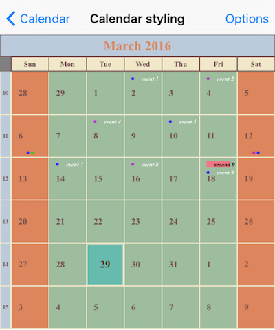
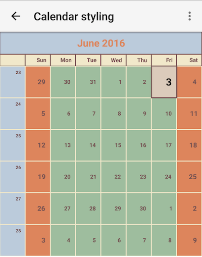

# Calendar Styling Overview
Telerik Calendar for NativeScript has four different view modes which can be easily customized to meet your application's visual requirements.
Every one of the calendar view modes has its visual representation and different visual items that could be styled.
You can define and combine styles for any of the view modes for single calendar instance and if you navigate from one view to another different styles will be applied for visual items.
The cells and all visuals that the calendar control is built from differentiate by the content they visualize.
Every one of these visual parts is customizable.

The following calendar properties should be used for different view modes:
- `monthViewStyle` - defines styling of RadCalendar for [Month view mode]( "Read more about styling in Month view mode"). Should be initialized with instance of `CalendarMonthViewStyle`
- `weekViewStyle` - defines styling of RadCalendar for [Week view mode]( "Read more about styling in Week view mode"). Should be initialized with instance of `CalendarWeekViewStyle`
- `yearViewStyle` - defines styling of RadCalendar for [Year view mode]( "Read more about styling in Year view mode"). Should be initialized with instance of `CalendarYearViewStyle`
- `monthNamesViewStyle` -  defines styling of RadCalendar for [MonthNames view mode]( "Read more about styling in MonthNames view mode"). Should be initialized with instance of `CalendarMonthNamesViewStyle`
- `dayViewStyle` - defines styling of RadCalendar for [Day view mode]( "Read more about styling in Day view mode"). Should be initialized with instance of `CalendarDayViewStyle`

These classes have properties for different visual parts of RadCalendar in corresponding view.

## Example

<snippet id='calenar-monthview-styling'/>

      
