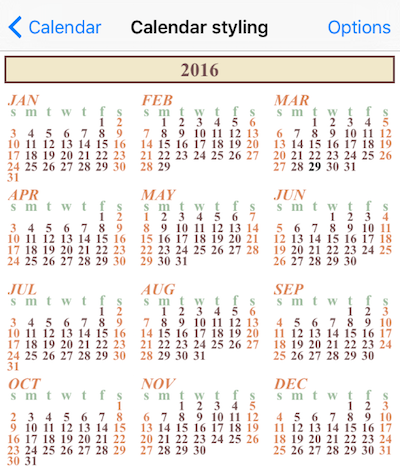
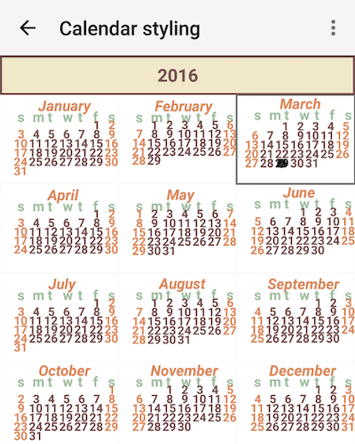

# RadCalendar Year View Styling

In order to apply custom style for this mode, you need to initialize the `yearViewStyle` property of `RadCalendar` with instance of `CalendarYearViewStyle`.
To apply custom style to title you need to initialize the `titleCellStyle` with instance of `CellStyle` class.

The `CellStyle` class has properties for common styling options:

- `cellBorderWidth` -  defines the border width of the title
- `cellBorderColor` -  defines the border color of the title
- `cellBackgroundColor` -  defines the background color of the title
- `cellAlignment` -  defines the content alignment in the title
- `cellTextColor` -  defines the color for the text shown in the title
- `cellTextFontName` -  defines the name of the font you want to use.
- `cellTextFontStyle` -  defines the style of the font used for text in title.
- `cellTextSize` -  defines the text size in title
- `cellPaddingHorizontal` -  defines the amount of horizontal padding
- `cellPaddingVertical` -  defines the amount of vertical padding   

Customization of month cels is done by initializing the `monthCellStyle` with instance of `MonthCellStyle` class. Here are the available properties:

- `weekendTextColor` - defines the text color for weekend days.
- `todayTextColor` - defines the text color for today date in month.
- `dayTextColor` - defines the text color for regular days in month.
- `dayFontName` - defines the font name for days in month.
- `dayFontStyle` - defines the font style for days in month.
- `dayTextSize` -  defines the size of text for days in month cell.
- `dayNameTextColor` - defines the text color for day names in month cell.
- `dayNameFontName` - defines the font for day names in month cell.
- `dayNameFontStyle` - defines the font style for day names in month cell.
- `dayNameTextSize` -  defines the text size of day names in month cell.
- `monthNameTextColor` -  defines the text color for title of month in cell.
- `monthNameFontName` - defines the font name for month title in cell.
- `monthNameFontStyle` - defines the font style for month title in cell.
- `monthNameTextSize` - defines the text size for month title in cell.

## Example
Here's an example of using the properties mentioned above:

<snippet id='calendar-yearview-styling'/>

This is how the calendar looks like in that case:

      

## References
Want to see this scenario in action?
Check our SDK examples repo on GitHub. You will find this and many other practical examples with NativeScript UI.

* [Styling Example](https://github.com/telerik/nativescript-ui-samples/tree/master/calendar/app/calendar/cell-styling)

Related articles you might find useful:

* [**Styling Inline Events**]()
* [**Styling Month Name**]()
* [**Styling Week View**]()
* [**Styling Month View**]()