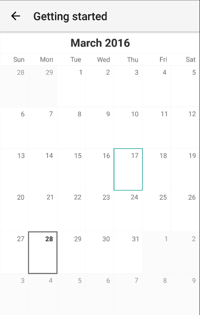
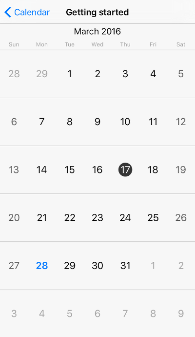

# RadCalendar Getting Started
This article will guide you through the process of adding a  instance to a page in a **{N}** application.

## Installation
Run the following command to add the plugin to your application:

```
tns plugin add nativescript-ui-calendar
```

## Initialization
Then, in order to add a  instance in a page of your application, you need to define the following XML namespace:

- `xmlns:calendar="nativescript-ui-calendar"`.

After defining the namespace adding a  instance to your page is done as follows:

<snippet id='calendar-getting-started-xml'/>

>  must be put in a parent layout panel that does not require from its children to have their own desired size. You should not therefore put  in a `StackLayout` or an auto-sized row within a `GridLayout`.

This will initialize a new  instance and put it as a direct child of your page:

   

## References
Want to see this scenario in action?
Check our SDK examples repo on GitHub. You will find this and many other practical examples with NativeScript UI.

* [Getting Started Example](https://github.com/NativeScript/nativescript-ui-samples/tree/master/calendar/app/calendar/getting-started)
