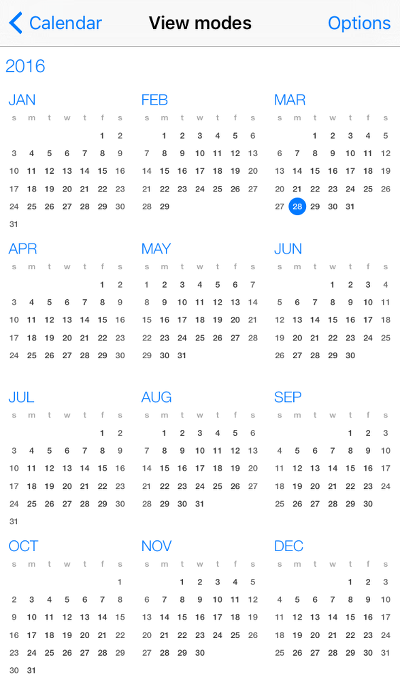
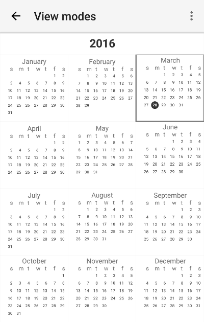

# RadCalendar Overview
 for NativeScript is based on the corresponding native calendar components from the Progress UI for iOS and Progress UI for Android suites. It exposes a unified API covering all major features coming from the native components like:
- inline events
- different view modes
- cells customization
- selection

     

## Features
### View modes
 supports four different view modes that are suitable for different application scenarios:

-  - displays the dates within one week
-  - displays the dates within one month
-  - displays the months within a year
-  - displays a whole year
-  - displays a timeline for a day with its events

For more information about View Modes take a look at the dedicated article: [Calendar view modes]( "Read more about view modes of RadCalendar").

### Style customization
 has a convenient API for customization of cells and selection indicators. For more information see the dedicated article: [Calendar styling ]( "Read more about styling of RadCalendar").

### Calendar transitions
 can be customized to animate the transition between different views. For more information take a look at the [Transition modes]( "Read more about transition modes of RadCalendar") article.

### Event source
 allows you to define events for a given date by specifying a list of events via it's **eventSource** property. You can read more about feeding  with events in the dedicated article: [Populating with data]().
