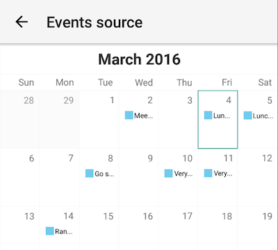
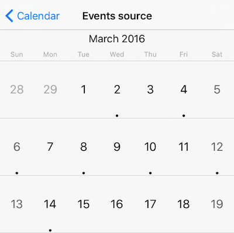
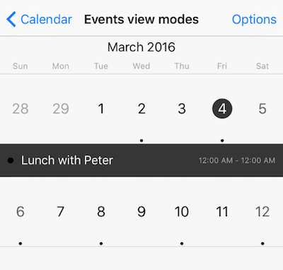
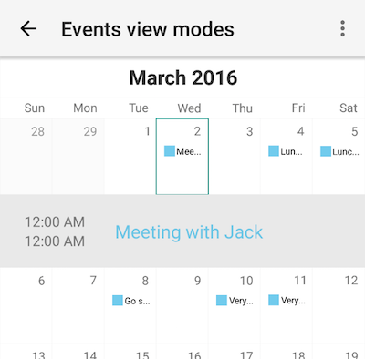

# Populating RadCalendar with Data
RadCalendar allows you to define a list of events for a particular date. This is done by using the `eventSource` property. This article describes the steps you need to take in order to feed  with your custom events using a events source.

### The CalendarEvent Class
Feeding events into  is done via instances of the  class. The  class is model describing a single event. It exposes properties allowing you to specify things like:

- start time of the event
- end time of the event
- whether the event is an 'all-day' event
- title of the event, etc.

To create instances of the  class you need to import the `calendar` module into your `.ts` file as shown below:

<snippet id='calendar-calendar-require'/>

## Define a List of Events and Bind Them to `RadCalendar`
Assuming we have imported the calendar module as instructed above, we can now create an `Array` of events and assign it to the  property of :

<snippet id='calendar-calendar-event-instance'/>

> The `_eventTitles` array is with example purposes and contains several strings representing event names.

The `calendarEvents` property used at the end of this snippet is exposed by the view-model assigned as a binding context to the page. This allows us to directly bind the  property of  in our XML file to it:

<snippet id='event-source-binding-xml'/>

Running the application, the following is shown on iOS and Android:

 

## Event View Modes
By default, events for each date cell are shown as dots (iOS) or squares with a summary (Android). You can customize this behavior by choosing one of the following event view modes:

-  - the default option
-  - event details are displayed in a list that appears in the calendar
-  - event details are displayed in a popup over the calendar

> All of these values are exposed by the  enum defined in the calendar module.

To change the events view mode you need to set the  property of  to one of these values. Here's how  looks like:

  

## References
Want to see this scenario in action?
Check our SDK examples repo on GitHub. You will find this and many other practical examples with NativeScript UI.

* [Populating With Data Example](https://github.com/NativeScript/nativescript-ui-samples/tree/master/calendar/app/calendar/populating-with-data)

