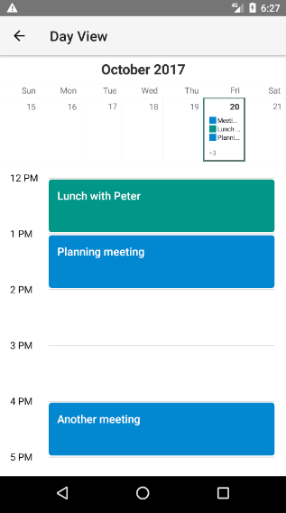
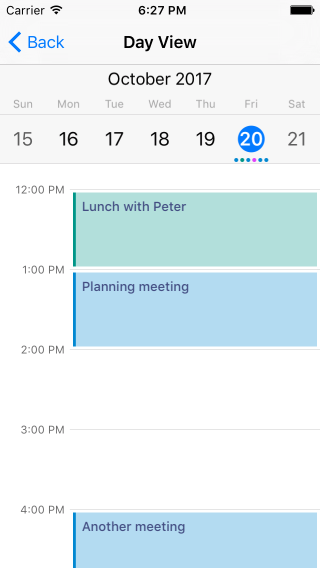

# RadCalendar View Modes
 supports four view mode types that are useful in different application scenarios. Setting a view mode is done via the  property. This property accepts values defined in the  enum. The following view modes are available:

-  - displays the dates within one week
-  - displays the dates within one month
-  - displays the months within a year
-  - displays a whole year
-  - displays a timeline for a day with its events

#### Figure 1: RadCalendar when its viewMode is set to Day on Android (left) and iOS (right)

 

## References
Want to see this scenario in action?
Check our SDK examples repo on GitHub. You will find this and many other practical examples with NativeScript UI.

* [View Modes Example](https://github.com/telerik/nativescript-ui-samples/tree/master/calendar/app/calendar/view-modes)
