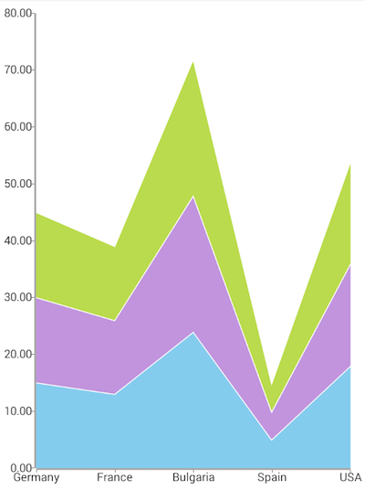
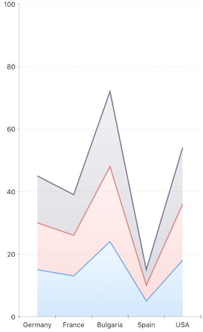

# RadChart Series
Progress NativeScript UI Chart comes with a bunch of series suitable for different types of data. There are two main chart types: `Cartesian` and `Pie`. Each of these chart types requires corresponding series types to be able to visualize the data. For  you need to use , and for  you need to use . `CartesianSeries` are represented by two main series types: scatter and categorical.

All series expose the following properties:

-  - determines whether labels are shown for each data point
-  - determines the title which will be displayed in the legend for the current series
-  - determines the name of the property on the source object that will provide the value used to plot the object in the chart
-  - used to bind the series with a source of data items
-  - responsible for the selection mode of the series.
The values are:
    -  - the series cannot be selected
    -  - series selection is not set and the series selection mode set to chart will be used.
    -  - the whole series will be selected
    -  - the touched data point will be selected only
    -  - multiple data point will be selected
-  - property of type PointLabelsStyle defining the style of the point labels

## Cartesian Series
The  draw the data from the source in a Cartesian Coordinate System. Examples of Cartesian Series are:

- 
- 
- 
- , etc.

All cartesian series can be divided into two groups depending on the axes they can play with:
- Linear series
- Categorical series

**Categorical Series** require a combination of a linear axis and a categorical axis, whereas **Linear Series** require both axes to be linear. In other words, **Categorical Series** plot the X or the Y value of the data object on a categorical axis, i.e. they fit the X or Y value into a particular category. The **Linear Series** plot the data objects on two linear axes, i.e. both X and Y are values that belong to a given linear range.

As `CartesianSeries` all categorical series share the base cartesian series API and provide a couple of additional properties needed for their proper initialization. The following properties are part of this object and are needed for correctly setting up a categorical chart:

-  - defines the name of the property on the data object which will be used to plot the object into the right category
-  - defines how separate series are combined within a single chart

Here's a simple scenario using Bar series. In our NativeScript application we define an object that exposes a collection which we will use as a data source for our chart. The collection is exposed by the `categoricalSource` property. We additionally define a page with a chart in it and set the `bindingContext` of the page to point to an instance of a data-model object:

<snippet id='categorical-source'/>

In our page definition, we set the `bindingContext` of the page to point to a `CategoricalDataModel` object:

<snippet id='binding-context-bar-series'/>

And in the XML definition of the page we put an instance of `RadCartesianChart`, define the `BarSeries` and bind them to the `categoricalSource` exposed by the data model:

<snippet id='bar-series'/>

The following screenshots demonstrate how your page looks like on iOS and Android:

 

### Stack Mode
There are scenarios in which a single Categorical chart can host multiple series. The  property allows you to define how these series will interact with each other. The following options are available for the `stackMode` property:

- `None` - series are displayed on top of each other in the order they are added in the chart
- `Stack` - separate data points which reside in the same category are stacked on top of each other in the order they are added in the chart
- `Stack100` - separate data points which reside in the same category are stacked on top of each other and positioned proportionally so that the whole plot-area of the chart is filled

This is the data with which we will populate our series:

<snippet id='stacked-series-model'/>
In our page definition, we set the `bindingContext` of the page to point to a `stackedSeriesModel` object:

<snippet id='stacked-series-binding-context'/>
The following XML snippet demonstrates combining three Area series in a single chart and defining a stack mode:

<snippet id='stacked-series'/>

Here's how your chart will look like with  set to `Stack100`:

 

## Pie series
Pie series are a separate type of series that are used in context with a Pie chart. There are two types of Pie series supported by Chart for NativeScript:

- `Pie` - data is represented in the form of a pie where separate data-points are visualized as a slice of the pie
- `Donut` - the Pie series principles apply here with the only difference that there is a 'hole' in the middle of the pie which makes it look like a donut
