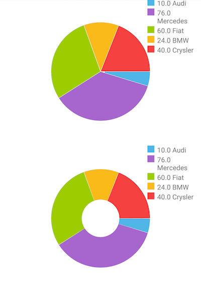

# RadChart Pie series
Unlike all other series,  do not require axes. They visualize each data point as pie slices with arc size directly proportional to the magnitude of the raw data point's value. Pie slices represent data in one direction contrasting with the other series which represent data in two dimensions.

## Example
The following definition represents the data context that will be used to populate our Pie series with data:

<snippet id='categorical-source'/>

We use an instance of this model to assign it as the `bindingContext` of the page we have put our Pie series on:

<snippet id='binding-context-pie-series'/>

And finally, in the XML definition of the page we put two RadCartesianCharts, add a PieSeries instance to one of them and DonutSeries to the other and bind the series to the source of data.

<snippet id='pie-series'/>

This is how the example looks like:
 

## References
Want to see this scenario in action?
Check our SDK examples repo on GitHub. You will find this and many other practical examples with NativeScript UI.

* [Series Examples](https://github.com/telerik/nativescript-ui-samples/tree/master/chart/app/examples/series)

Related articles you might find useful:

* [**Area Series**]()
* [**Bubble Series**]()
* [**Bar Series**]()
* [**Line Series**]()
* [**Range-Bar Series**]()
* [**Scatter-Bubble Series**]()
* [**Scatter Series**]()
* [**Spline Series**]()
* [**Area Series**]()
* [**Candlestick Series**]()
* [**Ohlc Series**]()