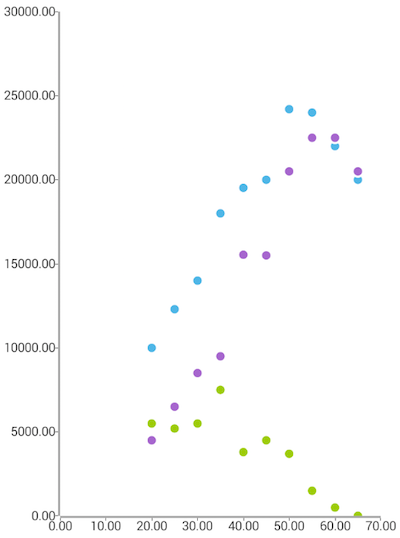
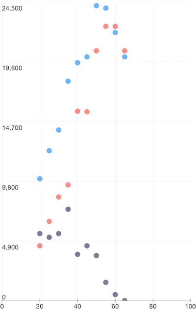

# RadChart Scatter Series
Scatter series are used in the context of a  and two  instances. Besides the setup requirements that come from ,  require an additional  and  parameters instead of  and .

## Customization
Scatter series could be customized as a standard  as it is described in [series styles article]( "Read more about styling of series.") 

## Example
The following definition represents the data context that will be used to populate the Scatter series with data:

<snippet id='scatter-data-source'/>

We use an instance of this model to assign it as the `bindingContext` of the page we have put our Scatter series on:

<snippet id='binding-context-scatter'/>

And finally, in the XML definition of the page we put a , add a  instance to it and bind the series to the source of data:

<snippet id='scatter-series'/>

 

## References
Want to see this scenario in action?
Check our SDK examples repo on GitHub. You will find this and many other practical examples with NativeScript UI.

* [Series Examples](https://github.com/telerik/nativescript-ui-samples/tree/master/chart/app/examples/series)

Related articles you might find useful:

* [**Area Series**]()
* [**Bubble Series**]()
* [**Bar Series**]()
* [**Pie Series**]()
* [**Range-Bar Series**]()
* [**Scatter-Bubble Series**]()
* [**Line Series**]()
* [**Spline Series**]()
* [**Area Series**]()
* [**Candlestick Series**]()
* [**Ohlc Series**]()