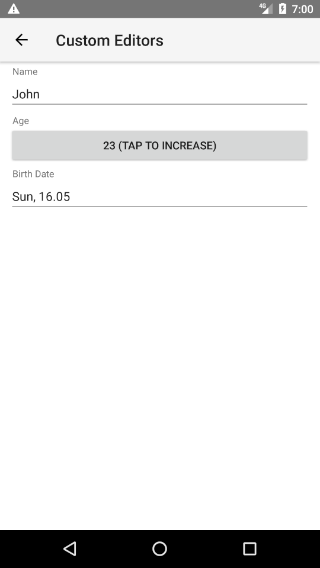
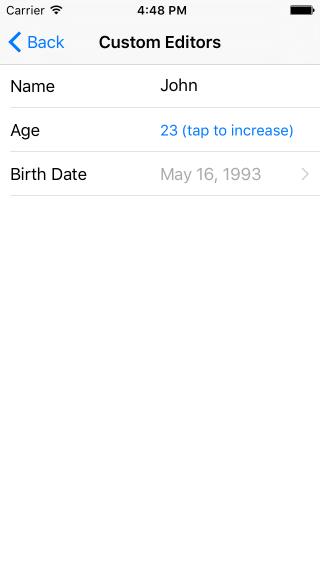

# RadDataForm Custom Editors

If you followed the [getting started]( "RadDataForm getting started") section, you now know how to edit an object's properties with `RadDataForm` for NativeScript. The [editors list]( "Editors List in RadDataForm for NativeScript") article demonstrated the available editors. This article will show you what to do if the editor you would like to use is not on the list with available editors. For example, if we wanted to have a `Button` to change the value of the property age in this example, we could use <a href="https://developer.android.com/reference/android/widget/Button.html" target="_blank">android.widget.Button</a> in Android and <a href="https://developer.apple.com/reference/uikit/uiview" target="_blank">UIButton</a> in iOS. 

#### Figure 1: RadDataForm with custom editor

 

## Create a custom property editor

In this article you will learn how to create a custom editor that uses native `Button` controls to change its value as in the screenshot above. First, you will need to set an instance of  as the editor of the `EntityProperty` associated with the property of the source object that we want to edit with a custom editor (in our example this is the `age` property): 

#### Example 1: RadDataForm with custom editor

<snippet id='dataform-editor-custom-xml'/>

Here's the flow for the usage of the custom editor step-by-step:

1. `RadDataForm` loads and it needs a view that will be used for the custom editor - the **editorNeedsView** event occurs.
2. The original value of the property in our source object has to be loaded in the custom editor - the **editorHasToApplyValue** event occurs.
3. The user interacts with the provided editor view which changes the value of the editor - **you** have to call the editor's **notifyValueChanged** method.
4. `RadDataForm` needs the current value of the editor - the **editorNeedsValue** event occurs and we have to update the value of the property depending on the current value of the custom editor.

All aforementioned events are fired with arguments of  type.

Here's what we are expected to do in the handlers of each of the mentioned events:

- The **editorNeedsView** event occurs when a view has to be placed inside our custom editor, so in our event handler we will create a native view depending on the current platform and set the result as value of the  property of the event data (On Android the event data will contain a  property with `Context` that we can use to create our `View`).
- The **editorHasToApplyValue** event occurs when the value of the property has to be used as initial value of our editor. Here, we will just take the value of the  property and apply it as formatted text for the view provided with the  property.
- The **editorNeedsValue** event occurs when we have to update the property value. This means that we will use again the  and  properties of the passed event data, but this time we will set the value depending on the value of our editor. 

This is the Android implementation of the mentioned event handlers:

#### Example 2: Custom editor implementation for Android

<snippet id='dataform-custom-editors-android'/>

Notice that we called the  method of the . This is necessary since the value change depends on the custom editor that we provide and thus it is our responsibility to notify `RadDataForm` for the update in the editor's value and in this example, the value change happens when the button is pressed. 

Here's the iOS implementation of the same event handlers:

#### Example 3: Custom editor implementation for iOS

<snippet id='dataform-custom-editors-ios'/>

We have created a helper class which exposes a `handleTap` method that will be executed when the native button is tapped. This is explained in more details <a href="https://docs.nativescript.org/runtimes/ios/how-to/ObjC-Subclassing#typescript-support" target="_blank">here</a>. The rest is quite similar to the code we have in the Android implementation - `editorNeedsView` to create the native view; `editorHasToApplyValue` - to update the editor with the provided value and `editorNeedsValue` - to provide the value that the editor currently holds.

## References

Want to see this scenario in action?
Check our [SDK examples](https://github.com/telerik/nativescript-ui-samples) repo on GitHub. You will find this and many other practical examples with NativeScript UI.

* [Custom Editors Example](https://github.com/telerik/nativescript-ui-samples/tree/master/dataform/app/examples/editors/custom-editors)

Related articles you might find useful:

* [**Editors Overview**]()
* [**Editors List**]()

