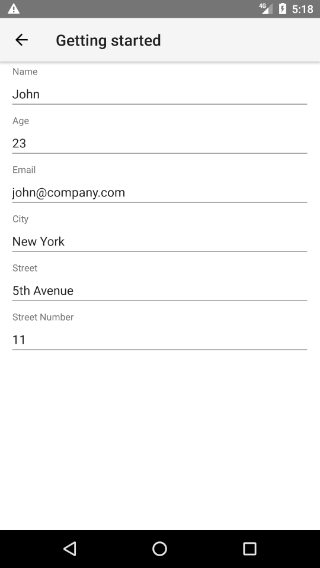
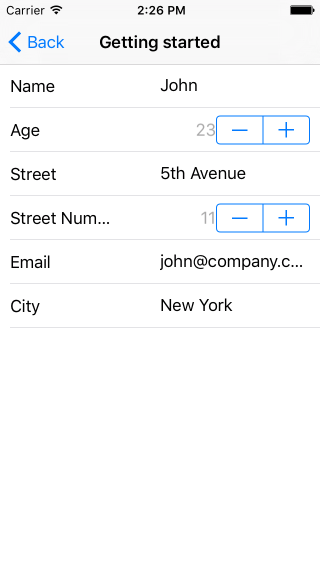

# RadDataForm: Provide the Source

This article will guide you through the process of adding a  instance to a page in a {N} application and using it to edit the properties of a business object.

* [Create the Source Object](#create-the-source-object)
* [Add RadDataForm to the Page](#add-raddataform-to-the-page)
* [References](#references)

## Create the Source Object

In order to use `RadDataForm` to edit an object, we need to have the object that we will edit. In this example, we will create a class `Person`, pass an instance of this class to `RadDataForm` and then we will be able to edit the person's properties. First, let's create a file named `person-model.ts` with the following content:

#### Example 1: Declare the object that we will use as a source for RadDataForm

<snippet id='dataform-person-view-model'/>

## Add RadDataForm to the Page

Run the following command to add the plugin to your application:

```
tns plugin add nativescript-ui-dataform
```

Then, in order to add a  instance in a page of your application, you need to define the following XML namespace:

- `xmlns:df="nativescript-ui-dataform"`.

#### Example 2: Add RadDataForm to a page

<snippet id='dataform-getting-started-xml'/>

Note the [data binding](https://docs.nativescript.org/ui/basics#bindings) of the `source` property of `RadDataForm` to the `person` property of the context of the page. In order to provide that context, we will use the `pageLoaded` event as follows:

#### Example 3: Define the BindingContext

<snippet id='dataform-getting-started-context'/>

If you run the application now, you should see the default editor for each property of the provided source object.

#### Figure 1: The basic RadDataForm on Android (left) and iOS (right)

 

Our next step is to adjust the editors that are used for each of the source object's properties. [Here]()'s how.

## References

Want to see these scenarios in action?
Check our [SDK Examples](https://github.com/telerik/nativescript-ui-samples) repo on GitHub. You will find these and many other practical examples with NativeScript UI.

* [Getting Started Example](https://github.com/telerik/nativescript-ui-samples/tree/master/dataform/app/examples/getting-started)
* [Getting Started JSON Example](https://github.com/telerik/nativescript-ui-samples/tree/master/dataform/app/examples/getting-started-json)

Related articles you might find useful:

* [Describe the Properties]()
* [Get the Result]()
* [Editors List]()
