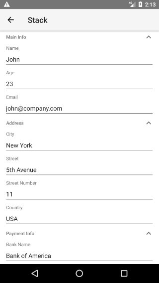
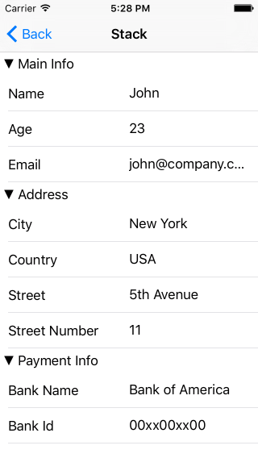
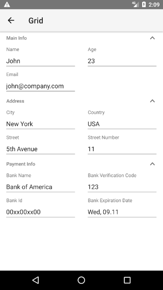
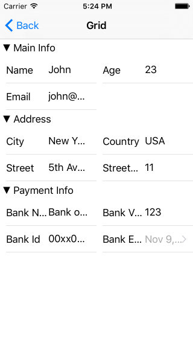

# RadDataForm: Group Layouts

If you followed the [getting started]( "RadDataForm getting started") section, you now know how to edit an object's properties with `RadDataForm` for NativeScript. The [Groups Overview]( "RadDataForm Groups Overview") article demonstrated how to show the editors in groups. This article will show you how to change the layout of each group in the .

* [Overview](#overview)
* [Stack Layout](#stack-layout)
* [Grid Layout](#grid-layout)
* [References](#references)

## Overview

The available layouts are:

- **DataFormStackLayout** (default): This layout places all of the editors in a  vertically ordered by the value of the  of their .
- **DataFormGridLayout**: This layout places all of the editors in a  in grid ordered by the values of the  and  of their . 

## Stack Layout

This is the default layout. If you declare each  in  without setting its  the default **DataFormStackLayout** will be used and `RadDataForm` will look like this:

#### Figure 1: This is how the editors in Stack Layout Group look in RadDataForm on Android (left) and iOS (right)

 

## Grid Layout

When you want to show more than one editor on one row, you can change the layout of a  to a . 

In order to specify where each editor is placed in the  you have to specify the  and  of its . The next example demonstrates how you can achieve a Grid Layout with 2 rows and 2 columns:

#### Example 1: Change the layout of a group to Grid Layout

<snippet id='dataform-grid-layout-xml'/>

#### Figure 2: This is how the editors in Grid Layout Group look in RadDataForm on Android (left) and iOS (right)

 

## References

Want to see this scenario in action?
Check our [SDK Examples](https://github.com/telerik/nativescript-ui-samples) repo on GitHub. You will find this and many other practical examples with NativeScript UI.

* [Layouts Example](https://github.com/telerik/nativescript-ui-samples/tree/master/dataform/app/examples/layouts)

Related articles you might find useful:

* [**Groups Overview**]()
* [**Styling**]()
