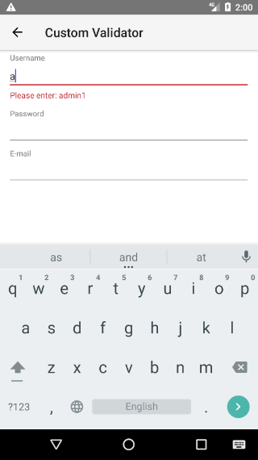
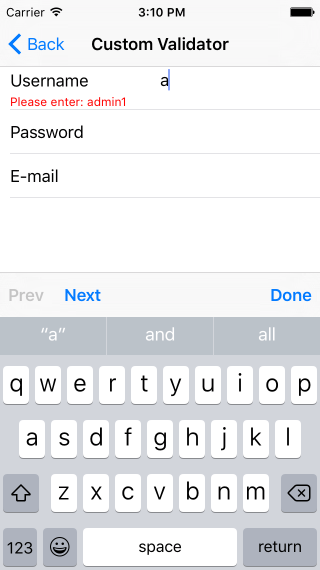
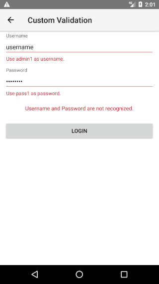
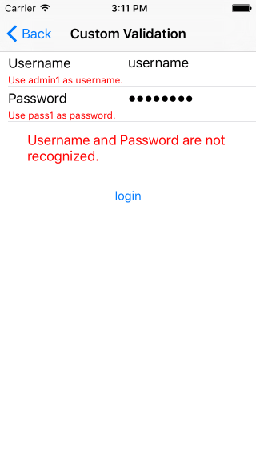

# RadDataForm: Custom Validation

If you followed the [getting started]( "RadDataForm getting started") section, you now know how to edit an object's properties with `RadDataForm` for NativeScript. From the [validation overview]( "RadDataForm validation overview") you should have become acquainted with the validation feature in . This article will show you how to use custom validation in .

* [Custom Validators](#custom-validators)
* [Manual Validation](#manual-validation)
* [References](#references)

## Custom Validators

If the validators provided by  don't fulfil your requirements you can create your own validator. All you need to do, is create a class extending the  class and override its  method. Here's a sample implementation that validates if the input has an exact content:

#### Example 1: Create a custom validator

<snippet id='dataform-custom-validator'/>

In order to use your validator, you can add it to your `xml` just like the other validators:

#### Example 2: Use a custom validator in RadDataForm 

<snippet id='dataform-custom-validator-xml'/>

> Note that you will also need to point the location of your validator definition. For our example the declaration is this: `xmlns:v=\"dataform/validation/custom-validator/exact-text-validator\"`, since our validator is defined in the `exact-text-validator.ts` file in the `custom-validator` directory.

#### Figure 1: Using a custom validator to validate input for username on Android (left) and iOS (right)

 

## Manual Validation

Another option is to manually notify  for the validation state of its properties and not use the validators at all. Here's an example that manually validates the fields that require validation on a button tap and if they are valid, commits them:

#### Example 3: Custom validation

<snippet id='dataform-custom-validation'/>

Let's walk through that implementation. First, we are getting each `EntityProperty` that we want to validate. Then we check their . After we check this value, we call  with `true` if the value is acceptable and with `false` otherwise. We are also setting the property's  to the text that we want to have displayed to inform the user why validation has failed. Finally, if all properties are valid, we [commit]( "RadDataForm Get the Result") the result and display a success message. Optionally, we show another message in the case of the failed validation, summarizing the validation errors.

#### Figure 2: Using a custom validation on button tap on Android (left) and iOS (right)

 

## References

Want to see this scenario in action?
Check our [SDK Examples](https://github.com/telerik/nativescript-ui-samples) repo on GitHub. You will find these and many other practical examples with NativeScript UI.

* [Custom Validator Example](https://github.com/telerik/nativescript-ui-samples/tree/master/dataform/app/examples/validation/custom-validator)
* [Custom Validation Example](https://github.com/telerik/nativescript-ui-samples/tree/master/dataform/app/examples/validation/custom-validation)

Related articles you might find useful:

* [**Validation Modes**]()
* [**Validators List**]()
