# RadDataForm: Validators List

If you followed the [getting started]( "RadDataForm getting started") section, you now know how to edit an object's properties with `RadDataForm` for NativeScript. From the [validation overview]( "RadDataForm validation overview") you should have become acquainted with the validation feature in . This article will present you with the validators that you can use to validate your fields.

All validators have an  property which allows you to change the message that is displayed below the field when it is not valid.

* [NonEmptyValidator](#nonemptyvalidator)
* [RangeValidator](#rangevalidator)
* [MinimumLengthValidator](#minimumlengthvalidator)
* [MaximumLengthValidator](#maximumlengthvalidator)
* [EmailValidator](#emailvalidator)
* [PhoneValidator](#phonevalidator)
* [IsTrueValidator](#istruevalidator)
* [RegExValidator](#regexvalidator)
* [Custom Validators](#custom-validators)
* [References](#references)

## NonEmptyValidator

The  can be used with fields that are required so that empty input is not accepted as a valid value.

#### Figure 1: The `NonEmptyValidator` on Android (left) and iOS (right)

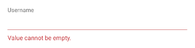 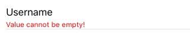

## RangeValidator

The  can be used with numeric values to determine if they fall within a specified range. The range is defined with the  and  properties.

#### Figure 2: The `RangeValidator` on Android (left) and iOS (right)

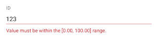 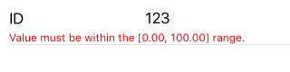

## MinimumLengthValidator

The  can be used with text values to determine whether the length of the current input has at least the length specified by the  property.

#### Figure 3: The `MinimumLengthValidator` on Android (left) and iOS (right)

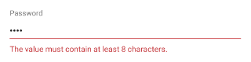 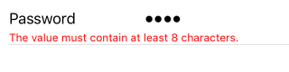

## MaximumLengthValidator

The  can be used with text values to determine whether the length of the current input is shorter or equal to the value specified with the  property.

#### Figure 4: The `MaximumLengthValidator` on Android (left) and iOS (right)

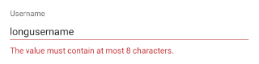 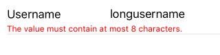

## EmailValidator

The  can be used with text values to determine whether the current input looks like an email. The email is defined with the following regular expression: `[a-zA-Z0-9\\+\\.\\_\\%\\-\\+]{1,256}\\@[a-zA-Z0-9][a-zA-Z0-9\\-]{0,64}(\\.[a-zA-Z0-9][a-zA-Z0-9\\-]{0,25})+`. If you want to use different criteria for matching an email, you can use the  and specify your preferred regular expression.

#### Figure 5: The `EmailValidator` on Android (left) and iOS (right)

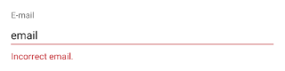 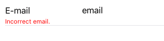

## PhoneValidator

The  can be used with text values to determine whether the current input looks like a phone number. The phone number is defined with the following regular expression: `(\\+[0-9]+[\\- \\.]*)?(\\([0-9]+\\)[\\- \\.]*)?([0-9][0-9\\- \\.]+[0-9])`. If you want to use different criteria for matching a phone number, you can use the  and specify your preferred regular expression.

#### Figure 6: The `PhoneValidator` on Android (left) and iOS (right)

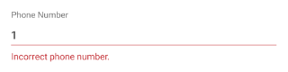 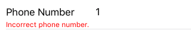

## IsTrueValidator

The  can be used with boolean values to determine whether the current input is positive. For example, this can be used to verify that the user has confirmed agreeing with some list with terms and conditions.

#### Figure 7: The `IsTrueValidator` on Android (left) and iOS (right)

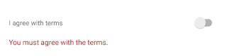 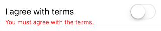

## RegExValidator

The  can be used with text values to determine whether the current input matches the regular expression given as value of the  property of the validator. Here's an example that validates that the input contains exactly 4 digits:

#### Example 1: Use the RegExValidator to validate if input contains 4 digits

<snippet id='dataform-validation-regex-xml'/>

#### Figure 8: The `RegExValidator` on Android (left) and iOS (right)

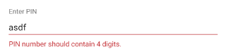 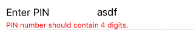

## Custom Validators

If the provided list doesn't fulfil your requirements, you can define your own validators or create custom validation rules. More information is available on [this article]( "RadDataForm custom validation").

## References
Want to see this scenario in action?
Check our [SDK Examples](https://github.com/telerik/nativescript-ui-samples) repo on GitHub. You will find many practical examples with NativeScript UI.

* [Validation Example](https://github.com/telerik/nativescript-ui-samples/tree/master/dataform/app/examples/validation)

Related articles you might find useful:

* [**Validation Events**]()
* [**Custom Validation**]()
