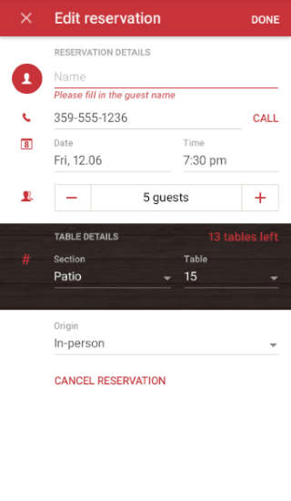
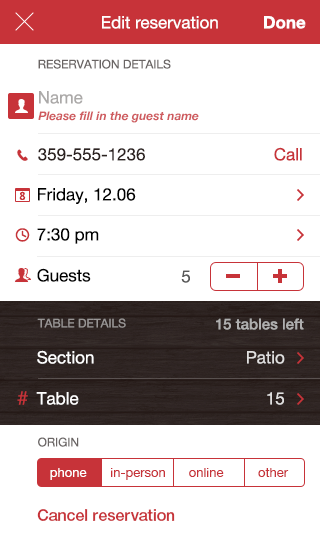

# RadDataForm: Overview

`RadDataForm` for NativeScript helps you edit the properties of a business object during runtime and build a mobile form fast and easy. All you have to do is set a business object as a value for the  property and  will automatically generate editors for each property of the source object. `RadDataForm` offers built-in editors for each primitive type and also has various features to help you create your desired form.

#### Figure 1: How RadDataForm can look on Android (left) and iOS (right)

 

## Getting Started

The following articles contains everything you need to know to start using `RadDataForm`. First, you need to [provide the source]( "Provide the Source for RadDataForm in NS") object. Then you can [describe the properties]( "Describe the properties in RadDataForm in NS") of the source in order to use the desired editors. Finally, you need to [get the result]( "Get the result in RadDataForm for NS") from the user's input.

## Editors

`RadDataForm` for NativeScript allows you to select a proper editor for each property of your source object and optionally customize it according to your preferences. You can start with the [overview page]( "Editors Overview in RadDataForm for NS") of the editors which demonstrates their common usage. Then you can have a look at the [complete list]( "List of Editors in RadDataForm for NS") with available editors and if none of them fulfils your requirements, you can create your [custom editors]( "Custom Editors in RadDataForm for NS").

## Groups

You can easily combine the editors in groups and optionally allow them to be collapsed. More information is available [here]( "Groups in RadDataForm for NS"). Once the editors are grouped, you can easily change the layout that is used for each group. More information is available [here]( "Group Layouts in RadDataForm for NS").

## Validation

If you need to validate the user's input before it's committed, you can use some of the predefined validators. [Here's]( "Validation in RadDataForm for NS") more information about the validation in `RadDataForm` for NativeScript. [This article]( "List with validators in RadDataForm in NS") contains the full list of available validators and if they are not enough you can create you [custom validators]( "Custom Validators in RadDataForm for NS"). To control when the validation is performed you can change the [validation mode]( "Validation mode in RadDataForm for NS"). [Here's]( "Validation events in RadDataForm for NS") more about the events that you can use to get notified when validation occurs.

## Image Labels

You can easily add an image to each editor that hints for its purpose instead of the default text that is displayed for each editor. You can read more about the image labels [here]( "Image Labels in RadDataForm for NS").

## ReadOnly

If you need to use the form to simply show the content of the source object without allowing the user to edit the content you can make the form read only or just disable specific editors that shouldn't allow editing. You can read more [here]( "ReadOnly mode in RadDataForm for NS").

## Styling

You can change the style of each of the editors of `RadDataForm` and also the style of the group headers if grouping is enabled. You can read more about the customization options [here]( "Styling in RadDataForm for NS").

