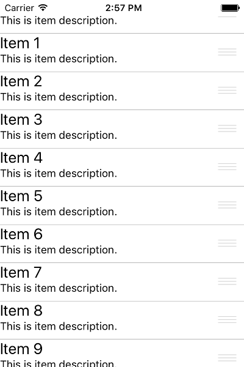
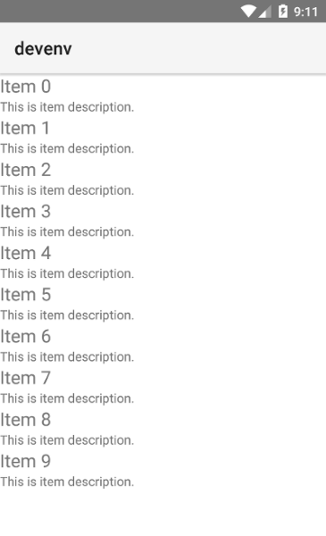

# RadListView Getting Started
This article will guide you through the process of adding a RadListView in your application, binding it to a data-source and visualizing the items by using an item template of your choice. For more information on how each separate feature of  is used, please refer to the dedicated articles which are using the same scenario and extend it further.

## Installation
Run the following command to add the plugin to your application:

```
tns plugin add nativescript-ui-listview
```

## Adding a RadListView to Your Page
Then, in order to add a  instance in a page of your application, you need to define the following XML namespace:

- `xmlns:lv="nativescript-ui-listview"`.

After that, you can use the following XML construct to put  in your page:

#### __Example 1: Adding RadListView to your Page__

<snippet id='listview-first-look'/>

This will initialize a new  instance with a Linear Layout and put it as a direct child of your page.

> You can read more about layouts here: [Item layouts]()

Now we want to prepare a list of items as a source and pass them to the RadListView. Let's create a view-model which will become the binding context of our page and will expose a collection of objects that we will use to populate the control. Create a new file called `view-model` in your application and paste the following code:

#### __Example 2: Creating the models used to feed RadListView with data__

<snippet id='listview-first-look-model'/>

Now, to provide a binding context for the page, we can use the `pageLoaded` event and assign an instance of the view-model to the `bindingContext` property of the page as follows:

#### __Example 3: Assigning the binding context to the RadListView page__

<snippet id='listview-first-look-context'/>

> Note that we have also set the  property to an instance of the  class. This is needed for the  to work.

Building and running the application will produce the following result:

#### __Figure 1: Getting started with RadListView for NativeScript:__

 

## References
Want to see this scenario in action?
Check our SDK examples repo on GitHub. You will find this and many other practical examples with NativeScript UI.

* [Getting Started Example](https://github.com/NativeScript/nativescript-ui-samples/tree/master/listview/app/examples/getting-started)

Related articles you might find useful:

* [**Pull to refresh**]()
* [**Swipe actions**]()
* [**Load on demand**]()
* [**Item reorder**]()
* [**Item animations**]()
* [**Item layouts**]()
* [**Multiple Item Templates**]()
