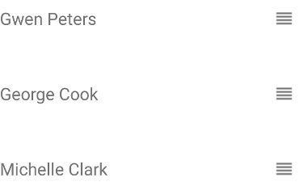

# RadListView: Item Reorder
Reordering items in a list is a common scenario in mobile apps. For example, a list view visualizing tasks can allow reordering the tasks to specify their priority. RadListView allows you to enable this functionality by setting a single property.

## Enabling Item Reorder
To enable the item-reorder function in your RadListView, simply set the  property as shown below. Additionally, you can subscribe for the  event to listen for reorder events:

#### __Example 1: Enabling Item Reorder on RadListView:__
<snippet id='listview-item-reorder-xml'/>

### Defining Reorder Mode
 supports two reorder modes:

-  - items are reordered by holding and dragging them
-  - items are reordered by simply dragging them

The default reorder mode is . To activate one of the available reorder modes set the  property to the corresponding value.

### Defining a Reorder Handle
When the  reorder mode is activated  behaves as follows:

- **iOS**: a reorder handle is displayed at the right side of the item. Dragging the item by the handle will reorder it.
- **Android**: now handle is displayed. Dragging the item at any place will reorder it.

You can easily customize the reorder handle by explicitly designating which part of your  will serve as a reorder handle. Take a look at the following XML snippet:

#### __Example 2: Defining a Reorder Handle in your template:__
<snippet id='listview-item-reorder-handle-xml'/>

As you can see a special  element is used which instructs  which part of the template should be used as a reorder handle. The  element is a regular {N} view so you can use all familiar properties to adjust its layout and appearance. Here, an `Image` element is put inside the .
The following pictures demonstrate how  looks like in this case:

#### __Figure 1: Item Reorder with a custom reorder handle in action:__
  

## Handling the Item Reorder Events
 exposes two events related to the item reorder functionality:

-  - fired before an item is reordered. Exposes an instance of the  class which contains the index of the item being reordered. Setting the  property of this instance to `false` can be used to cancel the reordering procedure
-  - fired when the reordering is about to start. No indices are changed at this point
-  - fired after an item has been reordered. Indices are now updated.

The  event exposes an instance of the  class which you can use to obtain the index of the item about to be reordered.

RadListView fires the  event once an item has been reordered. The event supplies you with a  instance which `data` property points to a `ListViewItemReorderData`  object. It exposes two properties giving you specific information about the reorder operation:

-  - indicates the destination of the reordered item
-  - indicates the target data group of the reordered item if present

The following code snippet demonstrates and example of a  handler:

#### __Example 3: Handling item reorder events:__
<snippet id='listview-item-reorder-handler'/>

## References
Want to see this scenario in action?
Check our SDK examples repo on GitHub. You will find this and many other practical examples with NativeScript UI.

* [Item Reorder Example](https://github.com/telerik/nativescript-ui-samples/tree/master/listview/app/examples/item-reorder)

