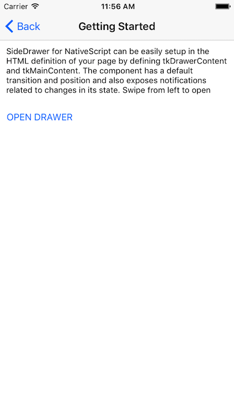
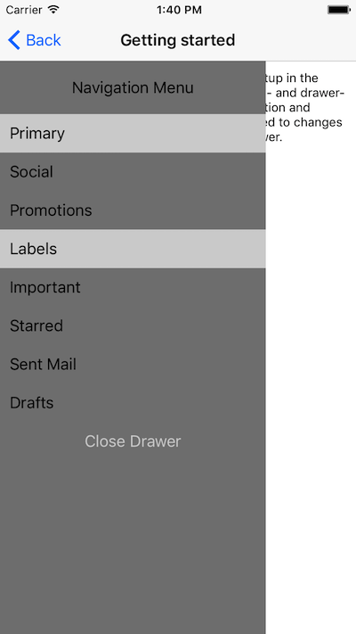
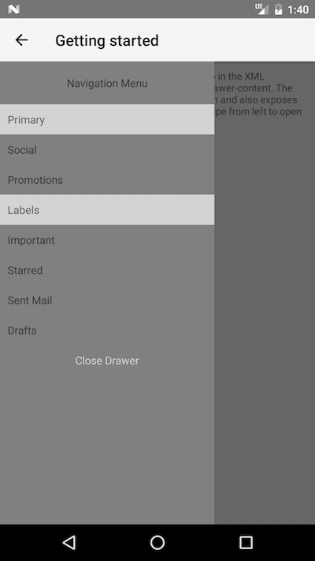

# RadSideDrawer Getting Started
This article will guide you through the process of adding a  instance to a page in your NativeScript application and initializing its content. 
> By design the `RadSideDrawer` is designed to be placed as a single child to your `Page`. For example:
```XML
<Page>
    <!-- RadSideDrawer should be either the absolute root element (instead Page) or a single child of the Page -->
    <RadSideDrawer>
        <!-- menu and content follows here-->
    </RadSideDrawer>
    <!-- <StackLayout></StackLayout>  NOT Allowed! (can't have other layouts on the same level s the drawer)-->
</Page>
```

## Installation
Run the following command to add the plugin to your application:

```
tns plugin add nativescript-ui-sidedrawer
```

## Adding RadSideDrawer to your page
Then, in order to add a  instance in a page of your application, you need to define the following XML namespace:

- `xmlns:nsDrawer="nativescript-ui-sidedrawer"`.

The namespace here is called `nsDrawer`. Now you can access 's APIs in your XML page. Adding an instance of  is done the following way:

<snippet id='sidedrawer-getting-started-xml'/>
<snippet id='sidedrawer-getting-started-binding-context'/>

As you can see, the  and  properties have also been initialized with a set of UI elements to demonstrate how content is set to the . The bindings and event handlers in the code snippets can be found in the next section.

## Binding properties on elements in the `drawerContent` and `mainContent`
Content defined in the drawer and main sections has access to the same `bindingContext` the drawer instance has. You can therefore bind properties on the `View` elements inside to properties exposed by the object behind the `bindingContext`. Considering the XML code above, here's a sample view-model code that is used as a binding context:

<snippet id='sidedrawer-getting-started-model'/>

The following screenshots demonstrate how the drawer looks like in that case:

#### Figure 1. RadSideDrawer's 'tkMainContent'
 


#### Figure 2. RadSideDrawer's 'tkDrawerContent'
 

## References
Want to see this scenario in action?
Check our SDK examples repo on GitHub. You will find this and many other practical examples with NativeScript UI.

* [RadAutoCompleteTextView Examples](https://github.com/telerik/nativescript-ui-samples/tree/master/sidedrawer/app/examples/)

Related articles you might find useful:

* [**Show over navigation bar**]()
* [**Transitions**]()
