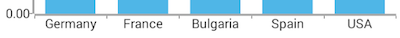
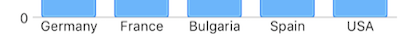

# RadChart CategoricalAxis

When [RadCartesianChart]( "Read more about RadCartesianChart") visualizes , it needs an axis that can represent the different categories. The  is used to displays a range of categories. Categories are built depending on the **Category** value of each **CategoricalDataPoint** present in the owning **CategoricalSeries** chart series. The axis is divided into discrete slots and each data point is visualized in the slot corresponding to its categorical value.

The next example demonstrates how to use  with . We first create a basic angular `Component` that contains a collection of objects provided by an custom service, which will be used by the chart to provide intuitive data visualization.

The service is a simple 'mock' of an backend call that will return an array of objects:

<snippet id='chart-angular-data-service'/>

Inside that service we have a single function which returns an array:

<snippet id='chart-angular-categorical-source'/>

<snippet id='chart-angular-country'/>

All that is left is to declare the template of the angular component in which we:

- Declare a 
- Declare the  and  between the  open and close tags
- After that set the **`tkCartesianHorizontalAxis`** and **`tkCartesianVerticalAxis`** directive to the axes
- Finally declare a  instance to it, bind the  to the source of data and set the **`tkCartesianSeries`** directive

<snippet id='chart-angular-bar-series-component'/>
<snippet id='chart-angular-bar-series'/>

## Features

### Plot Mode

The  allows you to define how exactly the axis will be plotted on the viewport of the chart. The possible values are:

* : Points are plotted in the middle of the range, defined between each two ticks.
* : Points are plotted over each tick.

You can get and set the current value with the  property.

### Major Tick Interval

Defines the step at which major ticks are generated. This property also affects axis labels as they are generated on a per major tick basis. You can get or set the value with the **majorTickInterval** property. For example, if you don't want to display all ticks, but instead only half of them (display the first, third, fifth, etc. ticks), you should set the major tick interval to 2.

This is how the axis in this example looks like:
 
