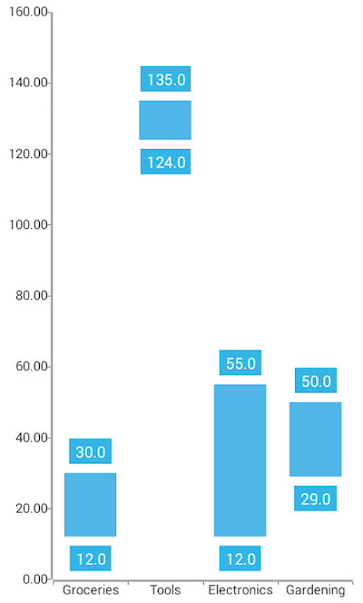
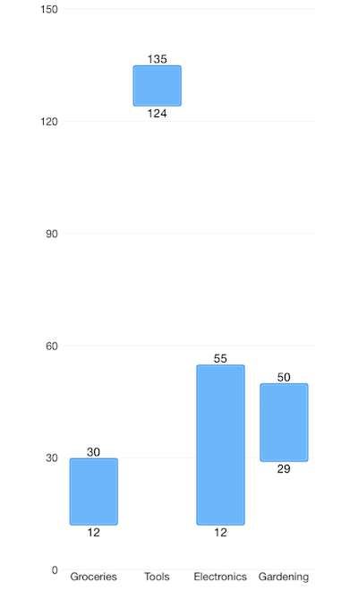

# RangeBar series: Overview
Range bar series are a special case of bar series where the width of each bar denotes the difference between data point's low and high value. The bars can be displayed either horizontally, or vertically, depending on whether the  is the vertical axis or the horizontal one. When the horizontal axis is categorical, the rectangles are displayed vertically. This means that they have equal width while their height represents the difference between the numerical values of each of the data points. The low value is the rectangle's start point, while the high value is the end point. On the other hand, when the vertical axis is categorical, the rectangles have equal height, while their width represents the difference between the values of the data point.

## Example
Just like with all angular 'pages' let's start with the `Component` in which we will place our  instance. We create a basic angular `Component` that contains a collection of objects provided by an custom service, which will be used by the chart to provide intuitive data visualization.

The service is a simple 'mock' of an backend call that will return an array of objects:

<snippet id='chart-angular-data-service'/>

Inside that service we have a single function which returns an array:

<snippet id='chart-angular-range-bar-source'/>

<snippet id='chart-angular-product'/>

All that is left is to declare the template of the angular component in which we:

- Declare a 
- Declare the  and  between the  open and close tags
- After that set the **`tkCartesianHorizontalAxis`** and **`tkCartesianVerticalAxis`** directive to the axes
- Finally declare a  instance to it, bind the  to the source of data and set the **`tkCartesianSeries`** directive

<snippet id='chart-angular-range-bar-series-component'/>
<snippet id='chart-angular-range-bar-series'/>

Depending on the required Bar orientation, you can swap the axes' position and assign the  to the  property and the Linear to the  property. This will change the orientation of the bars to vertical.

 
