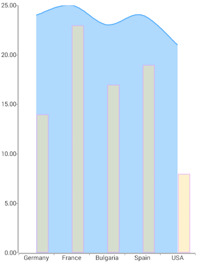
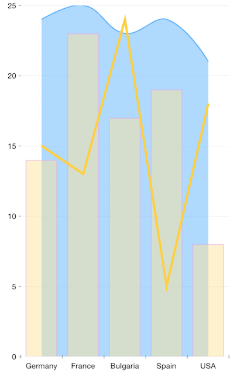
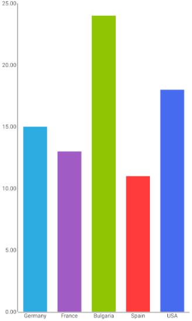
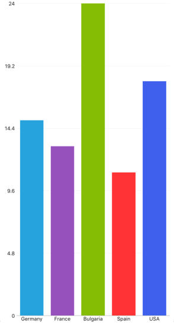

# Styling series: Palettes
Telerik Chart for NativeScript uses Palettes to enable the customization of series. Depending on the count of series you have defined in your chart, you can add as many palettes as needed and change several visual parameters of the series. A single palette defines an *entries* property which contains  instances. A **`PaletteEntry`** is essentially a property bag which holds the values that are used to style the associated series. The following properties are exposed by a `PaletteEntry` object:

- 
- 
- 

## Example

To better illustrate the usage of Palettes, we will use a scenario in the  with three series of different kind which are customized.

Just like with all angular 'pages' let's start with the `Component` in which we will place our  instance. We create a basic angular `Component` that contains a collection of objects provided by an custom service, which will be used by the chart to provide intuitive data visualization.

The service is a simple 'mock' of an backend call that will return an array of objects:

<snippet id='chart-angular-data-service'/>

Inside that service we have a single function which returns an array:

<snippet id='chart-angular-categorical-source'/>

<snippet id='chart-angular-country'/>

All that is left is to declare the template of the angular component in which we:

- Declare a 
- Declare the  and  between the  open and close tags
- After that set the **`tkCartesianHorizontalAxis`** and **`tkCartesianVerticalAxis`** directive to the axes
- Declare the ,  and  instance, bind their  to the source of data and set the **`tkCartesianSeries`** directive
- Declare the  instances, set their  and set the **`tkCartesianPalette`** directive (or **`tkPiePalette`** for )
- Finally between each **`Palette`** tag declare an  instance, set its  and any other property. Dont forget to set the **`tkCartesianPaletteEntry`** directive (or **`tkPiePaletteEntry`** for )

<snippet id='chart-angular-series-styling-component'/>
<snippet id='chart-angular-series-styling'/>

Our palette consists of a single entry that defines values for ,  and . What remains to be done is mapping the palette to the series it is meant to style. This is done by setting the **`seriesName`** property on the series and the palette to the same key. As you can see, the `seriesName` property is set to the Palette and the series to the same value - in that case *Bar*, *Area* and *Line*. You can use any string token here assuming it is the same on the corresponding series and the palette, as it serves as a mapping key between both.

The images below demonstrates the result of applying this palette to the Bar series:

 

In this example the second palette values will be used when the series or data point is selected. If palette for selected state is not explicitly defined the default colors will be used.

## PaletteMode

By default, the provided palettes (or the default colors) are applied per series, i.e. the first PaletteEntry from a palette will be applied to each of the items in the series. The `paletteMode` property can be used to change the way the palette is applied, i.e. the first PaletteEntry from the palette to be applied to the first item in the series, the second PaletteEntry to the second item, etc. You can choose from the following `paletteMode` values: `Series` or `Item` depending on how you want the palette to be applied. Here's how to change the `paletteMode` for `BarSeries`:

<snippet id='chart-angular-styling-bars'/>

And here's the result on android (on the left) and on iOS (on the right):

 

> Note that the paletteMode is applicable only for series where it visually makes sense. LineSeries, SplineSeries, AreaSeries and SplineAreaSeries (where there are no separate items but only connections between them), the paletteMode is not supported.
