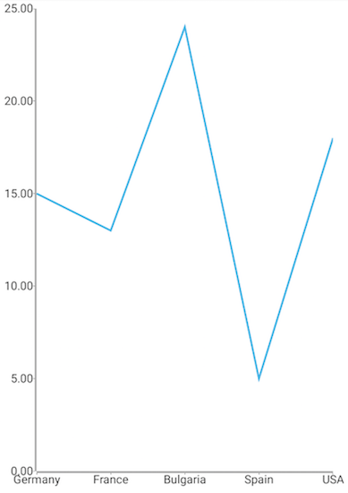
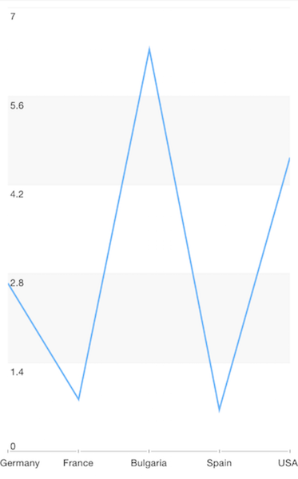

# RadChart Getting Started
In this article, you will learn to get started with the Chart plugin for NativeScript: how to initialize the chart, how to create the data series and how to use the different axes.

## Installation
Run the following command to add the plugin to your application:

```
tns plugin add nativescript-ui-chart
```

## Adding a RadCartesianChart to Your Component's template
Before proceeding, make sure that the  from the *nativescript-ui-chart* plugin has been imported in an `ngModule` in your app as explained [here](#usage-in-angular).

Let's start with the `Component` in which we will place our RadChart instance. We create a basic angular `Component` that contains a collection of objects provided by an custom service, which has two properties that will be used by the chart to provide intuitive data visualization.

The service is a simple 'mock' of an backend call that will return an array of objects:

<snippet id='chart-angular-data-service'/>

Inside that service we have a single function which returns an array:

<snippet id='chart-angular-categorical-source'/>

<snippet id='chart-angular-country'/>

## RadChart Initialization
The first step is to add the chart to the template of your `Component`. In this case we will use the [RadCartesianChart]( "Read more about RadCartesianChart.") type.

> Charts must be put in a parent layout panel that does not require from its children to have their own desired size. You should not therefore put your chart in a `StackLayout` or an auto-sized row within a `GridLayout`.

After adding the chart we need to set the  to an instance of a  and the  to an instance of a . Following the same patter as with the series object we need to:

- Declare the `CategoricalAxis` and `LinearAxis` between the `RadCartesianChart` open and close tags.
- After that set the **`tkCartesianHorizontalAxis`** and **`tkCartesianVerticalAxis`** directive to the axes.

After the axes are set we need to add the series which we will show in the chart. In this case we will use the [LineSeries]( "Read more about LineSeries") in combination with a [Categorical]( "Read more about Categorical axis.") and a [Linear axes]( "Read more about Linear axis."). 

- First we need to declare the `LineSeries` between the RadCartesianChart open and close tags.
- We set the  of the series to the `Country` property in the objects from the `categoricalSource` array of the `Component` and the  to the `Amount` property. 
- Finally in order for angular to be able to relate the series object with the `RadCartesianChart` we need to set the **`tkCartesianSeries`** directive to the `LineSeries`.

The `DataService` and `Country` are custom modules used for example purposes so make sure you import them accordingly from your project's folder structure.

<snippet id='chart-angular-line-series-component'/>
<snippet id='chart-angular-line-series'/>

This will produce a page showing a Chart that will look like:

  
