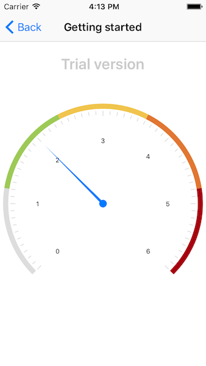
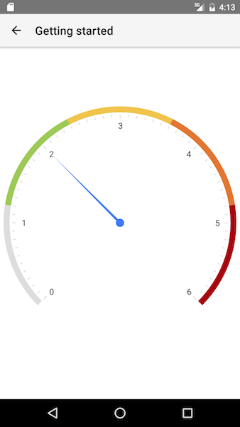

# RadGauge Getting Started

This article will guide you through the process of adding a  instance to a page in a {N} application and adding scales and indicators to it.

#### Figure 1. Radial gauge with needle and bar indicators
  

## Installation
Run the following command to add the plugin to your application:

```
tns plugin add nativescript-ui-gauge
```

## Adding a RadRadialGauge to your Component
Before proceeding, make sure that the  from the *nativescript-ui-gauge* plugin has been imported in an `ngModule` in your app as explained [here]().

To display data the  instance is not enough. We should add also add a scale with at least on indicator. In this example we are going to add a  with several  instances and one . To add a scale to the  we should use its  property. Adding indicators to the scale is similar - we are using 's  property.

In order to setup an `RadRadialGauge` in your Component HTML you will need to follow this steps:

- First start by declaring the `<RadRadialGauge></RadRadialGauge>` tags
- The main elements that are visualized by the gauge are its scales, in order to declare multiple scales simply declare the `<RadialScale tkRadialGaugeScales></RadialScale>` and set the `tkRadialGaugeScales` inline directive to it. The `tkRadialGaugeScales` is an custom inline directive that 'links' the  to the .

<snippet id='gauges-getting-started-angular-html' />
<snippet id='gauges-getting-started-angular' />

## References
Want to see this scenario in action?
Check our SDK examples repo on GitHub. You will find this and many other practical examples with NativeScript UI.

* [Getting Started Example](https://github.com/NativeScript/nativescript-ui-samples-angular/tree/master/gauge/app/examples/getting-started)

Related articles you might find useful:

* [**Indicators**]()
* [**Scales**]()
