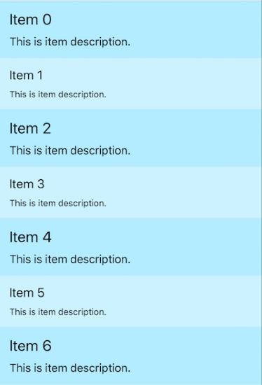
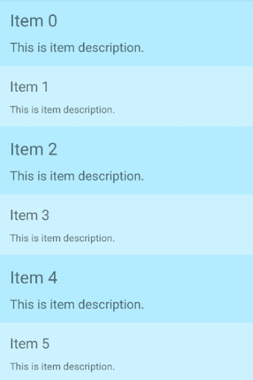

# Item customization: Introduction

Providing item template for your **RadListView** with XML is quite easy and straightforward task. Even though this method allows you to create complicated and beautiful designs, it is not flexible enough if you want to have different design for some items.

In this article we are going to use the  event in order to create a **RadListView** with different item designs.

# The 'itemLoading' event

The  event is called every time an item is about to be visualized in **RadListView**. It allows us to customize each item separately as it provides us with the NativeScript item view and the native view.
In order to use this customization technique we need to register a handler for the  event in our HTML and implement a corresponding handler:

<snippet id='angular-angular-listview-item-loading'/>

In the snippet above we are creating a simple ListView with a registered handler for the  event called `onItemLoading`:

<snippet id='angular-listview-item-loading-component'/>

The `args` object exposes the following important properties:
- `itemIndex` - the data source index of the item currently being visualized
- `view` - the {N} view that represents the visual container for the item
- `ios` (iOS specific) - exposes the native iOS cell used to visualize the item
- `android` (Android specific) - exposes the native Android View used to visualize the item

This structure gives us complete freedom to change and customize the appearance of every single item. In this particular case we are applying one set of styles for items with even indexes and another for items with odd indexes. This is the final result:

iOS:

Android:

