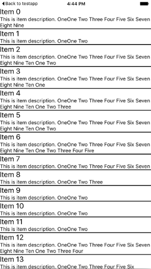

# Item separators: Introduction
This tutorial describes how to add separators between the items in RadListView.

Item separators are lines displayed between the items to better designate the bounds each item occupies within the scrollable list. Item separators are currently not supported as an out-of-the-box feature by RadListView but there is an easy way to implement this behavior which is described in this article.

# Implementing item separators in RadListView

1. Create an angular Component in your NativeScript application and put a  instance bound to a source of data items
2. Add a new `StackLayout` instance in the **`tkListItemTemplate`** and make its height be 2 pixels as shown below:
3. Run your application. The result should be as the following screenshot demonstrates

<snippet id='listview-angular-item-separator'/>

# Conclusion
Item separators are easily implementable in  by adding an element within your template with the corresponding dimensions and color. Separation between items in  can also be implemented by using a margin by setting the **`marginBottom`** to the root layout in the **`tkListItemTemplate`**.