# NativeScript UI Overview

NativeScript UI is a set of free* components that enable implementing rich-ui applications for iOS and Android by using [NativeScript](https://www.nativescript.org). **Progress NativeScript UI** is built on top of natively implemented components targeting iOS and Android. The components are available for download on npmjs.com 

> *Although the components are free, they are not open-source and their code is proprietary. [Read the components' license for details](https://github.com/telerik/nativescript-ui-feedback/blob/master/LICENSE.md). 

> In case you're interested in contributing to the code base, [read the contributing options available](https://github.com/telerik/nativescript-ui-feedback#contributing-to-nativescript-ui).

Continue reading about each component below or take them for a spin with the [NativeScript UI sample app on GitHub](https://github.com/telerik/nativescript-ui-samples)[NativeScript UI sample app on GitHub](https://github.com/telerik/nativescript-ui-samples-angular).

## Components

### RadSideDrawer

[[Documentation]()[Documentation]()] [[Sample Code](https://github.com/telerik/nativescript-ui-samples/tree/master/sidedrawer)[Sample Code](https://github.com/telerik/nativescript-ui-samples-angular/tree/release/sdkAngular/app/sidedrawer)][[Download from npm](https://www.npmjs.com/package/nativescript-ui-sidedrawer)]

The SideDrawer component (known as RadSideDrawer in code) allows you to follow a popular application pattern and show a hidden view which contains navigation UI or common settings. With SideDrawer you may:

* Embed any content inside the sliding panel from text and icons, to sliders and filters;
* Set the control to slide in from any of the four sides of the screen;
* Pick from a large set of polished out-of-the-box transition modes;
* Achieve programmatic control over the state of the side drawer;
* Choose to cover the navigation or action bar.

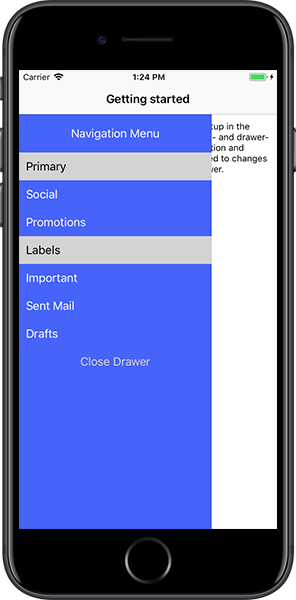 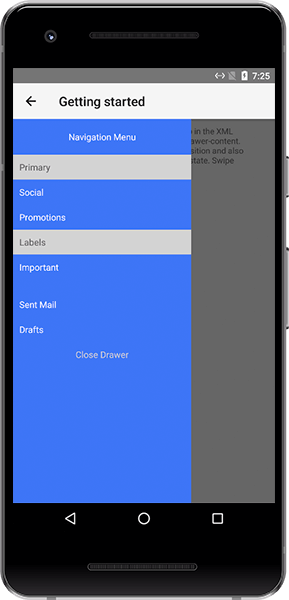

### RadListView

[[Documentation]()[Documentation]()] [[Sample Code](https://github.com/telerik/nativescript-ui-samples/tree/master/listview)[Sample Code](https://github.com/telerik/nativescript-ui-samples-angular/tree/release/sdkAngular/app/listview)][[Download from npm](https://www.npmjs.com/package/nativescript-ui-listview)]

> **NOTE**: The professional ListView component is different from the ListView built in to the core NativeScript modules. Use the professional ListView if you need to take advantage of the advanced functionality listed below.

The ListView component (known as RadListView in code) is a virtualizing list component that provides the most needed features associated with scenarios where a list of items is used. Features include:

* Pull to refresh;
* Load on demand;
* Swipe to execute;
* Header and footer;
* Item animation when the user scrolls, and four out-of-the-box effects to choose from;
*  `Linear`, `Grid`, and `Staggered` layout modes, allowing horizontal and vertical scrolling direction;
* Single and multiple selection modes;
* Smart defaults for many gestures: select on long press, execution of special action on swipe, reorder of items on long press and drag, refreshing the list on swipe, and loading more items only when needed.

 

### RadCalendar

[[Documentation]()[Documentation]()] [[Sample Code](https://github.com/telerik/nativescript-ui-samples/tree/release/sdk/app/calendar)[Sample Code](https://github.com/telerik/nativescript-ui-samples-angular/tree/release/sdkAngular/app/calendar)][[Download from npm](https://www.npmjs.com/package/nativescript-ui-calendar)]

The Calendar component (known as RadCalendar in code) is a highly customizable native calendar abstraction that exposes a unified API, covering:

* Four different view modes - `Week`, `Month`, `MonthNames`, and `Year`;
* `Single`, `Multiple`, and `Range` date selection;
* Inline and popover events;
* Vast control over styling and cell customization options.

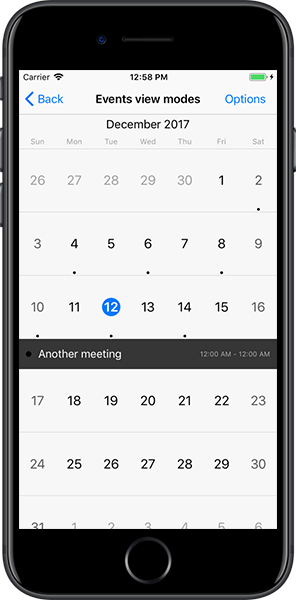 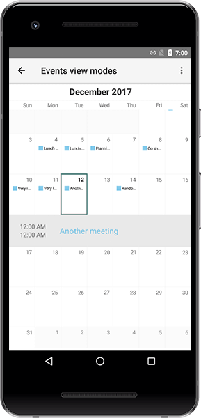

### RadChart

[[Documentation]()[Documentation]()] [[Sample Code](https://github.com/telerik/nativescript-ui-samples/tree/release/sdk/app/chart)[Sample Code](https://github.com/telerik/nativescript-ui-samples-angular/tree/release/sdkAngular/app/chart)][[Download from npm](https://www.npmjs.com/package/nativescript-ui-chart)]

The Chart component (known as RadChart in code) can be used to visualize data in a human-readable way through lines, areas, bars, pies, and more. Some features include:

* Wide array of accepted data types: numerical, string or `DateTime` data depending on the chart you want to visualize;
* Smooth interaction and zooming;
* Various chart series options:

	* Show trends with `Line`, `Area`, and `Spline Area` charts;
	* Compare sets of data with `Bar` charts;
	* Illustrate proportions with `Pie` and `Donut` charts - and use `Spline` and `Spline Area` charts to plot data that require the use of curve fittings;
	* Show relationships among values using `Scatter` and `Bubble` series, even use `Financial` series and indicators.
* Annotations, tooltips, and trackball;
* Support for multiple axes.

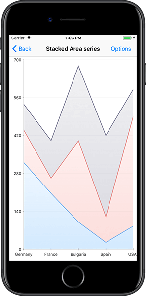 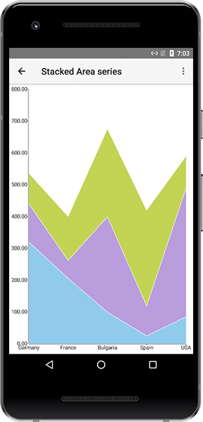

### RadAutoCompleteTextView

[[Documentation]()[Documentation]()] [[Sample Code](https://github.com/telerik/nativescript-ui-samples/tree/release/sdk/app/autocomplete)[Sample Code](https://github.com/telerik/nativescript-ui-samples-angular/tree/release/sdkAngular/app/autocomplete)][[Download from npm](https://www.npmjs.com/package/nativescript-ui-autocomplete)]

The AutoCompleteTextView component (known as RadAutoCompleteTextView in code) offers suggested options to your users based on characters they type. It provides multiple means for easy customization and data management, including:

*  Suggest modes - you can choose to show suggestions in a drop-down list, one suggestion at a time in the text input, or a combination of both;
*  `StartsWith` and `Contains` completion modes;
*  Two distinct display modes: `Plain` in which only one item can be selected, and `Tokens` allowing multiple selection of suggestions (each displayed as a token);
* Token Layout modes - Wrap and Horizontal.

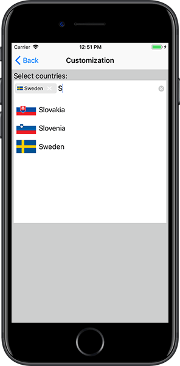 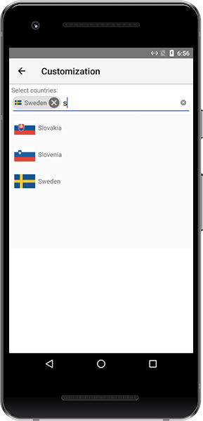

### RadDataForm

[[Documentation]()[Documentation]()] [[Sample Code](https://github.com/telerik/nativescript-ui-samples/tree/release/sdk/app/dataform)[Sample Code](https://github.com/telerik/nativescript-ui-samples-angular/tree/release/sdkAngular/app/dataform)][[Download from npm](https://www.npmjs.com/package/nativescript-ui-dataform)]

The DataForm component (known as RadDataForm in code) provides an easy and versatile approach for building mobile forms based on a provided data object's public members. Use DataForm to:

* Bind a form to a data object with a single line of code;
* Take advantage of more than **15** built-in editors (or provide your own custom editor);
* Create groups of editors, allow them to be collapsed and style them;
* Display a form in `ReadOnly` mode;
* Take control over collected data with built-in data validation - use a provided validator or create a custom one.

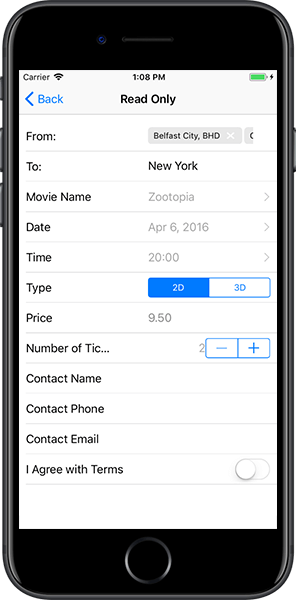 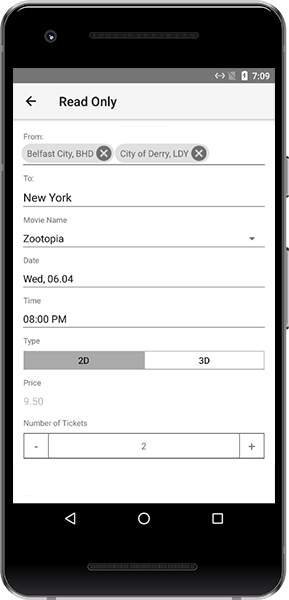

### RadGauges

[[Documentation]()[Documentation]()] [[Sample Code](https://github.com/telerik/nativescript-ui-samples/tree/release/sdk/app/gauges)[Sample Code](https://github.com/telerik/nativescript-ui-samples-angular/tree/release/sdkAngular/app/gauges)][[Download from npm](https://www.npmjs.com/package/nativescript-ui-gauge)]

The Gauges component (known as RadRadialGauge in code) allows you to display the current status of a value within a range of upper and lower bounds, illustrate progress towards a goal, or a summary of a fluctuating metric. With the gauges component you may:

* Add one or more `RadialScale` instances to your gauge;
* Use `Bar` indicators to visualize a range of values or a `Needle` indicator to point to a specific value;
* Include ready-to-use animations for smooth transition effects.

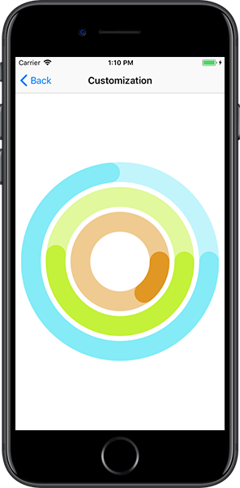 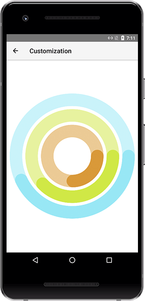

## Further resources

### SDK samples app

You can explore the Progress NativeScript UI getting started application, which is [publicly available on GitHub](https://www.github.com/telerik/nativescript-ui-samples)(https://www.github.com/telerik/nativescript-ui-samples-angular). It contains various examples of the usage of the components. More information about how to run the application is available in its README.

### AppStore/PlayStore sample app
In case you want to experience the native side of NativeScript and Progress NativeScript UI to the fullest, you can refer to the official sample NativeScript application. Its source code is located in [this GitHub repo](https://github.com/NativeScript/nativescript-marketplace-demo). You can easily check how the app works on your device by getting it from [AppStore](https://itunes.apple.com/us/app/examples-nativescript/id1046772499?ls=1&mt=8) or [PlayStore](https://play.google.com/store/apps/details?id=org.nativescript.examples).

## Feedback
Your feedback will be highly appreciated and will directly influence the development of **Progress NativeScript UI**.

You can submit issues and feedback to the [dedicated feedback GitHub repository](https://github.com/telerik/nativescript-ui-feedback).