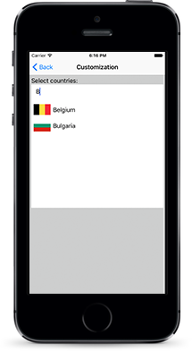
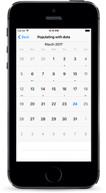
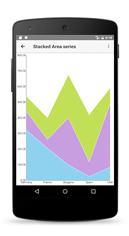
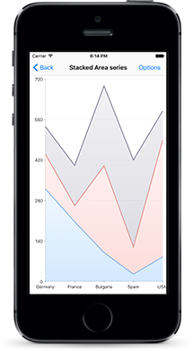
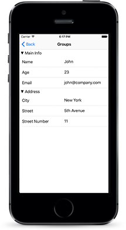
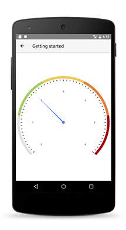
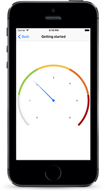

# Rich UI Widgets

NativeScript UI is a free suite of rich and customizable premium UI widgets for building NativeScript apps. It is available for download as a plugin on npmjs.com under [nativescript-pro-ui](https://www.npmjs.com/package/nativescript-pro-ui).

> Continue reading more about each component below or take them up for a spin with the [NativeScript UI sample app on GitHub](https://github.com/telerik/nativescript-ui-samples)[NativeScript UI sample app on GitHub](https://github.com/telerik/nativescript-ui-samples-angular).

* [AutoCompleteTextView](#autocompletetextview)
* [Calendar](#calendar)
* [Chart](#chart)
* [DataForm](#dataform)
* [Gauges](#gauges)
* [RadListView](#radlistview)
* [SideDrawer](#sidedrawer)

## AutoCompleteTextView

[AutoCompleteTextView](http://docs.telerik.com/devtools/nativescript-ui/Controls/NativeScript/AutoCompleteTextView/overview)[AutoCompleteTextView](http://docs.telerik.com/devtools/nativescript-ui/Controls/Angular/AutoCompleteTextView/overview) offers suggested options to your user based on characters they’ve already typed. It provides means for easy customization and data management, among which:

*  Suggest modes - you can choose to show suggestions in a drop-down list, one suggestion at a time in the text input, or a combination of both
*  `StartsWith` and `Contains` completion modes
*  Two distinct display modes - `Plain` in which only one item can be selected, and `Tokens` allowing multiple selection of suggestions, each of which displayed as a token

## Calendar

The [Calendar](http://docs.telerik.com/devtools/nativescript-ui/Controls/NativeScript/Calendar/overview)[Calendar](http://docs.telerik.com/devtools/nativescript-ui/Controls/Angular/Calendar/overview) is a highly customizable calendar components that exposes a unified API covering:

* Four different view modes - `Week`, `Month`, `MonthNames` and `Year`
* `Single`, `Multiple` and `Range` date selection
* Inline events
* Vast control over the styling and cell customization options

## Chart

The [Chart](http://docs.telerik.com/devtools/nativescript-ui/Controls/NativeScript/Chart/overview)[Chart](http://docs.telerik.com/devtools/nativescript-ui/Controls/Angular/Chart/overview) can be used to visualize data in a human-readable way through lines, areas, bars, pies and much more.

* Various data types - feed numerical, string or `DataTime` data depending on the chart you want to visualize.
* Smooth interaction and zooming
* The chart series your application needs:

	* Show trends with `Line`, `Area` and `Spline Area` charts 
	* Compare sets of data with `Bar` charts 
	* Illustrate proportions with `Pie` and `Donut` charts and use `Spline` and `Spline Area` charts to plot data that require the use of curve fittings
	* Show relationship among values using `Scatter` and `Bubble` series, even use `Financial` series and indicators.
* Annotations, tooltips and trackball
* Multiple axes support

## DataForm

The [DataForm](http://docs.telerik.com/devtools/nativescript-ui/Controls/NativeScript/DataForm/dataform-overview)[DataForm](http://docs.telerik.com/devtools/nativescript-ui/Controls/Angular/DataForm/dataform-overview)  provides an easy and versatile approach to processing data objects’ public members and building mobile forms fast. 

* Bind to an object with a single line of code
* Take advantage of more than **15** built-in editors or provide your own custom editor
* Create groups of editors, allow them to be collapsed and style them
* `ReadOnly` mode
* Take control over the collected data through in validation - use a built-in validator or create a custom one

## Gauges

The [Gauges](http://docs.telerik.com/devtools/nativescript-ui/Controls/NativeScript/Gauges/overview)[Gauges](http://docs.telerik.com/devtools/nativescript-ui/Controls/Angular/Gauges/overview)  allow you to show the current status of a value within a range of upper and lower bounds, illustrate progress towards a goal or a summary of a fluctuating metric.

* Add one or more `RadialScale` instances to your gauge
* Use `Bar` indicators to visualize a range of values or a `Needle` indicator to point to a specific value
* Ready-to-use animations for smooth transition effects 

## RadListView

[RadListView](http://docs.telerik.com/devtools/nativescript-ui/Controls/NativeScript/ListView/overview)[RadListView](http://docs.telerik.com/devtools/nativescript-ui/Controls/Angular/ListView/overview) is a virtualizing list component that provides the most needed features associated with scenarios where a list of items is used, such as:

* Pull to refresh
* Items animation when the user scrolls and 4 out-of-the-box effects to choose from
*  `Linear`, `Grid` and `Staggered` layout modes, allowing horizontal and vertical scrolling direction
* Single and multiple selection modes 
* Smart defaults for many gestures - select on long press, execution of special action on swipe, reorder of items on long press and drag, refreshing the list on swipe or loading more items only when needed

## SideDrawer

The [SideDrawer](http://docs.telerik.com/devtools/nativescript-ui/Controls/NativeScript/SideDrawer/overview)[SideDrawer](http://docs.telerik.com/devtools/nativescript-ui/Controls/Angular/SideDrawer/overview) allows you to follow a popular application pattern and show a hidden view which contains navigation UI or common settings.

* Embed any content inside the sliding panel from text and icons to sliders and filters
* The control slides in from all four sides of the screen
* Pick from a  large set of polished out-of-the-box transition modes
* Programmatic control over the state of the side drawer 
* Ability to show over the navigation or action bar

