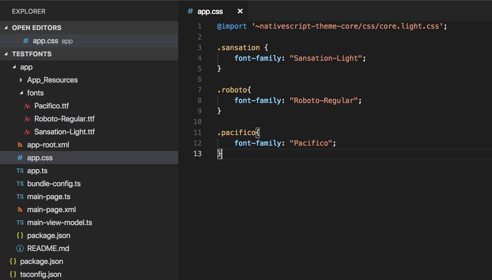

# User Interface Styling

You change the looks and appearance of views (elements) in a NativeScript application similarly to how you do it in a web application&mdash;using Cascading Style Sheets (CSS) or changing the style object of the elements in JavaScript. Only a subset of the CSS language is supported.

Similarly to the [DOM Style Object](http://www.w3schools.com/jsref/dom_obj_style.asp), each View instance exposes a **style** property, which holds all the style properties for the view. When the view is displayed, all its style properties are applied to the underlying native widget.


> **NOTE**: If you are using Angular with NativeScript, refer to the [Styling docs for NativeScript with Angular](https://docs.nativescript.org/angular/ui/styling).


> **NOTE**: If you are **not** using Angular with NativeScript, refer to the [Styling docs for NativeScript Core](https://docs.nativescript.org/ui/styling).


## Applying CSS Styles

The CSS styles can be set on 3 different levels:

* [Application-wide CSS](#application-wide-css): Applies to every application page

* [Page-specific CSS](#page-specific-css): Applies to the page's UI views


* [Component-specific CSS](#component-specific-css): Applies for component only

* [Inline CSS](#inline-css): Applies directly to a UI view

If there is CSS declared on different levels&mdash;all will be applied. The inline CSS will have the highest priority and the application CSS will have the lowest priority.

It is also possible to apply [platform-specific CSS](#platform-specific-css).

### Application-wide CSS

When the application starts, NativeScript checks if the file `app.css` exists. If it does, any CSS styles that it contains are loaded and used across all application pages. This file is a convenient place to store styles that will be used on multiple pages.

You can change the name of the file from which the application-wide CSS is loaded. You need to do the change before the application is started, usually in the app.js or app.ts file as shown below:


``` JavaScript
var application = require("tns-core-modules/application");
application.setCssFileName("style.css");

application.start({ moduleName: "main-page" });
```
``` TypeScript
import { setCssFileName, start as applicationStart } from "tns-core-modules/application";
setCssFileName("style.css");

applicationStart({ moduleName: "main-page" });
```

You could also check the name of the application-wide CSS file by using `getCssFileName()` method as shown below:

``` JavaScript
var application = require("tns-core-modules/application");
var fileName = application.getCssFileName();
console.log(`fileName ${fileName}`);

```
``` TypeScript
import { getCssFileName, start as applicationStart } from "tns-core-modules/application";
let fileName = getCssFileName();
console.log(`fileName ${fileName}`);

applicationStart({ moduleName: "main-page" });
```



```TypeScript
platformNativeScriptDynamic({ bootInExistingPage:false, cssFile:"style.css" });
```

> The path to the CSS file is relative to the application root folder.


### Page-specific CSS

When the page's XML declaration file is loaded, NativeScript looks for a CSS file with the same name (if such exists), reads any CSS styles that it finds, and automatically loads and applies them to the page. For example, a page named `mypage.xml` will automatically load any CSS in `mypage.css`. The CSS file must exist in the same folder as the XML file to be automatically applied.

If you import any [custom components](https://docs.nativescript.org/ui/basics#custom-components) on your page, the CSS from those components will be applied to the page, too. As a best practice, scope the CSS of custom components so that component styles do not "leak" on to pages.

```XML
<!-- myCustomComponent.xml -->
<StackLayout class="mywidget">
   <Label text="Custom component layout" class="label" />
</StackLayout>
```
```CSS
/* myCustomComponent.css */
/* GOOD: This will ONLY apply to the custom component */
.mywidget .label { 
    color: blue; 
}

/* BAD: This will apply to the custom component AND potentially to the page where the component is used */
.label { 
    color: blue; 
}
```

For an example of how styles from custom components get applied, [try this project on the NativeScript Playground](https://play.nativescript.org/?template=play-tsc&id=o87l19&v=52).

You can also override CSS styles specified in the file by using the page's `css` property:

```JavaScript
page.css = "button { color: red }";
```
```TypeScript
page.css = "button { color: red }";
```

After you have set the default CSS for the page, you can add to it using two methods:

1. Adding CSS from a string
2. Adding CSS from a file




### Component-specific CSS

In an Angular application everything is a component, therefore, it is a very common task to add some CSS code that should only apply to one component. Adding component-specific CSS in a NativeScript-Angular app involves using a component’s `styles` or `styleUrls` property.

```TypeScript
@Component({
    selector: 'list-test',
    styles: ['.third { background-color: lime; }'],
    template: ...
```

```TypeScript
@Component({
    selector: 'list-test',
    styleUrls: ['style.css'],
    template: ...
```

In each of these examples, the CSS rules will only apply to the declared component, and not other UI elements in the application.

> The `styles` and `styleUrls` will be applied even if the component is moved to another page within the application.



#### Adding CSS String

This snippet adds a new style to the current set of styles. This is quite useful when you need to add a small CSS chunk to an element (for example, for testing purposes):

``` JavaScript
page.addCss("button {background-color: blue}");
```
``` TypeScript
page.addCss("button {background-color: blue}");
```

#### Adding CSS File

This snippet adds new CSS styles to the current set. However, this method reads them from a file. It is useful for organizing styles in files and reusing them across multiple pages.

``` JavaScript
page.addCssFile(cssFileName);
```
``` TypeScript
page.addCssFile(cssFileName);
```

> The path to the CSS file is relative to the application root folder.

### Inline CSS

Similarly to HTML, CSS can be defined inline for a UI view in the XML markup:


```XML
<Button text="inline style" style="background-color: green;" />
```


```XML
<Button text="inline style" style="background-color: green;"></Button>
```


### Platform-specific CSS

NativeScript conventions make it easy to apply platform-specific CSS, either via separate stylesheets or via in-line declarations. For an overview of NativeScript's convention-based file name rules for targeting files at specific platforms and screen sizes, [refer to this article in the docs](https://docs.nativescript.org/core-concepts/navigation#supporting-multiple-screens).  **NOTE:** If you are using Angular, file name rules do not work for targeting specific screen sizes or orientations. JavaScript is required to target styles at different screens at runtime. [See this article](https://dzone.com/articles/tablet-support-for-nativescript-with-angular) for an example of targeting styles at tablets with Angular.

There are 4 primary ways to target styles at iOS or Android:

1. Platform-specific stylesheets (`styles.ios.css`, `styles.android.css`)(`styles.component.ios.css`, `styles.component.android.css`)
2. Platform-specific markup blocks (`<ios> ... </ios>`, `<android> ... </android>`)
3. Platform-specific attributes (`<Label ios:style="..." android:style="..."`)
4. Platform-specific CSS rules (`.ios .mystyle { ... }`, `.android .mystyle { ... }`) _[*requires plugin](https://market.nativescript.org/plugins/nativescript-platform-css)_

The most common and maintainable pattern for managing platform-agnostic and platform-specific styles in NativeScript is with multiple stylesheets and CSS imports. Use [this Playground demo](https://play.nativescript.org/?template=play-tsc&id=w9Lt96&v=2)[this Playground demo](https://play.nativescript.org/?template=play-ng&id=AlJP8U) to see this pattern in action.


With this pattern, a page has 3 separate stylesheets: common, iOS and Android. For example, for page `myPage.xml` you would have 3 stylesheets:

1. `myPage-common.css`
2. `myPage.ios.css`
3. `myPage.android.css`

In both `myPage.ios.css` and `myPage.android.css` you then import the shared common styles from `myPage-common.css`:

```CSS
/* Import shared style rules */
@import './myPage-common.css';

/* Add iOS/Android specific rules (if any) */
.mystyle { ... }
```


With this pattern, a page (or component) has 3 separate stylesheets: common, iOS and Android. For example, for page `home.component.html` you would have 3 stylesheets:

1. `home-common.css`
2. `home.component.ios.css`
3. `home.component.android.css`

In both `home.component.ios.css` and `home.component.android.css` you then import the shared common styles from `home-common.css`:

```CSS
/* Import shared style rules */
@import './home-common.css';

/* Add iOS/Android specific rules (if any) */
.mystyle { ... }
```


At build time, NativeScript will automatically import the common styles and choose the correct iOS or Android stylesheet depending on the target build platform.

## Supported Selectors

> Currently the CSS support is limited only to the selectors and properties listed in the current article.

NativeScript supports a subset of the [CSS selector syntax](http://www.w3schools.com/cssref/css_selectors.asp). Here is how to use the supported selectors:

* [Type selector](#type-selector)
* [Class selector](#class-selector)
* [ID selector](#id-selector)
* [Hierarchical selector](#hierarchical-selector-css-combinators)
* [Attribute selector](#attribute-selector)
* [Pseudo selector](#pseudo-selector)

### Type Selector
Like [CSS element selectors](http://www.w3schools.com/cssref/sel_element.asp), type selectors in NativeScript select all views of a given type. Type selectors are case insensitive, so you can use both `button` and `Button`.

```CSS
button { background-color: gray }
```

### Class Selector
[Class selectors](http://www.w3schools.com/cssref/sel_class.asp) select all views with a given class.
The class is set using the `className` property of the view.  **NOTE:**  To use `className` in JS/TS to add a class to an element, the class rule must be in a CSS file that is higher up the component tree than the element, such as `app.css`.


```CSS
.title { font-size: 32 }
```
```JavaScript
var label = new labelModule.Label();
label.className = "title"
```
```TypeScript
let label = new labelModule.Label();
label.className = "title"
```
```XML
<Label className="title" />
```


```CSS
.title { font-size: 32 }
```
```JavaScript
var label = new labelModule.Label();
label.className = "title"
```
```TypeScript
let label = new labelModule.Label();
label.className = "title"
```
```XML
<Label className="title" ></Label>
```


### ID Selector
[Id selectors](http://www.w3schools.com/cssref/sel_id.asp) select all views with a given id.
The id is set using the `id` property of the view.


```CSS
#login-button { background-color: blue }
```
```JavaScript
var btn = new buttonModule.Button();
btn.id = "login-button"
```
```TypeScript
var btn = new buttonModule.Button();
btn.id = "login-button"
```
```XML
<Button id="login-button" />
```


```CSS
#login-button { background-color: blue }
```
```JavaScript
var btn = new buttonModule.Button();
btn.id = "login-button"
```
```TypeScript
let btn = new buttonModule.Button();
btn.id = "login-button"
```
```XML
<Button id="login-button" ></Button>
```


### Hierarchical Selector (CSS Combinators)

A CSS selector could contain more than one simple selector, and between selectors a combinator symbol could be included.

* (space) - Descendant selector. For example, the following code will select all buttons inside StackLayouts (no matter) at which level.


```CSS
StackLayout Button { background-color: blue; }
```
```XML
<StackLayout>
    <WrapLayout>
        <Button id="login-button" testAttr='flower' />
    </WrapLayout>
</StackLayout>
```


```CSS
StackLayout Button { background-color: blue; }
```
```XML
<StackLayout>
    <WrapLayout>
        <Button id="login-button" testAttr='flower' ></Button>
    </WrapLayout>
</StackLayout>
```


* (>) - A direct child selector. Using the previous example, if the CSS is changed to:

```CSS
StackLayout > Button { background-color: blue; }
```

The `background-color` rule will not be applied. In order to apply the selector, the WrapLayout element would need to be removed so that the Button is a direct child of the StackLayout.

* (+) - An adjacent sibling selector, allows to select all elements, which are siblings of a specified element.

#### Direct Sibling Test by Class

```XML
<StackLayout class="layout-class">
    <Label text="Direct sibling test by id"/>
	<Button class="test-child" text="First Button"/>
	<Button class="test-child-2" text="Second Button"/>
</StackLayout>
```


```HTML
<StackLayout class="layout-class">
    <Label text="Direct sibling test by id"></Label>
	<Button class="test-child" text="First Button"></Button>
	<Button class="test-child-2" text="Second Button"></Button>
</StackLayout>
```


```CSS
.layout-class .test-child + .test-child-2 {
  background-color: green;
}
```
#### Direct Sibling Test by ID

```XML
<StackLayout class="layout-class">
    <Label text="Direct sibling test by id"/>
	<Button id="test-child" text="First Button"/>
	<Button id="test-child-2" text="Second Button"/>
</StackLayout>
```


```HTML
<StackLayout class="layout-class">
    <Label text="Direct sibling test by id"></Label>
	<Button id="test-child" text="First Button"></Button>
	<Button id="test-child-2" text="Second Button"></Button>
</StackLayout>
```


```CSS
.layout-class #test-child + #test-child-2 {
  background-color: green;
}
```
#### Direct Sibling by Type


```XML
<StackLayout class="direct-sibling--type">
    <Label text="Direct sibling by type"/>
    <Button text="Test Button"/>
    <Label text="Test Label"/>
    <Button text="Test Button"/>
    <Label text="Test Label"/>
    <Button text="Test Button"/>
    <Label text="Test Label"/>
</StackLayout>
```


```HTML
<StackLayout class="direct-sibling--type">
    <Label text="Direct sibling by type"></Label>
    <Button text="Test Button"></Button>
    <Label text="Test Label"></Label>
    <Button text="Test Button"></Button>
    <Label text="Test Label"></Label>
    <Button text="Test Button"></Button>
    <Label text="Test Label"></Label>
</StackLayout>
```


```CSS
StackLayout Button + Label{
    background-color:green;
    color:white;
}
```

### Attribute Selector


```CSS
button[testAttr]{ background-color: blue; }
```
```XML
<Button testAttr="flower" />
```


```CSS
button[testAttr]{ background-color: blue; }
```
```XML
<Button testAttr="flower" ></Button>
```


This selector will select all buttons that have the attribute `testAttr` with some value.

Also, some more advanced scenarios are supported:

* button[testAttr='flower'] {...} - Will apply CSS on every button that has the `testAttr` property set exactly to the value `flower`.
* button[testAttr~='flower'] {...} - Selects all buttons with a `testAttr` property that contains a space-separated list of words, one of which is "flower".
* button[testAttr|='flower'] {...} - Selects all buttons with a `testAttr` property value that begins with "flower". The value has to be a whole word, either alone like `btn['testAttr'] = 'flower'`, or followed by hyphen (-), like `btn['testAttr'] = 'flower-house'`.
* button[testAttr^='flower'] {...} - Selects all buttons with a `testAttr` property value that begins with "flower". The value does not have to be a whole word.
* button[testAttr$='flower'] {...} - Selects all buttons with a `testAttr` property value that ends with "flower". The value does not have to be a whole word.
* button[testAttr*='flo'] {...} - Selects all buttons with a `testAttr` property value that contains "flo". The value does not have to be a whole word.

Attribute selectors could be used alone or could be combined with all type of CSS selectors. 


```CSS
#login-button[testAttr='flower'] { background-color: blue; }
[testAttr] {color: white;}
```
```XML
<Button id="login-button" testAttr='flower' />
<Label testAttr="some value" />
```


```CSS
#login-button[testAttr='flower'] { background-color: blue; }
[testAttr] {color: white;}
```
```XML
<Button id="login-button" testAttr='flower' ></Button>
<Label testAttr="some value" ></Label>
```


### Pseudo Selector
A pseudo-selector or also pseudo-class is used to define a special state of an element.
Currently, NativeScript supports only `:highlighted` pseudo-selector.



```CSS
button:highlighted { background-color: red; color: gray;}
```
```XML
<Button testAttr='flower' />
```


## Supported CSS Properties

This list of properties can be set in CSS or through the style property of each view:

| CSS Property          | JavaScript Property   | Description     |
|:----------------------|:----------------------|:----------------|
| `color`               | `color`               | Sets a solid-color value to the matched view’s foreground. |
| `background`          | `background`          | Sets a solid-color value or [a linear gradient](https://docs.nativescript.org/cookbook/ui/styling) to the matched view’s background. |
| `background-color`    | `backgroundColor`     | Sets a solid-color value to the matched view’s background. |
| `placeholder-color`   | `placeholderColor`    | Sets the placeholder (hint) font color to matched views. |
| `background-image`    | `backgroundImage`     | Sets a image url to the matched view’s background image. |
| `background-repeat`   | `backgroundRepeat`    | Sets if/how the background image should be repeated. Possible values: `repeat`, `repeat-x`, `repeat-y`, `no-repeat` |
| `background-position` | `backgroundPosition`  | Sets the starting position of the background image. You can set the position with absolute, percent or alignment values. More info [here](http://www.w3schools.com/cssref/pr_background-position.asp). |
| `background-size`     | `backgroundSize`      | Sets the size of the background image. Possible values: "*length length*", "*percent% percent%*", "cover" or "contain". |
| `border-color`        | `borderColor`         | Sets border colors to the matched view’s. |
| `border-top-color`        | `borderTopColor`         | Sets a top border color to the matched view’s. |
| `border-right-color`        | `borderRightColor`         | Sets a right border color to the matched view’s. |
| `border-bottom-color`        | `borderBottomColor`         | Sets a bottom border color to the matched view’s. |
| `border-left-color`        | `borderLeftColor`         | Sets a left border color to the matched view’s. |
| `border-width`        | `borderWidth`         | Sets border widths to the matched view’s. |
| `border-top-width`        | `borderTopWidth`         | Sets a top border width to the matched view’s. |
| `border-right-width`        | `borderRightWidth`         | Sets a right border width to the matched view’s. |
| `border-bottom-width`        | `borderBottomWidth`         | Sets a bottom border width to the matched view’s. |
| `border-left-width`        | `borderLeftWidth`         | Sets a left border width to the matched view’s. |
| `border-radius`       | `borderRadius`        | Sets a border radius to the matched view’s. |
| `font`                | `font`                | Sets the font properties (this includes `font-family`, `font-size`, `font-style` and `font-weight`)  of the matched view. |
| `font-family`         | `fontFamily`          | Sets the font family of the matched view. |
| `font-size`           | `fontSize`            | Sets the font size of the matched view (only supports device-independent units). |
| `font-style`          | `fontStyle`           | Sets the font style of the matched view. Possible values: `italic`, `normal`. |
| `font-weight`         | `fontWeight`          | Sets the font weight of the matched view Possible values: `bold`, `normal` OR `100`,`200`,`300`,`400`,`500`,`600`,`700`,`800`,`900`, where `400` is `normal` and `700` is `bold` (NOTE: Some fonts do not support all available variants) |
| `text-align`          | `textAlignment`       | Sets text alignment in the matched view. Possible values: `left` , `center`, `right`. |
| `text-decoration`     | `textDecoration`      | Sets the text formatting. Possible values: `none`, `line-through`, `underline`. |
| `text-transform`      | `textTransform`       | Sets the text transform. Possible values: `none`, `capitalize`, `uppercase`, `lowercase`. |
| `letter-spacing`      | `letterSpacing`       | Sets the text letter spacing. (On Android API Level 21 and above.) |
| `line-height`         | `lineHeight`          | Sets the text line height |
| `z-index`             | `zIndex`              | Sets the z-index. (On Android API Level 21 and above.) |
| `clip-path`           | `clip-path`           | Sets the clip-path. Supported shapes are circle, ellipse, rect and polygon. You can define your own shape using [clippy](http://bennettfeely.com/clippy/)  |
| `vertical-align`      | `verticalAlignment`   | Sets the vertical alignment of the current view within its parent. Possible values: `top`, `center`, `bottom`, `stretch`. |
| `horizontal-align`    | `horizontalAlignment` | Sets the horizontal alignment of the current view within its parent. Possible values: `left`, `center`, `right`, `stretch`. |
| `margin`              | `margin`              | Sets the margin of the view within its parent. |
| `margin-top`          | `marginTop`           | Sets the top margin of the view within its parent. |
| `margin-right`        | `marginRight`         | Sets the right margin of the view within its parent. |
| `margin-bottom`       | `marginBottom`        | Sets the bottom margin of the view within its parent. |
| `margin-left`         | `marginLeft`          | Sets the left margin of the view within its parent. |
| `width`               | `width`               | Sets the view width. |
| `height`              | `height`              | Sets the view height. |
| `min-width`           | `minWidth`            | Sets the minimal view width. |
| `min-height`          | `minHeight`           | Sets the minimal view height. |
| `padding`             | `padding`             | Sets the distance between the boundaries of the layout container and its children. |
| `padding-top`         | `paddingTop`          | Sets the top padding of a layout container. |
| `padding-right`       | `paddingRight`        | Sets the right padding of a layout container. |
| `padding-bottom`      | `paddingBottom`       | Sets the bottom padding of a layout container. |
| `padding-left`        | `paddingLeft`         | Sets the left padding of a layout container. |
| `visibility`          | `visibility`          | Sets the view visibility. Possible values: `visible`, `collapse` (or `collapsed`). |
| `opacity`             | `opacity`             | Sets the view opacity. The value is in the [0, 1] range. |

## NativeScript Specific CSS Properties

In the context of mobile development, there are a number of properties that are mobile specific (and sometimes even platform specific e.g Android or iOS). In NativeScript, these featured properties are still accessible through both the code (inline, JavaScript, and TypeScript) but are also exposed as CSS properties. Apart from the API references, the below list is providing most of the non-common CSS properties in NativeScript.

| CSS Property          | JavaScript Property   | Platform   | Compatibility  | Description | 
|:----------------------|:----------------------|:-----------|:---------------|:------------|
| `selected-tab-text-color`  | `selectedTabTextColor`     | Both       | `TabView`      | Sets the color of the text, while selecting some of the tabs. |
| `tab-background-color`  | `tabBackgroundColor`     | Both       | `TabView`      | Sets the background color of the tabs. |
| `tab-text-font-size`  | `tabTextFontSize`     | Both       | `TabView`      | Sets the tab titles font size, without changing the font size of all contents of the tab. |
| `text-transform`  | `textTransform`     | Both       | `TabViewItem`      | Sets the text transform individually for every `TabViewItem`. Value options: `capitalize`, `lowercase`, `none`, and `uppercase`. |
| `android-selected-tab-highlight-color`  | `androidSelectedTabHighlightColor`     | **Android**       | `TabView`      | Sets the underline color of the tabs in Android. |

## Supported Measurement Units

NativeScript supports **DIPs** (Device Independent Pixels), **pixels** (via postfix `px`) and **percentages** (partial support for `width`, `height` and `margin`) as measurement units.

NativeScript's recommended measurement unit is DIP. All measurable properties like `width`, `height`, `margin`, `paddings, border-width`, etc.) support device independent pixels. The font sizes are always measured in DIPs. 

```CSS
.myLabel {
    font-size: 28;
    width: 200;
    height: 30;
}
```

The device independent pixels (DIPs) are equal to the device screen's pixels divided by the device screen scale (density).

```JavaScript
const screen = require("tns-core-modules/platform").screen;

// mainScreen is of type ScreenMetrics interface https://docs.nativescript.org/api-reference/interfaces/_platform_.screenmetrics
let scale =  screen.mainScreen.scale; 
let widthPixels = screen.mainScreen.widthPixels;
let heightPixels = screen.mainScreen.heightPixels;
let widthDIPs = screen.mainScreen.widthDIPs; // DIPs === pixels/scale (e.g 1024 pixels / 2x scale = 512 DIPs)
let heightDIPs = screen.mainScreen.heightDIPs; 
```
```TypeScript
import { screen } from "tns-core-modules/platform";

// mainScreen is of type ScreenMetrics interface https://docs.nativescript.org/api-reference/interfaces/_platform_.screenmetrics
let scale =  screen.mainScreen.scale; 
let widthPixels = screen.mainScreen.widthPixels;
let heightPixels = screen.mainScreen.heightPixels;
let widthDIPs = screen.mainScreen.widthDIPs; // DIPs === pixels/scale (e.g. 1024 pixels / 2x scale = 512 DIPs)
let heightDIPs = screen.mainScreen.heightDIPs; 
```

NativeScript supports **percentage** values for `width`, `height` and `margins`. When a layout pass begins, first the percent values are calculated based on parent available size. This means that on vertical StackLayout if you place two Buttons with `height='50%'` they will get all the available height (e.g., they will fill the StackLayout vertically.). The same applies for `margin` properties. For example, if you set `marginLeft = '5%'`, the element will have a margin that corresponds to 5% of the parent's available width.

## Accessing NativeScript component properties with CSS

You can set NativeScript component properties value that are not part of the CSS specification. For example:
```CSS
StackLayout {
   orientation: horizontal;
}
```

This feature is limited to properties with simple types like string, number and boolean, and will set a local property value similar to component markup declaration in XML. CSS inheritance is not supported. 

## Using fonts
The `font-family` property can hold several values. The first supported font in the list will be used. There is also support for the following generic font-families:
* serif (ex. Times New Roman)
* sans-serif (ex. Helvetica)
* monospace (ex. Courier New)

Platform specifics:
* Android: The supported fonts depend very much on the system, thus using the generic font-families or [custom-fonts](#custom-fonts) is recommended.
* iOS: There are more than 30 default fonts available on iOS. You can check the [supported fonts for specific iOS versions and devices](http://iosfonts.com). To use a built-in font, simply specify the font name in the `font-family` property, such as `font-family: "American Typewriter";`. Adjust the font variant using the [`font-weight`](#supported-css-properties) property.

### Custom fonts
You can use custom fonts in your app (in .TTF or .OTF format). 
The NativeScript runtime will look for the font files under the `app/fonts/` (or `src/fonts/` if you use Angular) directory and load them automatically.



> Note: In iOS your font file should be named **exactly** as the font name. 
If you have any doubt about the original font name, use the [Font Book](https://support.apple.com/en-us/HT201749) app to get the original font name.

## Import CSS
The @import CSS rule allows you to import CSS from a local file. This rule must precede all other types of rules.

```CSS
@import url('~/your-style.css');
```

## Using SASS
With NativeScript, it is possible to manage your app styles using the SASS CSS pre-compiler instead of plain CSS files. Just as with web projects, SASS gives your stylesheets extra capabilities like shared variables, mixins and nested style tags.

To use SASS with NativeScript, the `nativescript-dev-sass` plugin is required. This plugin will hook-in to the NativeScript build process and automatically convert `.scss/.sass` files to `.css` during `build` and `livesync` operations. Since SASS is compiled to CSS at build time, it does **not** require any changes to your stylesheet naming conventions for NativeScript's normal convention-based patterns to work. SASS files with the same name as a NativeScript page will still be automatically linked.

For complete details on adding SASS support to a NativeScript project, [see this page in the Theme docs](https://docs.nativescript.org/ui/theme#sass-usage).
