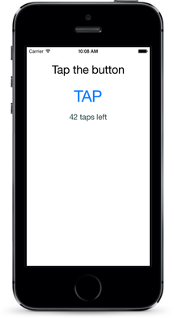

# Getting Started With NativeScript
NativeScript framework enable developers to use pure JavaScript language to build native mobile applications running on the major mobile platforms - Apple iOS, Google Android. The applications UI stack is built using native UI components and because of that no compromises with the User Experience of the applications are done.

## How It Works
The native script architectures can be generally explained with this diagram:


* **Native OS** - At the bottom level is the native OS (Android, iOS and soon Windows).
* **NativeScript runtime** runs the JavaScript code of your application. The runtime also provides a way to call all the native APIs of the platform the app is running on. This means that you have access to all the native capabilities of the platform.
* **NativeScript Modules** are a set of platform-agnostic libraries that are build on top of the runtime. These modules are wrap the platform specific code, providing a common API.
* **Application Code** - your application's code. Building an application on top of the NativeScript modules means that you will not have write platform-specific code. This should be the case most of the time. However, you still have the option to reach the native API trough the NativeSctipt runtime.

## Requirements
Currently NativeScript can run on the following platforms:

* Android 4.2+ (equivalent to Android API level 17+)
* iOS 7.1+

For NativeScript development you have the following options:

* Using the [NativeScript Command-Line Interface](https://github.com/NativeScript/nativescript-cli)
with a IDE or text editor of your choice.
* Using [AppBuilder](http://docs.telerik.com/platform/appbuilder/nativescript/index) where you have all the features of [Telerik Platform](http://www.telerik.com/platform) at your disposal.

## Example
In the following example we will start with a empty NativeScript project and build a simple hello word sample application.

### Creating Blank Project
Let's start by creating a blank project. As we mentioned you can either use the [NativeScript CLI](https://github.com/NativeScript/nativescript-cli) or NativeScript Blank project template in AppBuilder(available for JavaScript or TypeScript).
Form here on we will be working in the `App` folder inside the project.

### Adding UI
The project we just created has a single empty page. The UI of the page is defined declaratively in the 'main-page.xml' file. In the project there are also `main-page.js` (or `main-page.ts`) and `main-page.css` files that will hold applications code and styles for this page.

Let's add some UI in `main-page.xml`:
```XML
<?xml version="1.0" encoding="UTF-8" ?>
<Page>
  <StackPanel>
    <Label text="Tap the button" style="horizontal-align: center"/>
    <Button text="TAP" />
    <Label text="message" textWrap="true" style="horizontal-align: center"/>
  </StackPanel>
</Page>
```
We have added a title label, a button and a message label that we are going to use in the next section.
Here is the result:


*Note: UI declaration is covered in depth in the [UI with XML](ui-with-xml.md) article.*

### Creating a View-Model
[MVVM](http://en.wikipedia.org/wiki/Model_View_ViewModel) pattern is the preferred approach when developing mobile applications with NativeScript. In this section we will create and bind a view-model to the page we already have.
The view-model will hold simple counter which will be used to update a message each time the user taps on the button.  

Create a `view-models` folder and `main-view-model.js` ( or `main-view-model.ts` if you are using TypeScript) file in it:
``` JavaScript
var observable = require("data/observable");

var counter = 42;
var mainViewModel = new observable.Observable();
mainViewModel.set("message", counter + " taps left");
mainViewModel.tapAction = function () {
    counter--;
    if (counter <= 0) {
        mainViewModel.set("message", "Hoorraaay! You unlocked the NativeScript clicker achievement!");
    }
    else {
        mainViewModel.set("message", counter + " taps left");
    }
};
exports.mainViewModel = mainViewModel;
```
``` TypeScript
import observable = require("data/observable");

export class HelloWorldModel extends observable.Observable {
    private counter: number;
    constructor() {
        super();

        this.counter = 42;
        this.set("message", this.counter + " taps left");
    }

    public tapAction() {
        this.counter--;
        if (this.counter <= 0) {
            this.set("message", "Hoorraaay! You unlocked the NativeScript clicker achievement!");
        }
        else {
            this.set("message", this.counter + " taps left")
        }
    }
}
export var mainViewModel = new HelloWorldModel();
```

The view-model is an instance of `Observable` type so that the UI can receive notification whenever the `message` property is set.

Now that we have the main-view-model we will set it as a `bindingContext` of the main-page. We will do this by handling the `pageLoaded` event:

main-page.xml:
```XML
<Page loaded="pageLoaded"/>
    ...
</Page>
```

main-page.js (or main-page.ts):
```JavaScript
var vmModule = require("./view-models/main-view-model");
function pageLoaded(args) {
    var page = args.object;
    page.bindingContext = vmModule.mainViewModel;
}
exports.pageLoaded = pageLoaded;

```
```TypeScript
import observable = require("data/observable");
import pages = require("ui/page");
import vmModule = require("./view-models/main-view-model");

// Event handler for Page "loaded" event attached in main-page.xml
export function pageLoaded(args: observable.EventData) {
    // Get the event sender
    var page = <pages.Page>args.object;
    page.bindingContext = vmModule.mainViewModel;
}
```

The last thing we need to do is to bind the UI elements in the XML to the view-model:
main-page.xml
``` XML
<?xml version="1.0" encoding="UTF-8" ?>
<Page loaded="pageLoaded">
  <StackPanel>
    <Label text="Tap the button" style="horizontal-align: center"/>
    <Button text="TAP" tap="{{ tapAction }}"/>
    <Label text="{{ message }}" textWrap="true" style="horizontal-align: center"/>
  </StackPanel>
</Page>
```

Here is the result:


We used data-binding for the `tap` event of the button and the `text` of the message-label.
*Note: Binding is covered in depth in the [Data Binding](bindings.md) article.*

### Adding Styles
The final step in this tutorial will be to style the application. Styling in NativeScript is done with a subset of the CSS syntax.
For each page, the NativeScript runtime will automatically load and apply the CSS file that has the same name as the XML file for the page.

We will add the CSS in `main-page.css`:
```CSS
.title {
    font-size: 30;
    horizontal-align: center;
    margin:20;
}

button {
    font-size: 42;
    horizontal-align: center;
}

.message {
    font-size: 20;
    color: #284848;
    margin:10 40;
    horizontal-align: center;
}
```

Finally - replace the inline styles in the `main-page.xml` with `cssClass` attribute, so that the CSS classes we defined are applied:
```XML
<?xml version="1.0" encoding="UTF-8" ?>
<Page loaded="pageLoaded">
  <StackPanel>
    <Label text="Tap the button" cssClass="title"/>
    <Button text="TAP" tap="{{ tapAction }}" />
    <Label text="{{ message }}" cssClass="message" textWrap="true"/>
  </StackPanel>
</Page>
```

Here is the result:


*Note: CSS Styling is covered in depth in the [Styling](styling.md) article.*

## Next Steps
Read the advanced topics below or refer to the [Api Reference](ApiReference/) to continue wit NativeScript development:

* [Application](application-management.md)
* [Navigation](navigation.md)
* [Layouts](layouts.md)
* [Styling](styling.md)
* [Binding](bindings.md)
* [UI with XML](ui-with-xml.md)
* [UI Views](ui-views.md)
* [UI Dialogs](ui-dialogs.md)
* [Location](location.md)
* [Modules](modules.md)
