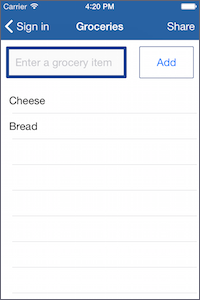
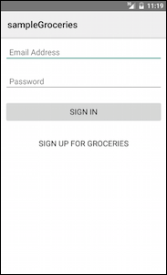
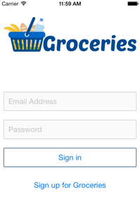
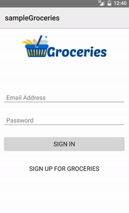
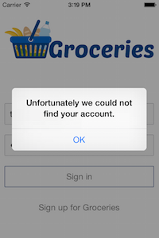

<style>
	/* Style the code exercise boxes */
	.exercise {
		border: 1px solid #ccc;
		border-radius: 0.3em;
		margin-bottom: 1em;
	}
	.exercise p, .exercise pre {
		margin-left: 1em;
		margin-right: 1em;
	}
	.exercise h4 {
		margin-top: 0;
		padding: 0.8em;
		border-bottom: 1px solid #eee;
		font-size: 1.1em;
	}

	/* Style the copy-to-clipboard buttons */
	.prettyprint {
		position: relative;
		overflow: visible;
	}
	.copy-button {
		position: absolute;
		top: -1.5em;
		right: 0;
		height: 1.5em;
		padding: 0 0.5em;
		background: #fbfdfe;
		border: 2px solid #dbe3e4;
		border-width: 1px 1px 0 1px;
		font-size: 1.3em;
	}
	.copy-button:active, .copy-button:focus {
		background: #5854F8;
		outline: 0;
	}
	.copy-button:active .typ, .copy-button:focus .typ {
		color: white;
	}

	/* Add the section counters */
	body {
		counter-reset: h2counter -1;
	}
	#page-article h2 {
		counter-reset: h3counter -1;
	}
	#page-article h2::before {
		content: counter(h2counter) ".\0000a0\0000a0";
		counter-increment: h2counter;
	}
	#page-article h3::before {
		content: counter(h2counter) "." counter(h3counter) ".\0000a0\0000a0";
		counter-increment: h3counter;
	}

	/* Account for the different nav */
	#page-nav {
		padding: 45px 20px 60px 4px;
	}
	#page-nav > ul > li > a {
		color: #141e2f;
		font-weight: bold;
	}
	#page-nav > ul > li > ul a {
		color: #556;
	}
</style>

## NativeScript Getting Started Guide

Welcome to the [NativeScript](https://nativescript.org) getting started guide. In this guided tutorial you'll use NativeScript, a cross-platform JavaScript framework for building native mobile apps, to build an iOS and Android app from scratch.

> **Note**: If you'd prefer a video introduction to NativeScript, check out our [getting started guide on YouTube](https://www.youtube.com/watch?v=rsCT5fpES4Q).

### What you're building

This guide will walk you through building [Groceries](https://github.com/NativeScript/sample-Groceries), a groceries-management app that does the following things:

- Connects to an existing RESTful service.
- Allows users to register and login.
- Allows authenticated users to add and delete groceries from a list.
- Runs cross-platform—i.e. iOS and Android.

If you follow along to the end, here's what the finished app will look like on iOS:




And here's what the app will look like on Android:


## Getting up and running

In this chapter you're going to start with the basics, including installing the NativeScript CLI, starting a new project, and getting your first app up and running.

### Install NativeScript and configure your environment

The NativeScript CLI has a few system requirements you must have in place before building NativeScript apps. As a first step, start by going through the appropriate instructions below depending on your development machine's operating system:

- [Windows](http://docs.nativescript.org/setup/ns-cli-setup/ns-setup-win.html)
- [OS X](http://docs.nativescript.org/setup/ns-cli-setup/ns-setup-os-x.html)
- [Linux](http://docs.nativescript.org/setup/ns-cli-setup/ns-setup-linux.html)

> **Tip**: If you're a bit overwhelmed by these requirements, or if you're looking for a way to build iOS apps on Windows, you might be interested in [using NativeScript through Telerik AppBuilder](http://docs.nativescript.org/setup/quick-setup#the-appbuilder-tool-set). Telerik AppBuilder provides tooling for NativeScript apps, including the ability to perform iOS and Android builds in the cloud, which removes the need to complete these system requirements.

After completing the setup you should have two commands available from your terminal: `tns`—which is short for <b>T</b>elerik <b>N</b>ative<b>S</b>cript—and `nativescript`. The two commands are equivalent, so we'll stick with the shorter `tns` command throughout this guide.

You can verify the installation was successful by running `tns` in your terminal. You should see something like this:

```
$ tns
# NativeScript
┌─────────┬─────────────────────────────────────────────────────────────────────┐
│ Usage   │ Synopsis                                                            │
│ General │ $ tns <Command> [Command Parameters] [--command <Options>]          │
│ Alias   │ $ nativescript <Command> [Command Parameters] [--command <Options>] │
└─────────┴─────────────────────────────────────────────────────────────────────┘
```

### Start your app

With the NativeScript CLI installed, it's time to start building your app. Normally, you would [use the `tns create` command to create an empty NativeScript application](https://github.com/NativeScript/NativeScript-cli#create-project)—e.g. `tns create hello-world`—but for this guide we've scaffolded out a boilerplate project to act as a starting point for [Groceries](https://github.com/NativeScript/sample-Groceries).

<h4 class="exercise-start">
    <b>Exercise</b>: Get the Groceries starting point
</h4>

Navigate to a folder where you want to keep your app's code:

<div class="no-copy-button"></div>

```
cd the-folder-you-want-groceries-to-be-in
```

Next, clone the Groceries repo from GitHub:

```
git clone https://github.com/NativeScript/sample-Groceries.git
```

After that, change into the newly cloned repo's folder:

```
cd sample-Groceries
```

The master branch has the final state of the Groceries app. Feel free to [refer back to it](https://github.com/NativeScript/sample-Groceries) at any time, but for now, switch over to the “start” branch for this guide's starting point:

```
git checkout start
```

<div class="exercise-end"></div>

### Add target development platforms

Your app is now setup, but before you run it, you need to initialize a platform-specific native project for each platform you intend to target—i.e. iOS and Android.

<h4 class="exercise-start">
    <b>Exercise</b>: Add the iOS and Android platforms
</h4>

If you're on a Mac, start by adding the iOS platform:

```
tns platform add ios
```

Next, add the Android platform with the same `platform add` command:

```
tns platform add android
```

<div class="exercise-end"></div>

>**Note:** You can only add platforms for SDKs that you already have installed on your development machine. If you get errors running `tns platform add`, refer back to the section on [setting up your development environment](#install-nativescript-and-configure-your-environment).

The `platform add` command adds a folder called `platforms` to your project, and copies all of the required native SDKs into this folder. When you eventually build the application, the NativeScript CLI will copy your application code into the `platforms` folder so that a native binary can be created.

### Running your app

With the platform initialization complete, you can now run your app in an emulator or on devices.

<h4 class="exercise-start">
    <b>Exercise</b>: Run your app
</h4>

If you're on a Mac, start by running the app in an iOS simulator with the following command:

```
tns run ios --emulator
```

If all went well, you should see something like this:


Likewise, you can run your app in the Android emulator with the following command:

```
tns run android --emulator
```

> **Warning**: You must have at least one Android AVD (Android Virtual Device) configured for this command to work. If you get an error, try [setting up an AVD](https://www.genymotion.com/#!/) and then run the command again.

If all went well, you should see your app running in an Android emulator:


<div class="exercise-end"></div>

Here are a few other tips for running NativeScript apps.

> **Tips**:
> * 1) To run on a USB-connected Android or iOS device, use the same `run` command with the `--emulator` flag omitted—i.e. `tns run android` and `tns run ios`.
> * 2) NativeScript supports running NativeScript apps in [Genymotion](https://www.genymotion.com/#!/) emulators. To deploy to a Genymotion virtual device, launch your Genymotion virtual device and run `tns run android`.
> * 3) The `tns device` command list all USB-connected iOS devices, USB-connected Android devices, and Genymotion virtual devices that `tns run` can deploy to. Note that `tns device` does not list iOS simulators or Android AVDs.

### Development workflow

At this point, you have the NativeScript CLI downloaded and installed, as well as the iOS and Android dependencies that you need to run your app. Now you need a good workflow that lets you make changes and see results fast.

The simplest way to see your changes is to execute `tns run ios` or `tns run android` after you save files. To see this action, let's make a trivial update to your app.

<h4 class="exercise-start">
    <b>Exercise</b>: Your first NativeScript change
</h4>

If your previous `tns run ios` or `tns run android` task is still running, type `Ctrl` + `C` in your terminal to kill it.

Open your app's `app/views/login/login.xml` file in your text editor of choice and change `<Label text="hello world" />` to `<Label text="hello NativeScript" />`.

Return to your terminal and run either `tns run ios --emulator` (if you're on a Mac), or `tns run android --emulator`. You should see the app relaunch and the updated text displayed.

<div class="exercise-end"></div>

As you might have noticed, the `tns run` command blocks your terminal while your app is running (it's the task you had to use `Ctrl` + `C` to kill). The `tns run` command sticks around because the task is a console of sorts. The task shows both the output of `console.log()` statements as your app executes, as well as stack traces when things go wrong. So if your app crashes at any time during this guide, look to the terminal for a detailed report of the problem.

The iOS and Android logs can be a bit noisy, so you might have to scroll up a bit to find the actual problem. For instance if I try to call `foo.bar()` when `foo` does not exist, here's the pertinent information I get on iOS:

```
/app/path/to/file.js:14:8: JS ERROR ReferenceError: Can't find variable: foo
1   0xe3dc0 NativeScript::FFICallback<NativeScript::ObjCMethodCallback>::ffiClosureCallback(ffi_cif*, void*, void**, void*)
```

And here's the same information in the Android logs:

```
E/TNS.Native( 2063): ReferenceError: foo is not defined
E/TNS.Native( 2063): File: "/data/data/org.nativescript.groceries/files/app/./views/login/login.js, line: 13, column: 4
```

> **Tip**: When you're trying to debug a problem, you can also try adding `console.log()` statements in your JavaScript code—exactly as you would in a browser-based application.

If you find continuously running `tns run` from the terminal to be a bit manual, you may be interested in trying one of the following workflows:

* The `tns livesync` command instantly transfers XML, CSS, and JavaScript files to a running NativeScript app. If you set the command's `--watch` flag (`tns livesync ios --emulator --watch` or `tns livesync android --emulator --watch`), the NativeScript CLI will watch your app for changes, and apply those changes automatically after you save files. Be warned, however, that the `livesync` command currently does not show `console.log()` output or stack traces. So during debugging you may want to switch back to `tns run`.
* For Sublime Text users, [this build script](http://developer.telerik.com/featured/a-nativescript-development-workflow-for-sublime-text/) lets you type `Cmd`/`Ctrl` + `B` to start a build without returning to the terminal. (This is the workflow the authors of this guide use.)
* Emil Öberg's [nativescript-emulator-reload npm module](https://github.com/emiloberg/nativescript-emulator-reload) adds a Gulp watcher that relaunches an emulator after every change you make.

Now that you have created an app, configured your environment, and setup your app to run on iOS and Android, you're ready to start digging into code.

## Building the UI

Before you start coding the Groceries app it's important to understand a NativeScript app's folder structure. It'll help you understand where to place new files, as well as a bit of what's going with NativeScript on under the hood.

Go ahead and open your app's `sample-Groceries` folder up in your text editor of choice and let's dig in.

### Directory structure

To keep things simple, let's start by looking at the outer structure of the Groceries app:

```
.
└── sample-Groceries
    ├── app
    │   └── ...
    ├── package.json
    └── platforms
        ├── android
        └── ios
```

Here's what these various files and folders do:

- **app**: This folder contains all the development resources you need to build your app. You'll be spending most of your time editing the files in here.
- **package.json**: This file contains configuration about your app, such as your app id, the version of NativeScript you're using, and also which npm modules your app uses. We'll take a closer look at how to use this file when we talk about using npm modules in [chapter 5](#plugins-and-npm-modules).
- **platforms**: This folder contains the platform-specific code NativeScript needs to build native iOS and Android apps. For instance in the `android` folder you'll find things like your project's `AndroidManifest.xml` and .apk executable files. Similarly, the `ios` folder contains the Groceries' Xcode project and .ipa executables.

The NativeScript CLI manages the `platforms` folder for you as you develop and run your app; therefore it's a best practice to treat the `platforms` folder as generated code. The Groceries app includes the `platforms` folder in its `.gitignore` to exclude its files from source control.

Next, let's dig into the ```app``` folder, as that's where you'll be spending the majority of your time.

```
.
└── sample-Groceries
    ├── app
    │   ├── App_Resources
    │   │   ├── Android
    │   │   └── iOS
    │   ├── shared
    │   │   └── ...
    │   ├── tns_modules
    │   │   └── ...
    │   ├── views
    │   │   └── login
    │   │       ├── login.js
    │   │       └── login.xml
    │   ├── app.css
    │   ├── app.js
    │   └── ...
    └── ...
```

Here's what these various files and folders do:

- **App_Resources**: This folder contains platform-specific resources such as icons, splash screens, and configuration files. The NativeScript CLI takes care of injecting these resources into the appropriate places in the `platforms` folder when you execute `tns run`.
- **shared**: This folder contains any files you need to share across views in your app. In the Groceries app, you'll find a few view model objects and a `config.js` file used to share configuration variables like API keys.
- **tns_modules**: This folder contains the NativeScript-provided modules you'll use to build your app. Each module contains the platform-specific code needed to implement some feature—the camera, http calls, the file system, and so forth—exposed through a platform-agnostic API (e.g. ```http.getJSON()```). We'll look at some examples momentarily.
- **views**: This folder contains the code to build your app's views, each of which will have a subfolder in `views`. Each view is made up of an XML file, a JavaScript file, and an optional CSS file. The groceries app contains three folders for its three views.
- **app.css**: This file contains global styles for your app. We'll dig into app styling in [section 2.3](#css).
- **app.js**: This file sets up your application's starting module and initializes the app.

Let's start with `app/app.js`, as it's the starting point for NativeScript apps. Your `app.js` contains the three lines below: 

```
var applicationModule = require("application");
applicationModule.mainModule = "./views/login/login";
applicationModule.start();
```

Here, you're requiring, or importing, the [NativeScript application module](http://docs.nativescript.org/ApiReference/application/HOW-TO). Then, you set its `mainModule`, or the starting screen of your app to be the login screen, which lives in your app's `views/login` folder.

> **Tip**: JavaScript modules in NativeScript follow the [CommonJS specification](http://wiki.commonjs.org/wiki/CommonJS). This means you can use the [`require()` method](http://wiki.commonjs.org/wiki/Modules/1.1#Module_Context) to import modules, as is done above, as well as use the `export` keyword to expose a module's properties and methods, which we'll look at later in this chapter. These are the same constructs Node.js uses for JavaScript modules, so if you already know how to use Node.js modules, you already know how to use NativeScript modules!

Now that your app is ready for development, let's add some UI components to make your login screen show more than some basic text.

### Adding UI components

Let's dig into the files used to create your app's UI, which reside in the `app/views` folder. Each folder in `app/views` contains the code for one of the three pages in Groceries: `list`, `login`, and `register`. If you look in the `app/views/login` folder, you'll see three files: `login.css`, `login.js`, and the `login.xml` file we updated in the previous chapter. If you open `login.xml` again you should see the following code:

```
<Page>
    <Label text="hello NativeScript" />
</Page>
```

This page currently contains two UI components: a `<Page>` and a `<Label>`. To make this page look more like a login page, let's add a few additional components, namely two `<TextField>` elements and two `<Button>` elements.

<h4 class="exercise-start">
    <b>Exercise</b>: Add UI components to <code>login.xml</code>
</h4>

Open `app/views/login/login.xml` and replace the existing `<Label>` with the following code:

```
<TextField hint="Email Address" keyboardType="email" />
<TextField secure="true" hint="Password" />

<Button text="Sign in" />
<Button text="Sign up for Groceries" />
```

<div class="exercise-end"></div>

NativeScript UI components provide attributes to let you configure their behavior and appearance. The code you just added uses the following attributes:

- `<TextField>`
    - `hint`: Used to show placeholder text in the TextField to tell the user what to type.
    - `secure`: A boolean attribute that determines whether the TextField's text should be masked, which is commonly done on password fields.
    - `keyboardType`: The type of keyboard to present to the user for input. In this case, `keyboardType="email"` shows a keyboard optimized for entering email addresses. NativeScript currently supports [five types of keyboards](http://docs.nativescript.org/ApiReference/ui/enums/KeyboardType/README) for textfields.
- `<Button>`
    - `text`: Controls the text displayed within the button.

After you run your app with this change (refer back to [section 1.4](#development-workflow) if you need to remember how to run NativeScript apps), you might not see what you expect, as only a single `<Button>` component shows on the screen:


This app looks off because you need to tell NativeScript how to layout the UI components you place in your page, which the current code does not do. Let's look at how to use NativeScript layouts to arrange these components on the screen.

> **Tip**: The NativeScript docs include a [full list of the UI components and attributes](http://docs.nativescript.org/ui-with-xml) you can use to build your apps with. You can even [build your own, custom UI components](https://docs.nativescript.org/ui-with-xml#custom-components).

### Layouts 

NativeScript provides several different layout containers that allow you to place UI components precisely where you want them to appear. 

- The [Absolute Layout](https://docs.nativescript.org/ApiReference/ui/layouts/absolute-layout/HOW-TO.html) lets you position elements using explicit x and y coordinates. This is useful when you need to place elements in exact locations, for instance showing an activity indicator widget in the top-left corner of your app.
- The [Dock Layout](https://docs.nativescript.org/ApiReference/ui/layouts/dock-layout/HOW-TO.html) is useful for placing UI elements at the outer edges of your app. For example, a container docked at the bottom of the screen would be a good location for an ad.
- The [Grid Layout](https://docs.nativescript.org/ApiReference/ui/layouts/grid-layout/HOW-TO.html) lets you divide your interface into a series of rows and columns, much like a `<table>` in HTML markup.
- The [Stack Layout](https://docs.nativescript.org/ApiReference/ui/layouts/stack-layout/HOW-TO.html) lets you stack child UI components either vertically or horizontally.
- The [Wrap Layout](https://docs.nativescript.org/ApiReference/ui/layouts/wrap-layout/HOW-TO.html) allows child UI components to flow from one row or column to the next when space is filled.

In the case of your login screen, all you need is a simple `<StackLayout>` to stack the UI components on top of each other. In later sections, you'll use some of the more advanced layouts.

<h4 class="exercise-start">
    <b>Exercise</b>: Add a stack layout to the login screen
</h4>

In your `login.xml`, add the `<StackLayout>` component below directly within the `<Page>` component. Your `login.xml` should look like this:

```
<Page>
    <StackLayout orientation="vertical">

        <TextField hint="Email Address" keyboardType="email" />
        <TextField secure="true" hint="Password" />

        <Button text="Sign in" />
        <Button text="Sign up for Groceries" />

    </StackLayout>
</Page>
```

<div class="exercise-end"></div>

The stack layout is a UI component, and as such, it that has attributes just like the `<TextField>` and `<Button>` components you used in the previous section. Here, the `orientation="vertical"` attribute tells the Stack Layout to arrange its child components vertically.

After you run your app with this change, you'll see that that your login page's UI components now stack up as expected:


However, although the UI components are in the correct order, they could use some spacing and a bit of color to make the app look a bit nicer. To do that let's look at another NativeScript feature: CSS.

> **Tips**:
> * For a simple introduction to the other NativeScript layout elements, check out Jen Looper's article on [demystifying NativeScript layouts](https://www.nativescript.org/blog/demystifying-nativescript-layouts).
> * Refer to the NativeScript docs for a [far more detailed look at how NativeScript layouts work](http://docs.nativescript.org/layouts), and the various things you can do to configure them.

### CSS

NativeScript uses a [subset of CSS](http://docs.nativescript.org/styling) to change the visual appearance of your app. There are three mechanisms you can use to add CSS properties to UI components: [application-wide CSS](http://docs.nativescript.org/styling#application-wide-css) (`app.css`), [page-specific CSS](http://docs.nativescript.org/styling#page-specific-css), and an [inline `style` attribute](http://docs.nativescript.org/styling#inline-css).

As a best practice, place CSS rules that should apply to all pages in your `app.css`, and CSS rules that apply to a single page in a page-specific CSS file (e.g. `login.css`). Inline styles are great for quick testing—e.g. `<Page style="background-color: green;">`—but should be avoided in general, as the `style` attributes tend to clutter up XML files—especially once you need to apply multiple rules.

Let's start by adding a few application-wide CSS rules.

<h4 class="exercise-start">
    <b>Exercise</b>: Create global styles
</h4>

Paste the following code in your app's `app.css` file:

```
Page {
    background-color: white;
    font-size: 17;
}
TextField {
    margin: 10;
    padding: 10;
}
Image {
    margin-top: 20;
    margin-left: 0;
    margin-right: 0;
    margin-bottom: 80;
}
Button {
    margin: 10;
    padding: 10;
}
```

<div class="exercise-end"></div>

If you've done any web development before, the syntax should feel familiar here; you select four UI components (Page, TextField, Image, and Button) by their tag name, and then apply a handful of CSS rules as name/value pairs. Not all web CSS properties are supported, as some aren't possible to replicate in native apps without incurring prohibitive performance penalties. A [full list of the CSS properties that are supported](http://docs.nativescript.org/styling#supported-properties) are listed in the NativeScript docs.

Let's make one more change. Although oftentimes you want CSS rules to apply equally to your iOS and Android app, occasionally it makes sense to apply a CSS rule to only one platform. For instance, iOS textfields frequently have borders around them, but Android textfields do not. Let's look at how to make platform-specific style changes in NativeScript.

<h4 class="exercise-start">
    <b>Exercise</b>: Add platform-specific CSS
</h4>

Add the following as the first line of your app's `app.css` file:

```
@import { url('~/platform.css') };
```

Next, add a `cssClass="link"` attribute to the sign up button in `login.xml`. The button's markup should look like this:

```
<Button text="Sign up for Groceries" cssClass="link" />
```

<div class="exercise-end"></div>

Let's break down what just happened. First, NativeScript supports CSS's `@import` statement for importing one CSS file into another. So this new line of code imports the CSS rules from `platform.css` into `app.css`. But, you might have noticed that Groceries does not have a file named `platform.css`—only `app/platform.android.css` and `app/platform.ios.css` exist. So what's going on here?

> **Warning**: NativeScript is consistent with browser implementations, in that `@import` statements must precede all other CSS rules in a file.

Recall that when you execute `tns run`, or `tns livesync`, the NativeScript CLI takes your code from the `app` folder and places it in the native projects located in the `platforms/ios` and `platforms/android` folders. But here's where the naming convention comes in: in the process of moving files, the CLI intelligently selects `.android.*` and `.ios.*` files. To give a specific example, in this case the CLI moves `platform.ios.css` into `platforms/ios` and renames it `platform.css`; similarly, the CLI moves `platform.android.css` into `platforms/android`, and again renames it `platform.css`. This convention provides a convenient way to branch your code to handle iOS and Android separately, and it's supported for any type of file in NativeScript—not just CSS files. You'll see a few more examples of this convention later in this guide.

There's one other change here we need to discuss, and that's the `cssClass` attribute you added to this button:

```
<Button text="Sign up for Groceries" cssClass="link" />
```

NativeScript uses the `cssClass` attribute for adding CSS class names to UI components. In this case the class name is used to give the sign up button a slightly different look than the sign in button. You can find the CSS rules associated with this class name in `platform.android.css` and `platform.ios.css`:

```
/* From platform.android.css */
.link {
    background-color: transparent;
}

/* From platform.ios.css */
.link {
    border-width: 0;
}
```

> **Tip**: NativeScript also supports selecting elements by the `id` attribute. Refer to the docs for [a full list of the supported selectors](http://docs.nativescript.org/styling#supported-selectors).

With these changes in place, you'll notice that the app looks half way decent now, and also has a distinctly different look on iOS and Android:




Feel free to take some time to play with the look of this app before moving on. You can try adding some additional CSS class names, or adding some page-specific styles in your `login.css` file. When you're ready, let's move on and add an image to this login screen.

### Images

In NativeScript you use the `<Image>` UI component and its `src` attribute to add images to your pages. The `src` attribute allows you to specify your image in three ways. The first (and simplest) way is to point at the URL of an image:

```
<Image src="https://www.nativescript.org/images/default-source/landingpages/logo.png" />
```

The second way is to point at an image that lives within your app's `app` folder. For instance if you have an image at `app/images/logo.png`, you can use it with:

```
<Image src="~/images/logo.png" />
```

The third way, and the one Groceries uses, is to use platform-specific image resources. Let's add an image to the login screen and then discuss exactly what's happening.

<h4 class="exercise-start">
    <b>Exercise</b>: Add a logo
</h4>

In `login.xml`, add the `<Image>` below as the first child of the existing `<StackLayout>` tag:

```
<Image src="res://logo" stretch="none" horizontalAlignment="center" />
```

<div class="exercise-end"></div>

The `res://` syntax tells NativeScript to use a platform-specific resource, in this case an image. You might recall from before that platform-specific resources go in your app's `app/App_Resources` folder, and if you look there you'll find a few different image files, several of which are named `logo.png`.

Although more complex than putting an image directly in the `app` folder, using platform-specific images gives you more control over image display on different device dimensions. For instance iOS lets you use provide three different image files for devices with different pixel densities. As such you'll find logos named `logo.png`, `logo@2x.png`, and `logo@3x.png` in your `App_Resources/iOS` folder. For Android you'll find similar image files in `App_Resources/Android/drawable-hdpi` (for "high" dpi, or high dots-per-inch), `App_Resources/Android/drawable-mdpi` (for medium-dpi), and `App_Resources/Android/drawable-ldpi` (for low-dpi).

Once these files are in place the NativeScript framework knows how to pick the correct file; all you have to do is reference the image using `res://` and its base file name—i.e. `res://logo`. With this change in place here's what your login screen should look like on iOS and Android:


At this point your UI looks good, but the app still doesn't actually do anything. Let's look at how you can use JavaScript to add some functionality.

## Application logic

In this chapter, you'll learn how to add JavaScript logic to your NativeScript app, and you'll be doing so using the base pattern on which the NativeScript framework is built, MVVM, or "model, view, view model". Here's what those words mean:

- **Model**: The model defines and represents the data. Separating the model from the various views that may use it allows for code reuse.
- **View**: The view represents the UI, which in NativeScript is written in XML. The view is often data-bound to the view model so that changes made to the view model in JavaScript instantly triggers visual changes to UI components.
- **View Model**: The view model contains the application logic (often including the model), and exposes the data to the view. NativeScript provides a module called 'Observable', which facilitates creating a view model object that can be bound to the view. We'll discuss that shortly.

The biggest benefit of separating models, views, and view models, is that you are able to use two-way data binding; that is, changes to data in the model gets instantly reflected on the view, and vice versa. The other big benefit is code reuse, as you're often able to reuse models and view models across views.

In Groceries, so far you've only touched the view (`login.xml`), and in this chapter you'll be creating a view model. To do so, we first need to introduce one other type of file: the code-behind.

### The code-behind

In NativeScript a code-behind file is a JavaScript file that shares the same name as the view. For instance, the login page's view is named `login.xml`, so its code-behind file is named `login.js`. The code-behind file is where you put all code that interacts with the view itself.

Let's look at what you can do in a code-behind file with a simple example.

<h4 class="exercise-start">
    <b>Exercise</b>: Construct the login view model
</h4>

Open `login.xml` and add a `loaded` attribute to the `<Page>` UI component at the top. It should look like this:

```
<Page loaded="load">
```

Next, paste the code below in `app/views/login/login.js` to define a `load()` function:

```
exports.load = function() {
    console.log("hello");
};
```
<div class="exercise-end"></div>

> **Note**: The keyword `exports` is part of [CommonJS](http://wiki.commonjs.org/wiki/Modules/1.1), the standard on which both NativeScript and Node.js' implementations of modules are based. In CommonJS-based JavaScript modules, a free variable called `exports` is an object to which a module may add properties and methods to configure its external API. In this case, using `exports` in a code-behind file exposes the function for use in the view, or XML file. That is, the `exports.load` assignment in the code-behind file is what makes `loaded="load"` in the view work.

When you run the app with this change, NativeScript will trigger the `load()` function you created in the code-behind file, and you should see the word “hello” logged in your terminal.


This simple example shows you how you can append attributes to UI components to run functions in the view's accompanying JavaScript file. Let's use another one of these attributes: `tap`.

<h4 class="exercise-start">
    <b>Exercise</b>: Add tap attributes to the login buttons and add their functions
</h4>

You can add a `tap` attribute that will fire when the user taps or touches a button. In `app/views/login/login.xml`, switch the two buttons at the bottom of the screen to use this markup:

```
<Button text="Sign in" tap="signIn" />
<Button text="Sign up for Groceries" cssClass="link" tap="register" />
```

Then, at the bottom of the `app/views/login/login.js` file, paste in the following `signIn()` and `register()` functions:

```
exports.signIn = function() {
    alert("Signing in");
};

exports.register = function() {
    alert("Registering");
};
```
<div class="exercise-end"></div>

At this point, if you run your app and tap either of the buttons in your simulator, you will see the appropriate alerts pop up. 


Now that you can see tap gestures working, let's make them do something more interesting than open alerts.

### Navigating screens

When you tap the “Sign Up for Groceries” button, you would expect a navigational change to a registration screen. This is very easy to do in NativeScript.

<h4 class="exercise-start">
    <b>Exercise</b>: Enable the “Sign Up” button on the login screen with a navigational change
</h4>

In `app/views/login/login.js`, add this line to the top of the file:

```
var frameModule = require("ui/frame");
```

Then, replace the current `register()` function with the version shown below:

```
exports.register = function() {
    var topmost = frameModule.topmost();
    topmost.navigate("./views/register/register");
};
```
<div class="exercise-end"></div>

This function makes use of the [frame module](http://docs.nativescript.org/ApiReference/ui/frame/README.html), which is the NativeScript module responsible for navigation in your app. Here, you tell the topmost frame, or the frame the user actually sees, to navigate to the register view. 

If you run your app and click this button, you will be sent to the registration screen, which we have pre-built for you.




Now that you can access the registration page, go ahead and sign up for an account to use for the rest of this tutorial.

<h4 class="exercise-start">
    <b>Exercise</b>: Register for an account
</h4>

Open Groceries and click on the “Sign up for Groceries” button to access the registration page. From there, provide an email address and password, and click the “Sign Up” button to create an account.

Feel free to use a fake email address and “password” for your password, just remember to write down the credentials you enter as you'll need them later.

<div class="exercise-end"></div>

> **Tip**: Although our Groceries app doesn't use complex navigation strategies, you have several available to you out of the box, such as the [TabView](http://docs.nativescript.org/ui-views#tabview) and the [SegmentedBar](http://docs.nativescript.org/ui-views#segmentedbar). A SideDrawer component is also available for free via Telerik's [UI for NativeScript](https://www.nativescript.org/blog/welcome-to-telerik-ui-for-nativescript) product.

### Accessing UI components

Since you have been working with forms in NativeScript, you need to understand how data flows back and forth between the front end and back end. Specifically, you have created a login form, but you need to able to know what the user types into the fields in order to log them in to your app.

<h4 class="exercise-start">
    <b>Exercise</b>: Send data from the front end to the view model
</h4>

Open `login.xml` and add an `id="email_address"` attribute to the email textfield. Its markup should now look like this:

```
<TextField id="email_address" hint="Email Address" keyboardType="email" />
```

With an `id` attribute in place, you can now access this textfield in your code-behind file. To do that, start by opening `app/views/login/login.js` back up, and adding the code below at the top, underneath the `frameModule` variable.

```
var viewModule = require("ui/core/view");
var email;
```

> **Note**: This line of code imports the [view module](https://docs.nativescript.org/ApiReference/ui/core/view/View.html), which is the base class for all UI components. The module provides a lot of functionality, including that ability to control properties of a view and its children. You're going to use it to get access to the email textfield.

Next, edit the `load()` function in `login.js` to get a reference to the email address text field:

```
exports.load = function(args) {
    var page = args.object;
    email = viewModule.getViewById(page, "email_address");
};
```

There are two things to note here. First, because the `load()` function handles the page's `loaded` event, NativeScript passes it a reference to the `<Page>` in the function's argument, which is named `args` by convention. Second, you use the view module's `getViewById()` function to get a reference to the textfield component.

> **Tip**: You can read more about `getViewById()`, and the other things you can do with the view module on [its API reference page](http://docs.nativescript.org/ApiReference/ui/core/view/View.html).

Finally, edit the `signIn()` function to log the contents of the textfield:

```
exports.signIn = function() {
    console.log(email.text);
};
```
<div class="exercise-end"></div>

To see how this works in action, run the app, type some text in the email address text field, and tap the sign in button. If all went well, you should see the text you typed logged in your terminal.


By accessing UI elements in JavaScript, you can control how those elements look and behave on the front end. However, accessing these UI components individually is a very manual process, and it makes it hard to track the state of the UI. This is where view models come in.

### Adding a view model

NativeScript provides view model functionality in the form of a module called 'Observable'.

The Observable is the view model in the MVVM design pattern. It provides a mechanism used for two-way data binding, so as to enable direct communication between the UI and code-behind file. This means that if the user updates the data in the UI, the change will be automatically reflected in the view model, and vice versa. 

<h4 class="exercise-start">
    <b>Exercise</b>: Create a view model and bind it to the view
</h4>

To allow for two-way data binding using an Observable, open `login.xml`, and replace the two existing TextField UI components with the two shown below, which each include a new `text` attribute:

```
<TextField id="email_address" text="{{ email }}" hint="Email Address" keyboardType="email" />
<TextField secure="true" text="{{ password }}" hint="Password" />
```

> **Note**: The use of two curly brackets surrounding the `text` attribute's value delineates a data-bound value. You will be setting corresponding properties with the same name in the view model.

Add the following code to the top of `app/views/login/login.js`, which includes the observable module, and defines a new `user` object, which you'll be using as this page's view model:

```
var observableModule = require("data/observable");

var user = new observableModule.Observable({
    email: "user@domain.com",
    password: "password"
});
```

Now, replace the existing `load()` function with the one below, which sets `user` as the binding context for the page.

```
exports.load = function(args) {
    var page = args.object;
    page.bindingContext = user;
};
```

<div class="exercise-end"></div>

What's going on here?

- First, you're creating a `user` view model that is based on the NativeScript Observable module. You create the view model with two properties, `email` and `password`, that are pre-populated with some dummy values.
- Next, you bind the page to the `user` view model by setting it as the page's `bindingContext` property. This is specifically what makes the curly bracket syntax work.

Simply put, properties placed on a page's binding context are available to XML elements using the `{{ propertyName }}` syntax. In this case, because JavaScript sets the view model's `email` to `"user@domain.com"`, and because you bound the email address textfield to that property using `<TextField text="{{ email }}">`, when you run this app you'll see "user@domain.com" appear on the front end.


What's really cool is that the binding is two way. Meaning, when the user types text in these textfields, those changes are immediately made to your view model. Let's look at how to use these values to make this login functional, and how to tie your app into a backend service.

## NativeScript modules

In the previous chapter, you saw how NativeScript leverages the concept of 'modules' to include bits of reusable JavaScript code. Using `require()`, you can include these snippets ad-hoc in your code when you need to use them—similarly to the way you use npm to import Node.js libraries. 

In this chapter you'll learn about NativeScript modules, which are the JavaScript modules in your app's `tns_modules` folder. Whether you've realized it or not, you've already used several NativeScript modules. This includes the modules you've brought in via `require()`—the view module, the frame module, the observable module, and so forth—and also the UI components you've been using in XML, as `<Page>`, `<Image>`, `<TextField>`, and `<Button>` are all just NativeScript modules.

If you dig into `tns_modules` you can get an idea of how these modules work. Start by finding the `app/tns_modules/http` folder, which includes the implementation of the http module. It includes:

- a `package.json` file that sets the name of the module;
- a file containing the module's Android implementation (`http-request.android.js`);
- a file containing module's iOS implementation (`http-request.ios.js`);
- a generic file (`http.js`) that abstracts the platform-specific code above into a platform-agnostic API, so that you can make HTTP calls on both platforms using a single JavaScript API.

> **Note**: You can refer to the [Node.js documentation on folders as modules](https://nodejs.org/api/modules.html#modules_folders_as_modules) for more detailed information on how NativeScript organizes its modules. (Remember that NativeScript modules adhere to the same CommonJS specification that Node.js modules do.)

The \*.ios.\* and \*.android.\* naming convention should look familiar, as it's the exact same convention we used to include Android- and iOS-specific styling in [chapter 2.3](#css). NativeScript uses this same convention to implement its modules on iOS and Android. Now that you know where these modules are, let's take a closer look at what else they can do for your app.

### Connecting to a backend with the http module

When you created your own account on the registration page, you probably noticed that data was magically going... somewhere. But there's actually no magic involved; the register page invokes a RESTful API provided by [Telerik Backend Services](http://www.telerik.com/backend-services) to register the user for the Groceries service.

> **Note**: You don't have to use Telerik Backend Services to hit your backend service; you can use any HTTP API in a NativeScript app. Telerik Backend Services is convenient for us to use for this tutorial because it lets us spin up HTTP endpoints quickly.

Take a look at `app/shared/config.js`. There's only a small code snippet there, but it includes a hardcoded root path to the Groceries backend that the register page uses, and that you'll be using momentarily:

```
module.exports = {
    apiUrl: "http://api.everlive.com/v1/GWfRtXi1Lwt4jcqK/"
};
```

> **Tip**: `config.js` also shows a convenient pattern you can use for sharing configuration variables throughout your app.

Next, take a look in the `app/shared/view-models` folder, which contains a few view models that we've pre-packaged into Groceries, and those view models contain the code to hit our backend. You can see this demonstrated in the `user-view-model.js` file's `register()` function.

> **Note**: In a larger app, it's pretty common to place code that interacts with the backend in separate files, and not directly in the view models. But in our case, the connection code lives directly in the view model for simplicity—which is perfectly reasonable for small apps. 

Note that the `register()` function makes use of the config module to get the path to the backend, as well as the [http module](http://docs.nativescript.org/ApiReference/http/README.html) that you examined in the `tns_modules` folder earlier.

```
var httpModule = require("http");
var config = require("../../shared/config");
```

Let's look at how the http module works by adding another method to the user view model.

<h4 class="exercise-start">
    <b>Exercise</b>: Complete the login in the view model
</h4>

Open `app/shared/view-models/user-view-model.js` and find the empty `login()` function:

<div class="no-copy-button"></div>

```
viewModel.login = function() {

};
```

Replace the empty `viewModel.login()` function with the code below:

```
viewModel.login = function() {
    return new Promise(function(resolve, reject) {
        httpModule.request({
            url: config.apiUrl + "oauth/token",
            method: "POST",
            content: JSON.stringify({
                username: viewModel.get("email"),
                password: viewModel.get("password"),
                grant_type: "password"
            }),
            headers: {
                "Content-Type": "application/json"
            }
        }).then(function(data) {
            config.token = data.content.toJSON().Result.access_token;
            resolve();
        }).catch(function(error) {
            console.log(error);
            reject();
        });
    });
};
```

<div class="exercise-end"></div>

Let's break down what the code you just pasted in does.

- You return a new `Promise`, which allows the caller of this function to execute code after the asynchronous login either completes successfully or fails. You'll see how this works when you add code that calls `login()` momentarily.

> **Tip**: [Promises](https://developer.mozilla.org/en-US/docs/Web/JavaScript/Reference/Global_Objects/Promise) are a part of ECMAScript 6 (the scripting language of which JavaScript is an implementation). Because Promises have been implemented in the two JavaScript engines NativeScript uses—V8 for Android and JavaScriptCore for iOS—Promises are available for use in NativeScript apps.

- Next, you use the http module's [`request()` method](http://docs.nativescript.org/ApiReference/http/HttpRequestOptions.html) to POST data to the `apiUrl` from config that we looked at earlier. The username, password and grant_type are sent to this endpoint as a JSON string. (Telerik Backend Services [requires a grant_type parameter](http://docs.telerik.com/platform/backend-services/development/rest-api/users/authenticate-user) for logins.)

- Finally, the endpoint's response is handled. `httpModule.request()` returns a `Promise`, which this code uses to either resolve or reject its own `Promise`. When the request is successful (the `then()` handler), the code saves a reference to the user's authentication token to be used on subsequent requests.

With this code in place let's return to `login.js` to use this new function.

<h4 class="exercise-start">
    <b>Exercise: Add UserViewModel to the login code-behind</b>
</h4>

In `login.js`, include a reference to the `shared/view-models/user-view-model` file.

```
var UserViewModel = require("../../shared/view-models/user-view-model");
```

Remove the following four lines of code, as you'll be using the `UserViewModel` instead of the `user` you added in the previous chapter.

<div class="no-copy-button"></div>

```
var observableModule = require("data/observable");
var user = new observableModule.Observable({
    email: "user@domain.com",
    password: "password"
});
```

Next, add the following line of code after the `var UserViewModel = require(...)` line:

```
var user = new UserViewModel();
```

Finally, replace the `exports.signIn()` function with the code below:

```
exports.signIn = function() {
    user.login();
};
```

<div class="exercise-end"></div>

Take a moment to look at just how clean your code-behind file is now. The code-behind instantiates a view model (`UserViewModel`), and calls its `signIn()` method when the user taps the view's sign in button. Because the view model is bound to the page's two textfields (remember `{{ email }}` and `{{ password }}`), the view model already has the data it needs to perform the actual login.

And if you try running your app, and input your account's credentials, you can indeed now login, but... you don't see anything. That's because view models aren't responsible for updating the UI. Instead the view model returns a `Promise` to let the code behind handle the UI. Let's see how you can use that `Promise`, and introduce a new NativeScript module in the process.

### Dialog module

To utilize the `Promise` that the view model's `login()` function returns, you need to handle two scenarios: what to do when the login works, and what to do when it doesn't.

In the case of Groceries, when the login works you're going to navigate the user to the list page, which you'll be building momentarily, and which will let the user add and remove groceries from a list. To do the navigation you'll use the same frame module you used earlier in this guide.

The trickier situation is handling when the login fails, and for that you're going to use the dialog module. The dialog module can be used to show [several types](http://docs.nativescript.org/ApiReference/ui/dialogs/HOW-TO.html) of popup UIs in your app, including actionsheets, confirmation boxes, alert boxes, and prompts. It is a highly customizable module, and it allows you to control the buttons you include in your alerts, their text, and the messaging in the alert itself. The dialog module's code is in the `tns_modules/ui` folder with other UI widgets. Let's see how to use this widget on the login page.

<h4 class="exercise-start">
    <b>Exercise</b>: Handle an error with a dialog window
</h4>

Add the following line to the top of `login.js` to import the dialog module:

```
var dialogsModule = require("ui/dialogs");
```

Next, re-write your `signIn()` function to look like this:

```
exports.signIn = function() {
    user.login()
        .then(function() {
            frameModule.topmost().navigate("./views/list/list");
        }).catch(function() {
            dialogsModule.alert({
                message: "Unfortunately we could not find your account.",
                okButtonText: "OK"
            });
        });
};
```
<div class="exercise-end"></div>

This code uses the `Promise` to handle both a successful and unsuccessful login. On success, you call the frame module's `navigate()` method to navigate the user to the (currently empty) list page. On failure, you use the dialog module to show the user an error message. Try inputting some invalid credentials to see what the dialog looks like.




With that, the login page is now completely functional! Now that you have user management working in your NativeScript app, let's move onto the page that users will use to manage their grocery list. To do that, you need a module that shows items in a list, which is exactly what the ListView module does.

> **Tip**: From this point forward in the guide you'll have to login a lot, so you may find it helpful to hardcode your credentials in the app during development. The easiest way to do that is pass an email address and password to the `UserViewModel()` constructor, for example:

> ```
> var user = new UserViewModel({
>     email: "username@domain.com",
>     password: "password"
> });
> ```

### ListView

As its name implies, the ListView widget lets you show a list of things on the screen, which is exactly what you need for showing a list of groceries. Before tying the grocery list to a backend API, let's start by seeing how to show a hardcoded list of items on the screen.

<h4 class="exercise-start">
    <b>Exercise</b>: Construct the list view
</h4>

Open `app/views/list/list.xml` and paste in the code below, which creates the list where your groceries will reside:

```
<Page loaded="load">
    <GridLayout>
        <ListView items="{{ groceryList }}">
            <ListView.itemTemplate>
                <Label text="{{ name }}" horizontalAlignment="left" verticalAlignment="center"/>
            </ListView.itemTemplate>
        </ListView>
    </GridLayout>
</Page>
```
<div class="exercise-end"></div>

> **Note**: Notice that this page is going to use a `<GridLayout>` to layout the UI components on the screen. As you add more UI components, you'll start dividing the screen into rows and columns, but for now you're just going to let the `<ListView>` take up the full screen (which is the default behavior of a `<GridLayout>` with no attributes).

As discussed earlier, even though you're using `<ListView>` in XML, the ListView module is still a NativeScript module. You can find its implementation in the `tns_modules/ui/list-view` folder. If you wanted to, you could construct a ListView in pure JavaScript code in the code-behind file as shown in [this example](http://docs.nativescript.org/ApiReference/ui/list-view/HOW-TO.html). However for most situations, using the NativeScript UI modules in XML is easier, so we'll be sticking with XML usage throughout this tutorial.

The last thing to note here is the use of `<ListView.itemTemplate>`. This tag gives you the ability to control how each of the ListView's items displays within the list. For now you're using a simple `<Label>` UI component to display the `{{ name }}` of each grocery.

If you were to run this code as it stands, you wouldn't see any items in the grocery list. You need to build out a way to manage data within the ListView module, and to do that you're going to need a new NativeScript module: the ObservableArray.

### Working with arrays

In previous section of this guide you saw how to create observables and how to use them to connect XML views with code behind files and view models. You're going to do the same thing in this section with one additional twist, and it involves making this `items` attribute work:

```
<ListView items="{{ groceryList }}">
```

The ListView module's `items` attribute takes an array, and to create that array on the view model, NativeScript provides a special ObservableArray module. To see how it works, let's start building the list page's code behind file.

<h4 class="exercise-start">
    <b>Exercise</b>: Populate the list view
</h4>

Open `app/views/list/list.js` and paste in the following code:

```
var dialogsModule = require("ui/dialogs");
var observableModule = require("data/observable");
var observableArrayModule = require("data/observable-array");
var viewModule = require("ui/core/view");
var page;

var pageData = new observableModule.Observable({
    groceryList: new observableArrayModule.ObservableArray([
        { name: "eggs" },
        { name: "bread" },
        { name: "cereal" }
    ])
});

exports.load = function(args) {
    page = args.object;
    page.bindingContext = pageData;
};
```

<div class="exercise-end"></div>

Here, you're creating a new Observable object called `pageData`, which you set as the page's `bindingContext` in the `load()` function. Inside the Observable, you set a single `"groceryList"` property to be a new instance of the ObservableArray module. Notice how the `"groceryList"` property corresponds to `<ListView items="{{ groceryList }}">`, and each array entry's `"name"` property corresponds to `<Label text="{{ name }}">`. If you run your app you'll see the list screen now shows the hardcoded data:


Now that we have items on the screen let's look at how you can tie this list to a backend instead of hardcoded data. To do so you'll switch the list page to use a view model, much like you did with the login page.

A starting view model for this page is already in the file at `app/shared/view-models/grocery-list-view-model.js`, which you can see contains the code that looks a lot like you already have in `list.js`:

```
var config = require("../../shared/config");
var httpModule = require("http");
var observableArrayModule = require("data/observable-array");

function GroceryListViewModel(items) {
    var viewModel = new observableArrayModule.ObservableArray(items);
    return viewModel;
}

module.exports = GroceryListViewModel;
```

Let's expand on this to tie this view model to a backend.

<h4 class="exercise-start">
    <b>Exercise</b>: Populate a list view from a backend
</h4>

You're going to start by changing `list.js` to use the `GroceryListViewModel`. First, `require()` the `GroceryListViewModel` so you can use it:

```
var GroceryListViewModel = require("../../shared/view-models/grocery-list-view-model");
```

Next, remove the existing `var pageData` assignment:

<div class="no-copy-button"></div>

```
// Remove these seven lines of code
var pageData = new observableModule.Observable({
    groceryList: new observableArrayModule.ObservableArray([
        { name: "eggs" },
        { name: "bread" },
        { name: "cereal" }
    ])
});
```

And add the code below in the same location:

```
var groceryList = new GroceryListViewModel([]);
var pageData = new observableModule.Observable({
    groceryList: groceryList
});
```

Finally, replace the existing `exports.load()` function with the one below, which calls two new methods on the view model—`empty()` and `load()`.

```
exports.load = function(args) {
    page = args.object;
    page.bindingContext = pageData;

    groceryList.empty();
    groceryList.load();
};
```

In this code, `groceryList` is now referencing the grocery list model, and the `load()` function now empties the list, and then calls the view model's `load()` function to reload the data from the backend.

The last piece to make this work is actually implementing the `empty()` and `load()` functions in the view model. Open `app/shared/view-models/grocery-list-view-model.js`, and paste the following code between the `var viewModel` assignment, and the `return viewModel` statement.

```
viewModel.load = function() {
    httpModule.getJSON({
        url: config.apiUrl + "Groceries",
        method: "GET",
        headers: {
            "Authorization": "Bearer " + config.token
        }
    }).then(function(data) {
        data.Result.forEach(function(grocery) {
            viewModel.push({
                name: grocery.Name,
                id: grocery.Id
            });
        });
    });
};

viewModel.empty = function() {
    while (viewModel.length) {
        viewModel.pop();
    }
};
```

<div class="exercise-end"></div>

The code to do an HTTP call should look familiar, as it's using the same http module you used in the previous section. Here, you're using the http module's `getJSON()` method, which automatically takes care of formatting the backend's response as JSON.

If you load the app and login with email address "tj.vantoll@gmail.com" and password "password", you should see a list of groceries that looks something like this:


The cool thing here is the code you didn't have to write. Notice that there no need to refresh the UI, or manually access the ListView UI component—all the view model does is push the JSON response to the ObservableArray, and the UI takes care of itself!

Let's see how you can build on top of this and let users add to their grocery list directly from the app.

### GridLayout

You already know how to add items to a `<ListView>`, as you just did so in the previous section—all you need to do is call the ObservableArray module's `push()` method.

But, to give the user the ability to add items to this list you're going to have to put some more UI components on the screen, and to do that you're going to need to divide the screen into rows and columns using the `<GridLayout>` UI component.

<h4 class="exercise-start">
    <b>Exercise</b>: Add the ability to add groceries to the list
</h4>

Open `app/views/list/list.xml` and change the `<GridLayout>` tag to use the code below:

```
<GridLayout rows="auto, *" columns="2*, *">
```

The `rows` attribute divides the screen into two rows, the first auto-sized according to its childrens' height, and the other to contain *, or the remaining height of the screen. The `columns` attribute divides the screen into two columns, where the first column takes up 2/3 of the screen, and the second takes up the remaining third.

Next, to give the user a means of adding groceries to the list, add a text field and a button to the page. Add these two lines of code directly after the initial `<GridLayout>` tag:

```
<TextField id="grocery" text="{{ grocery }}" hint="Enter a grocery item" row="0" col="0" />
<Button text="Add" tap="add" row="0" col="1"></Button>
```

The text field has an id attribute of `"grocery"`, and is bound to the `{{ grocery }}` property of the page's binding context. The button's `tap` event refers to an `add()` function, that you'll add to the code-behind file momentarily.

But the most important thing to note here is the use of the `row` and `col` attributes. These attributes are zero-based, so the text field's `row="0" col="0"` attributes place it in the first row and first column, whereas the button's `row="0" col="1"` attributes place it in the first row and second column.

Finally, replace the `<ListView>` tag with the code below to place it in the second row, to have it span both columns, and also to give it an `id` attribute that you'll need later.

```
<ListView items="{{ groceryList }}" id="groceryList" row="1" colSpan="2">
```

Now you just need to make the necessary changes to the code behind file to support these XML changes. Open `list.js` and start by adding a new `"grocery"` property to the `pageData` Observable. The `pageData` assignment should now look like this:

```
var pageData = new observableModule.Observable({
    groceryList: groceryList,
    grocery: ""
});
```

Next, you need to add an `add()` function to handle the button tap event. Paste in the following code at the bottom of `list.js`:

```
exports.add = function() {
    // Check for empty submissions
    if (pageData.get("grocery").trim() !== "") {
        // Dismiss the keyboard
        viewModule.getViewById(page, "grocery").dismissSoftInput();
        groceryList.add(pageData.get("grocery"))
            .catch(function() {
                dialogsModule.alert({
                    message: "An error occurred adding to your list.",
                    okButtonText: "OK"
                });
            });
        // Empty the input field
        pageData.set("grocery", "");
    } else {
        dialogsModule.alert({
            message: "Please enter a grocery item",
            okButtonText: "OK"
        });
    }
};
```

In this function, you first ensure the user didn't submit without typing a grocery. If the user did type something, you dismiss the device's keyboard, then you get the `"grocery"` property from the page's binding context (which remember is bound to the new `<TextField>`), and pass that value to the view model's `add()` function.

Therefore the last thing you need to do is define that `add()` function. To do so, open `app/shared/view-models/grocery-list-view-model.js` and paste the following function under the `empty()` function, but before the `return viewModel` statement.

```
viewModel.add = function(grocery) {
    return new Promise(function(resolve, reject) {
        httpModule.request({
            url: config.apiUrl + "Groceries",
            method: "POST",
            content: JSON.stringify({
                Name: grocery
            }),
            headers: {
                "Authorization": "Bearer " + config.token,
                "Content-Type": "application/json"
            }
        }).then(function() {
            viewModel.push({ name: grocery });
            resolve();
        }).catch(function(error) {
            console.log(error);
            reject();
        });
    });
};
```
<div class="exercise-end"></div>

If you build and rerun your app now, you'll find that you can add a grocery item and it will appear immediately in your list—and, all of this is completely driven by a backend service. Pretty cool, huh?


Now that you have the login, registration, and list pages complete, you can enhance the app's functionality as a grocery list management tool. In the next chapters you'll add functionality such as email validation, social sharing, and more. And you'll use one of NativeScript's most useful feature to do so: npm modules.

> **Tip**: There are several modules that come out of the box with your NativeScript install that we did not have time to cover in this guide—including a [location service](http://docs.nativescript.org/ApiReference/location/HOW-TO), a [file-system helper](http://docs.nativescript.org/ApiReference/file-system/HOW-TO), a [timer module](http://docs.nativescript.org/ApiReference/timer/HOW-TO), a [camera module](http://docs.nativescript.org/ApiReference/camera/HOW-TO), a [color module](http://docs.nativescript.org/ApiReference/color/HOW-TO), and a whole lot more. Make sure to peruse the “API Reference” of the docs, or just look around `tns_modules` to see all of what's available.

## Plugins and npm modules

Often, you need functionality that is not implemented in the NativeScript modules. But no worries, as NativeScript allows you to leverage [npm](https://www.npmjs.com/) (node package manager) to import npm modules into your apps. Alternately, you can install NativeScript plugins, which are simply npm modules that can access native code and leverage Android and iOS SDKs, if required. 

In this chapter, you'll install and use an external module, an email validator, so that you can check email addresses for validity as they are entered on the registration screen. Then, you'll add a NativeScript plugin, the [NativeScript social share widget](https://www.npmjs.com/package/nativescript-social-share), to allow users to share their grocery lists using their device's native sharing widget.

### Using an npm module in your app

It would be nice to be able to make sure people are entering well-formatted email addresses into your app on the registration screen. You could write this functionality yourself, but validating email addresses is [surprisingly tricky](http://stackoverflow.com/questions/46155/validate-email-address-in-javascript), and it's a lot easier to use one of many npm modules that already provide this validation. For Groceries let's see how to add this [email-validator module](https://www.npmjs.com/package/email-validator) to test for valid addresses.

<h4 class="exercise-start">
    <b>Exercise</b>: Install the email validator module
</h4>

Return to your terminal and make sure that you are working in the root directory in your Groceries project folder, a.k.a. here:

<div class="no-copy-button"></div>

```
sample-Groceries <----------------
    ├── app
    │   └── ...
    ├── package.json
    └── platforms
        ├── android
        └── ios
```

From the root directory install the email-validator module:

```
npm install email-validator --save
```

<div class="exercise-end"></div>

The install process does a few things in the background. First, because you added the `--save` flag, npm records this dependency in your app's `package.json`. If you open your `package.json` you should now see `"email-validator"` in your app's `"dependencies"` array.

```
"dependencies": {
  "email-validator": "^1.0.2"
}
```

The npm CLI also creates a `node_modules` folder in the root of your app. This folder contains the code for the email-validator module, which in this case is a bit of validation logic in `node_modules/email_validator/index.js`. 

> **Tip**: By saving your app's npm dependencies in your `package.json` file, you can always regenerate your `node_modules` folder by running `npm install`. Because of this, it's a common practice to exclude the `node_modules` folder from source control. The Groceries app uses git for source control, and as such includes `node_modules/` in its `.gitignore`.

Now that you have the module installed let's look at how to use it.

<h4 class="exercise-start">
    <b>Exercise</b>: Use the email validator module
</h4>

Open `/app/shared/view-models/user-view-model.js` and add the following line at the top of the file:

```
var validator = require("email-validator/index");
```

> **Note**: In this case, you need to explicitly point to the validator module's `index.js` file. The NativeScript framework is configured to look at the `"main"` value in an npm module's `package.json` file. In the case of this particular module, the `"main"` value is simply `"index"` (rather than `"index.js"`) so you need to reference the index file directly. If this package's `"main"` were set to `"index.js"`, you could use the simpler `require("email-validator")`.

To make use of this validator, add a function to `user-view-model.js`, right above the line `return viewModel`:

```
viewModel.isValidEmail = function() {
    var email = this.get("email");
    return validator.validate(email);
};
```

Then, edit the registration function in `app/views/register/register.js` to trap any malformed email addresses:

```
exports.register = function() {
    if (user.isValidEmail()) {
        completeRegistration();
    } else {
        dialogsModule.alert({
            message: "Please include a valid email address.",
            okButtonText: "OK"
        });
    }
};
```

<div class="exercise-end"></div>

In this function, the user submits an email and password, and the value is sent to the view model for validation. If it passes, registration can proceed, otherwise you show an alert:


In general npm modules greatly expand the number of things you're able to do in your NativeScript apps. Need to do date and time formatting? Use [moment](https://www.npmjs.com/package/moment). Need utility functions for objects and arrays? Use [lodash](https://www.npmjs.com/package/lodash) or [underscore](https://www.npmjs.com/package/underscore). This code reuse benefit gets even more powerful when you bring NativeScript plugins into the picture.

> **Warning**: Not all npm modules work in NativeScript apps. Specifically, modules that depend on Node.js or browser APIs will not work, as those APIs do not exist in NativeScript. The NativeScript wiki contains a [list of some of the more popular npm modules that have been verified to work in NativeScript apps](https://github.com/NativeScript/NativeScript/wiki/supported-npm-modules).

### Using a NativeScript plugin in your app

NativeScript plugins are nothing more than npm modules that have the added ability to run native code and use iOS and Android frameworks. Because NativeScript plugins are just npm modules, a lot of the techniques you learned in the previous section still apply. The one big difference is in the command you use to install plugins. Let's look at how it works by installing the NativeScript social share plugin.

<h4 class="exercise-start">
    <b>Exercise</b>: Install the social sharing plugin
</h4>

Return to your terminal, make sure you're still in the root of your app, and run the following command:

```
tns plugin add nativescript-social-share
```

<div class="exercise-end"></div>

The install process does the same thing that the `npm install` command does—including retrieving the module from npm, installing the module in `node_modules`, and saving the module as a dependency in your app's `package.json`—but the `tns plugin add` command additionally configures any native code that the plugin needs to use.

For instance the [NativeScript push plugin](https://github.com/NativeScript/push-plugin) uses both iOS and Android SDKs, and the `tns plugin add` command takes care of installing those. The [NativeScript flashlight plugin](https://github.com/tjvantoll/nativescript-flashlight) needs permissions to use the camera on Android, and the `tns plugin add` command takes care of setting that up too.

Now that you've installed the social share plugin, let's look at how to use it.

<h4 class="exercise-start">
    <b>Exercise</b>: Use the social sharing plugin
</h4>

Open `app/views/list/list.js` and add the following line at the top of the file, which requires the social share module you just installed:

```
var socialShare = require("nativescript-social-share");
```

Next you have to add some UI that lets the user share their grocery list. To do so, open `app/views/list/list.xml` and add the following code below the opening `<Page>` tag, and above the opening `<GridLayout>` tag.

```
<Page.actionBar>
    <ActionBar title="Groceries">
        <ActionBar.actionItems>
            <ActionItem text="Share" tap="share" ios.position="right" />
        </ActionBar.actionItems>
    </ActionBar>
</Page.actionBar>
```

This code defines an [ActionBar](https://docs.nativescript.org/ApiReference/ui/action-bar/ActionBar), which is a UI component that includes various menu items, enclosed in the `<ActionBar.actionItems>` tag. The `title` of the ActionBar allows you to show page-specific titles.

> **Note**: On iOS devices, `<ActionItem>`s are placed from left to right in sequence; you can override that (as the code above does) by providing an `ios.position` attribute.

With the module installed and required, and the UI in place, the last thing you need to do is implement the `<ActionItem>`'s tap handler (`share()`) in the list page's code-behind file.

To do so, return to `list.js` and paste the following code at the bottom of the file:

```
exports.share = function() {
    var list = [];
    var finalList = "";
    for (var i = 0, size = groceryList.length; i < size ; i++) {
        list.push(groceryList.getItem(i).name);
    }
    var listString = list.join(", ").trim();
    socialShare.shareText(listString);
};
```

<div class="exercise-end"></div>

This code takes the groceries from the grocery list view model, converts the data into a comma-delimited string, and passes that string to the social share module's `shareText()` method.

Now when you run the app, you'll see a Share button at the top of the screen, which lets you share the comma-delimited list of groceries via the native iOS and Android sharing widgets.


Pretty cool, huh? The ability to use npm modules greatly expands the number of things you're able to do in a NativeScript app. Need to compose emails in your app? Try out the [NativeScript email plugin](https://www.npmjs.com/package/nativescript-email). Need to use the clipboard in your app? Try out the [NativeScript clipboard plugin](https://www.npmjs.com/package/nativescript-clipboard).

If you're looking for NativeScript plugins start by doing a [search for “NativeScript” on npm](https://www.npmjs.com/search?q=nativescript). If you don't find the plugin you need, you can [request the plugin on our ideas portal](https://nativescript.ideas.aha.io/), or you can take a stab at [creating the plugin yourself](https://docs.nativescript.org/plugins).

Between NativeScript modules, npm modules, and NativeScript plugins, the NativeScript framework provides a lot of functionality you can use to build your next app. However, we've yet to talk about NativeScript's most powerful feature: the ability to directly access iOS and Android APIs in JavaScript. Let's look at how it works.

## Accessing native APIs

The beauty of NativeScript is that you can write a native iOS or Android app in JavaScript, XML, and CSS without touching Swift, Objective-C, or Java, if you choose. But what if you want to present a different, more platform-specific UI to your users? Or if you want to access an iOS or Android API that NativeScript doesn't expose through a NativeScript module or plugin?

NativeScript gives you the option to dig into native code as needed, and to do so without leaving JavaScript. To show how this works in action, let's start by adding some color to the ActionBar in the iOS version of the Groceries app.

### Customize the ActionBar - iOS

When you use the ActionBar UI component in a NativeScript app, NativeScript is actually creating and managing an iOS `UINavigationController` for you. You can confirm this by digging into the implementation code, specifically `tns_modules/ui/action-bar/action-bar.ios.js`, and `tns_modules/ui/frame/frame.ios.js`.

What you might not realize is the the code that you see in these NativeScript modules, the code that looks like Objective-C-ified or Java-ified JavaScript code, is available for you to use in your own JavaScript modules. For instance, you can easily get a reference to the `UINavigationBar` and simply call its [documented methods](https://developer.apple.com/library/prerelease/ios/documentation/UIKit/Reference/UINavigationBar_Class/index.html) to change its look and feel. Let's look at how to do that.

<h4 class="exercise-start">
    <b>Exercise</b>: Modify the ActionBar
</h4>

Before you start tinkering with the `UINavigationBar` let's add an `<ActionBar>` to the login and register pages, so that the app's three pages all have a consistent look.

Open `app/views/register/register.xml` and paste the following code in directly after the opening `<Page>` tag:

```
<Page.actionBar>
    <ActionBar title="Sign up"></ActionBar>
</Page.actionBar>
```

Next, open `app/views/login/login.xml` and paste in the following code, again directly after the opening `<Page>` tag:

```
<Page.actionBar>
    <ActionBar title="Sign in"></ActionBar>
</Page.actionBar>
```

With the ActionBar in place, let's look at how to customize its look with some native iOS APIs. Open `app/views/login/login.js` and paste the following code in the `exports.load()` function, directly after the `var page = args.object;` assignment:

```
if (page.ios) {
    var navigationBar = frameModule.topmost().ios.controller.navigationBar;
    navigationBar.barTintColor = UIColor.colorWithRedGreenBlueAlpha(0.011, 0.278, 0.576, 1);
    navigationBar.titleTextAttributes = new NSDictionary([UIColor.whiteColor()], [NSForegroundColorAttributeName]);
    navigationBar.barStyle = 1;
    navigationBar.tintColor = UIColor.whiteColor();
}
```

<div class="exercise-end"></div>

Ok, let's break down what just happened, starting with the `if (page.ios)` check. NativeScript modules, in general, follow the pattern of exposing their native implementations through `ios` and `android` properties. You can see this in the if check (`page.ios`), and also on the first line within the if check, as `frameModule.topMost().ios` is used to retrieve a reference to the underlying `UINavigationController`. Testing for the existence of these properties (e.g. `if (page.ios)`) is a convenient way to fork your code, to ensure that iOS-specific code only runs on iOS, and Android-specific code only runs on Android.

Within the if block, you start by getting a reference to the `UINavigationBar`, and then you set four of its properties—`barTintColor`, `titleTextAttributes`, `barStyle`, and `tintColor`. This produces the look shown below:


Learning how to transfer iOS and Android APIs into valid NativeScript code can take a little trial and error to get the hang of. You can always refer to the NativeScript docs for detailed discussions of how to handle the code conversion. Here are the [docs for Android](http://docs.nativescript.org/runtimes/android/marshalling/java-to-js.html), and here are the [docs for iOS](http://docs.nativescript.org/runtimes/ios/marshalling/Marshalling-Overview.html).

> **Tip**: NativeScript provides TypeScript declaration files for all iOS and Android APIs. If you're using TypeScript you can reference these declaration files to enable code completion in your editor. Even if you're not using TypeScript, these declaration files can be invaluable references when you're transferring native APIs to NativeScript code. For instance try searching for “UINavigationBar” in the iOS declaration file below to see which other properties are available.
> - [iOS TypeScript declaration file](https://raw.githubusercontent.com/NativeScript/NativeScript/master/ios.d.ts)
> - [Android TypeScript declaration file](https://raw.githubusercontent.com/NativeScript/NativeScript/master/android17.d.ts)

Forking the user experience can entail more than just changing some colors. For instance, sliding to delete list items is a common UI interaction on iOS, but not Android. But as you've seen, NativeScript makes it relatively easy to fork your code to provide a more platform-specific experience. So to allow a user to delete an item from a list, let's create a slide-to-delete UI for iOS, and use a more-Android-friendly trash can icon to let the user delete items from our Android app.

### Deleting from a list - Android

For Android you're going to add tappable trash cans to each item in the grocery list; therefore the first challenge is figuring out how to show these images only for Android, as you'll be using a completely different UI on iOS.

To do so you'll use a new bit of syntax in your XML. NativeScript allows you to set an attribute for only one platform using the `platform:attributeName` syntax. For instance the following sets a button's text to “foo” on iOS, and “bar” on Android:

```
<Button ios:text="foo" android:text="bar" />
```

This same syntax is available for all attributes for all UI components, and this mechanism is another convenient way NativeScript lets you fork your code for separate iOS and Android implementations. Let's use this technique to show a trash can only on Android.

<h4 class="exercise-start">
    <b>Exercise</b>: Add an Android-only UI element
</h4>

Open `app/views/list/list.xml`, find the `<ListView.itemTemplate>` tag, and replace it with the code below:

```
<ListView.itemTemplate>
    <GridLayout columns="*, auto">
        <Label text="{{ name }}"/>
        <Image src="res://ic_menu_delete" ios:visibility="collapsed" col="1" tap="delete" />
    </GridLayout>
</ListView.itemTemplate>
```

<div class="exercise-end"></div>

With this code you're primarily adding an `<Image>` to the existing ListView template. But now that you have multiple UI components in this template, you have to tell NativeScript how to layout these two components, which is what the `<GridLayout>` handles. By specifying `columns="*, auto"` you divide each item into two columns, the first of which contains the label, and second of which contains the new image.

For the image itself, the `ios:visibility="collapsed"` attribute sets the image's `visibility` CSS property to `"collapsed"`, which hides it. Because the attribute was prefixed with `ios:`, that CSS property is only applied on iOS; therefore the button displays on Android devices, but not on iOS ones. The trash can image itself has already been placed in the app for you, and can be found in appropriate sizes in the four drawable folders in `/app/App_Resources/Android/drawable-*dpi`. Here's what the trash can UI looks like on Android:

 

The last thing to do is make the trash actually delete items, and to do that you'll need to implement the `tap="delete"` handler in the list code-behind file.

<h4 class="exercise-start">
    <b>Exercise</b>: Build the delete functions
</h4>

Open `app/views/list/list.js` and paste the following code at the bottom of the file:

```
exports.delete = function(args) {
    var item = args.view.bindingContext;
    var index = groceryList.indexOf(item);
    groceryList.delete(index);
};
```

This code reads gets the index of the grocery the user tapped, matches that to corresponding item in the view model, and then passes that index to the view model's `delete()` method—which doesn't exist yet, so let's create it.

Open `app/shared/view-models/grocery-list-view-model.js` and paste in the code below. Remember to add this function toward the end of the file, right above the `return viewModel` line:

```
viewModel.delete = function(index) {
    return new Promise(function(resolve, reject) {
        httpModule.request({
            url: config.apiUrl + "Groceries/" + viewModel.getItem(index).id,
            method: "DELETE",
            headers: {
                "Authorization": "Bearer " + config.token,
                "Content-Type": "application/json"
            }
        }).then(function(data) {
            viewModel.splice(index, 1);
            resolve();
        }).catch(function(error) {
            console.log(error);
            reject();
        });
    });
};
```

<div class="exercise-end"></div>

This code probably looks fairly familiar by now. You're again calling the http module's `request()` method, this time specifying a `method` of `"DELETE"` to delete a grocery from the backend. You again return a `Promise` so the calling function has the opportunity to handle successful and unsuccessful calls. Note again the power of using the MVVM approach of building your app. To update the grocery list UI, all you have to do is remove the item from the ObservableArray (`viewModel.splice(index, 1)`), and let the list's presentation take care of itself.

If you run your app on Android you should now have the ability to delete items from the list.


Now that you have built the interface for Android's tappable icon, let's add a swipe delete interface for iOS.

### Deleting from a list - iOS

If you're an iOS user you're probably familiar with the slide-to-delete gesture as it's common in a number of iOS applications. The code to implement the gesture is actually baked into the iOS SDK itself (see [`UITableViewCellEditingStyle`'s docs](https://developer.apple.com/library/ios/documentation/UIKit/Reference/UITableViewCell_Class/#//apple_ref/c/tdef/UITableViewCellEditingStyle)), so therefore you can directly use those APIs in your NativeScript apps.

The code to do so is a little trickier than our previous example for Android, and therefore we've provided a ready-built module to implement this functionality in the `shared/utils/ios-swipe-delete.js` file. In this file you'll find a custom implementation of a data source that adheres to the `UITableViewDataSource` protocol. The file exports a single `enable()` function, which takes a reference to a ListView, and injects that ListView with the custom data source behavior.

Don't worry too much about exactly what this code is doing, as it involves a bit of understand of how iOS APIs works. What is cool is that you *can* implement this relatively advanced iOS API in a few dozen lines of code, and that it's really easy to wrap this code with a very simple JavaScript API. This ease of use is exactly why NativeScript modules and NativeScript plugins are so easy to consume. Let's look at how to use this module.

<h4 class="exercise-start">
    <b>Exercise</b>: Edit the List View
</h4>

Add the following line of code to the top of `app/views/list/list.js`:

```
var swipeDelete = require("../../shared/utils/ios-swipe-delete");
```

Then, add the following code to the `exports.load()` function, directly under the `page = args.object;` assignment:

```
if (page.ios) {
    var listView = viewModule.getViewById(page, "groceryList");
    swipeDelete.enable(listView, function(index) {
        groceryList.delete(index);
    });
}
```

<div class="exercise-end"></div>

This code gets a reference to the page's `<ListView>` (remember when you added an `id` of `"groceryList"` to the `<ListView>` earlier?), and then passes that reference to the swipe-to-delete module's `enable()` function. The `enable()` function also takes a callback, so you additionally pass an inline function that calls the view model's `delete()` function that you built in the previous section. Here's what the swipe-to-delete functionality looks like on iOS:


>**Note:** Advanced ListView interactions like swipe-to-delete, pull-to-refresh, as well as other components such as calendars and charts are available out-of-the-box as part of Telerik's [UI For NativeScript](https://www.nativescript.org/blog/welcome-to-telerik-ui-for-nativescript) product.

And... that's it! You've created a functional, cross-platform, backend-driven app to manage your grocery list. In the process you've created a unique UI for Android and iOS, leveraged NativeScript plugins and npm modules, learned how to login and register, managed backend services, created a list with add and delete functionality, and more. 

Congratulations!

> **Tip**: If you're curious about how NativeScript makes it possible to directly invoke iOS and Android APIs, you can read about [“How NativeScript Works”](http://developer.telerik.com/featured/nativescript-works/) on our blog.

## Next steps

Your journey with NativeScript is just beginning. Here are some resources to help you figure out where to go from here.

- Follow [@nativescript](https://twitter.com/nativescript) on Twitter for the latest and greatest news about NativeScript.
- Subscribe to [the NativeScript blog](https://www.nativescript.org/blog) for weekly articles. You can subscribe via RSS or email.
- Head to the [NativeScript Google Group](https://groups.google.com/forum/#!forum/nativescript) if you run into problems with NativeScript, or just want to talk to others in the NativeScript community.
- Check out [NativeScript's roadmap](https://www.nativescript.org/roadmap) to see what's coming next, or watch the [NativeScript/NativeScript repo](https://github.com/NativeScript/NativeScript) on GitHub to follow NativeScript as it's being built.
- Look through the NativeScript [sample apps](https://www.nativescript.org/app-samples-with-code) to get an idea of what people are building.

Finally, if you find an error in this guide, or have suggestions about how we can make it better, please file those ideas in [this guide's issue tracker](https://github.com/NativeScript/quick-start/issues) on GitHub.

<script>
	// Build the exercise sections
	$(".exercise-start").each(function() {
		var exerciseDiv = $("<div class='exercise'></div>");
		$(this).before(exerciseDiv);
		$(this).nextUntil(".exercise-end").addBack().appendTo(exerciseDiv);
	});
	$(".exercise-end").remove();

	// Detecting clipboard support without UA sniffing is basically impossible
	// at the moment. We can (hopefully) whitelist Firefox after the upcoming
	// Firefox 41 release.
	// See https://gist.github.com/jonrohan/81085b119d16cdd7868a
	if (navigator.userAgent.match(/Chrome/)) {
		// Add copy buttons to all pre tags in exercises
		$(".exercise pre").each(function() {
			// Pre tags in exercises can remove the code button by including a div
			// with the no-copy-button class name before them.
			if ($(this).prev().hasClass("no-copy-button")) {
				return;
			}
			$(this).prepend("<button class='copy-button' title='Copy to clipboard'>Copy</button>");
		});
	}

	// Add copy-to-clipboard behavior to the copy buttons.
	// See https://developers.google.com/web/updates/2015/04/cut-and-copy-commands?hl=en
	$(".copy-button").on("click", function() {
		window.getSelection().removeAllRanges();
		var codeElement = $(this).parent().find("code")[0];
		var range = document.createRange();
		range.selectNode(codeElement);
		window.getSelection().addRange(range);
		document.execCommand("copy");
		window.getSelection().removeAllRanges();
		$(this).blur();
	});

	// Replace the docs' nav with the quick-start nav
	var sideNav = $("#page-nav").empty();
	var html = "<ul>";
	var chapterCount = 0;
	var sectionCount = 0;
	$("h2").each(function() {
		html += "<li>" +
			"<a href='" + $(this).find("a").attr("href") + "'>" +
				chapterCount + ": " + $(this).text() +
			"</a>";

		// Add the subsections to the nav
		html += "<ul>";
		$(this).nextUntil("h2", "h3").each(function() {
			html += "<li>" +
				"<a href='" + $(this).find("a").attr("href") + "'>" +
					chapterCount + "." + sectionCount + ": " + $(this).text() +
				"</a></li>";
			sectionCount++;
		});
		html += "</ul></li>";
		chapterCount++;
		sectionCount = 0;
	});
	html += "</ul>";
	sideNav.html(html);
</script>
