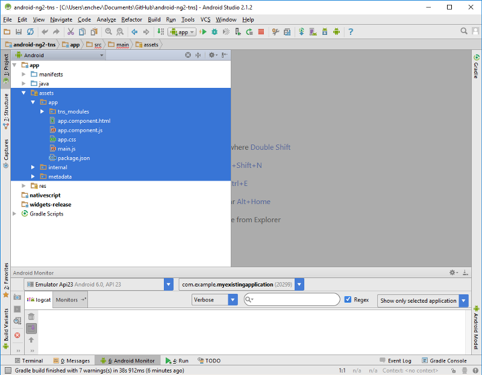
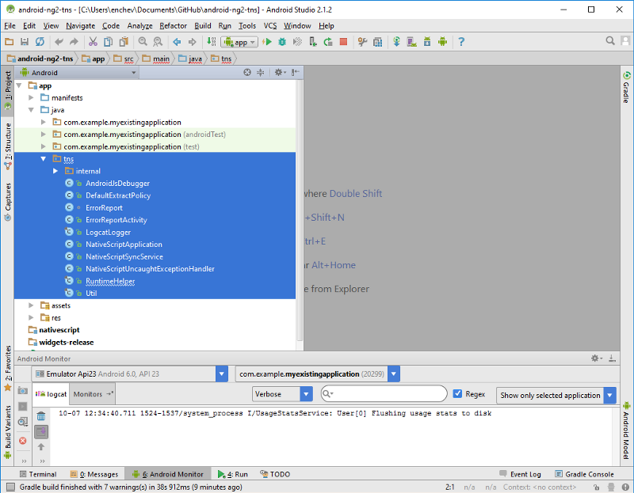
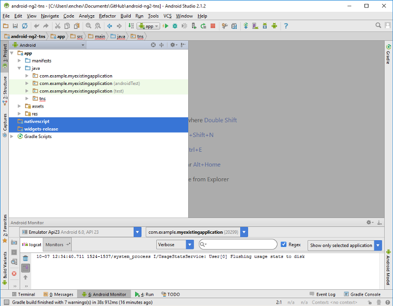
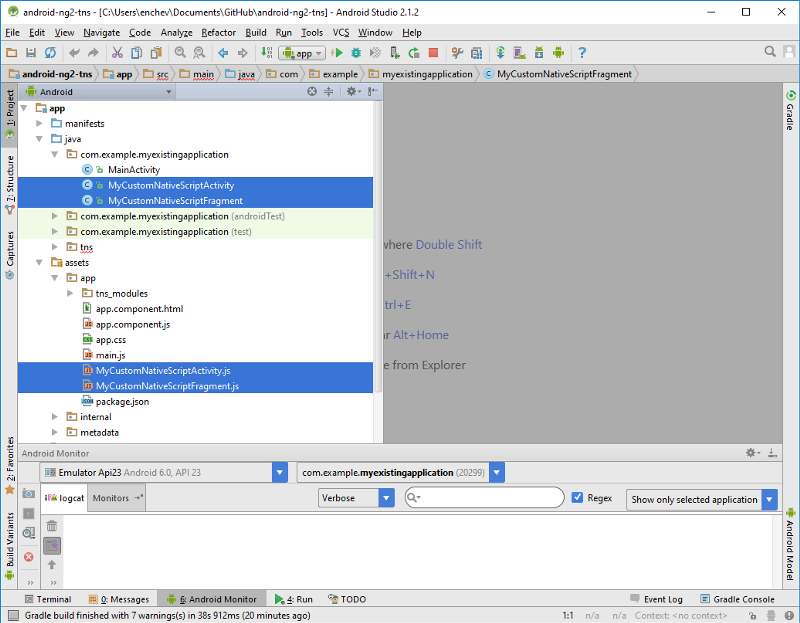
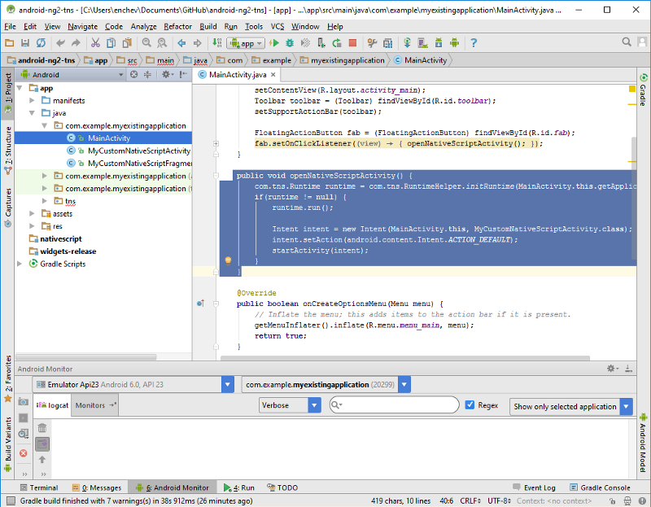
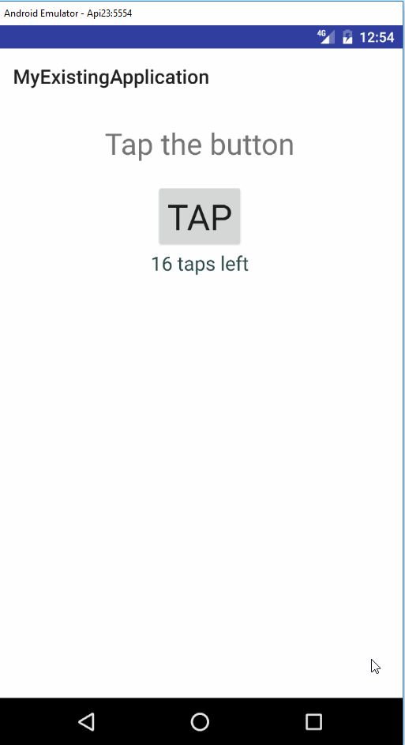

# Extend your existing Android app with Angular 2 and NativeScript

## This article provides step-by-step instructions how to extend existing Android app with Angular 2 and NativeScript

1.Build your NativeScript app for Android:
`tns build android`

2.Copy your NativeScript app `\platforms\android\src\main\assets` folder to your Android app:

3.Copy your NativeScript app `\platforms\android\src\main\java\com\tns` folder to your Android app java classes folder:

4.Add reference to **nativescript.aar** and **widgets-release.aar**:

> Note: Both can be found in your NativeScript app `\platforms\android\` folder.

5.Add both [Java classes](https://github.com/enchev/android-ng2-tns/tree/master/app/src/main/java/com/example/myexistingapplication) and [JavaScript implementations](https://github.com/enchev/android-ng2-tns/tree/master/app/src/main/assets/app) of **MyCustomNativeScriptActivity** and **MyCustomNativeScriptFragment** to your Android app:

6.Start MyCustomNativeScriptActivity using NativeScript RuntimeHelper:

7.Run your Android app and enjoy the result:

Get the app from here: [https://github.com/enchev/android-ng2-tns](https://github.com/enchev/android-ng2-tns)
