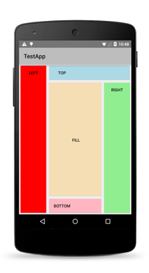

# The NativeScript Layout System

NativeScript provides a recursive layout system which sizes and positions [views][views] on the screen.

* [Layouting](#layouting)
	* [Measure Pass](#measure-pass)
	* [Layout Pass](#layout-pass)
	* [Alignment](#alignment)
	* [Margins](#margins)
* [Layouts](#layouts)
	* [Layout Paddings](#layout-paddings)
	* [Layout Containers](#layout-containers)
 
## Layouting

Layouting is the process of measuring and positioning the child views of a [Layout][Layout] container. Layouting is an intensive process whose speed and performance depend on the count of the children and the complexity of the layout container. For example, a simple layout container such as [AbsoluteLayout][AbsoluteLayout] might perform better than a more complex layout container, such as [GridLayout][GridLayout].

Layouting completes in two passes - a measure pass and a layout pass. Every layout container provides its own `onMeasure()` and `onLayout()` methods to achieve its own specific layouting.

### Measure Pass

During the measure pass, each [View][View] is measured to retrieve its desired size. The measure pass evaluates the following properties:

* width
* height
* minWidth
* minHeight
* visibility
* marginTop
* marginRight
* marginBotton
* marginLeft

### Layout Pass

During the layout pass, each [View][View] is placed in a specific layout slot. This slot is determined by the desired size of the view (retrieved from the measure pass) and the following properties:

- marginTop
- marginRight
- marginBottom
- marginLeft
- horizontalAlignment
- verticalAlignment

### Alignment

Layouting applies horizontal and vertical alignment only when an element is allocated more size than it needs.

The following table shows the valid values of `horizontalAlignment`.

| Member  | Description   |
| ------- | ------------- |
| left    | The view is aligned to the left of the layout slot of the parent element. |
| center  | The view is aligned to the center of the layout slot of the parent element. |
| right   | The view is aligned to the right of the layout slot of the parent element. |
| stretch | The view is stretched to fill the layout slot of the parent element. `width` takes precedence, if set. |

The following table shows the valid values of `verticalAlignment`.

| Member  | Description |
| ------- | ----------- |
| top     | The view is aligned to the top of the layout slot of the parent element. |
| center  | The view is aligned to the center of the layout slot of the parent element. |
| bottom  | The view is aligned to the bottom of the layout slot of the parent element. |
| stretch | The view is stretched to fill the layout slot of the parent element. `height` takes precedence, if set. |

### Margins

The four margin properties (`marginTop`, `marginRight`, `marginBottom` and `marginLeft`) describe the distance between a view and its parent.

When you set margins through XML, you can choose between the following approaches.

* **Set one value**: Provide a single value which will be applied on all sides of the view.
* **Set two values**: Provide two values. The first value is applied to the top and the right side, the second value is applied to the bottom and the left side (in that order).
* **Set four values**: Provide four values for each margin. The first value is applied to the top, the second value is applied to the right, the third value is applied to the bottom and the fourth value is applied to the left side (in that order).

## Layouts

`Layout` is the base class for all views that provide positioning of child elements. 

You can use inherited [Layout][Layout] classes to position elements. They accept the base properties of [View][View] such as `width`, `height`, `minWidth`, alignments and others. In addition, `layout` exposes four padding properties which affect the size of the layout. Derived classes expose additional properties that enable most user interface scenarios.

### Layout Paddings

The four padding properties (`paddingTop`, `paddingRight`, `paddingBottom` and `paddingLeft`) describe the distance between the layout container and its children. 

When set paddings through XML, you can choose between the following approaches. 

* **Set one value**: Provide a single value which will be applied on all sides of the view.
* **Set two values**: Provide two values. The first value is applied to the top and the right side, the second value is applied to the bottom and the left side (in that order).
* **Set four values**: Provide four values for each padding. The first value is applied to the top, the second value is applied to the right, the third value is applied to the bottom and the fourth value is applied to the left side (in that order).

### Predefined Layouts

The following table shows predefined layouts that NativeScript provides.

| Layouts  | Description  | Screenshot |
| -------- | ------------ | ---------- | 
| [AbsoluteLayout][AbsoluteLayout] | This layout lets you set exact locations (left/top coordinates) for its children. | |
| [DockLayout][DockLayout] | This layout arranges its children at its outer edges and allows its last child to take up the remaining space. | |
| [GridLayout][GridLayout] | This layout defines a rectangular layout area that consists of columns and rows. | |
| [StackLayout][StackLayout] | This layout arranges its children horizontally or vertically. The direction is set with the orientation property. | |
| [WrapLayout][WrapLayout] | This layout positions its children in rows or columns, based on the orientation property, until the space is filled and then wraps them on a new row or column. | |

[views]: ui-views.md
[View]: ./ApiReference/ui/core/view/View.md
[Layout]: ./ApiReference/ui/layouts/layout/Layout.md
[AbsoluteLayout]: ./ApiReference/ui/layouts/absolute-layout/HOW-TO.md
[DockLayout]: ./ApiReference/ui/layouts/dock-layout/HOW-TO.md
[GridLayout]: ./ApiReference/ui/layouts/grid-layout/HOW-TO.md
[StackLayout]: ./ApiReference/ui/layouts/stack-layout/HOW-TO.md
[WrapLayout]: ./ApiReference/ui/layouts/wrap-layout/HOW-TO.md