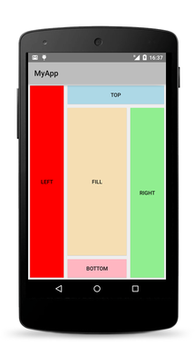
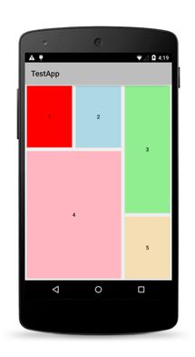

[View]: ./ApiReference/ui/core/view/View.md
[Layout]: ./ApiReference/ui/layouts/layout/Layout.md
[AbsoluteLayout]: ./ApiReference/ui/layouts/absolute-layout/HOW-TO.md
[DockLayout]: ./ApiReference/ui/layouts/dock-layout/HOW-TO.md
[GridLayout]: ./ApiReference/ui/layouts/grid-layout/HOW-TO.md
[StackLayout]: ./ApiReference/ui/layouts/stack-layout/HOW-TO.md
[WrapLayout]: ./ApiReference/ui/layouts/wrap-layout/HOW-TO.md

# Layout System

NativeScript framework comes with its own recursive layout system which size and position views on the screen. Layout is the process of measure and position the child views of a [Layout][Layout] container. Layout process is intensive and depends on the count of the children and the complexity of the layout container. The simple layout container as [AbsoluteLayout][AbsoluteLayout] can have better performance than more complex [Layout][Layout], such as [GridLayout][GridLayout].
Layout system completes in two passes - measure pass and layout pass. Every [Layout][Layout] provides its own `onMeasure()` and `onLayout()` methods to achieve its own specific layout.
In the measure pass each [View][View] is measured to get its desired size. Measure pass evaluates width, height, minWidth, minHeight, visibility and margins properties.
In the second pass (layout pass) each [View][View] is placed in specific layout slot which is determined by view desired size, margins, horizontal and vertical alignments.

All [View][View] classes expose several properties that affects the layout:

- minWidth
- minHeight
- width
- height
- marginTop
- marginRight
- marginBottom
- marginLeft
- horizontalAlignment
- verticalAlignment
- visibility

## Alignment Properties

Horizontal and vertical alignments takes effect only when element is given more size than it needs.

The following table shows each value of `horizontalAlignment`:

| Member  | Description   |
| ------- | ------------- |
| left    | View is aligned to the left of the parent element's layout slot.|
| center  | View is aligned to the center of the parent element's layout slot. |
| right   | View is aligned to the right of the parent element's layout slot. |
| stretch | View is stretched to fill the parent element's layout slot. Explicit `width` take precedence. |

The following table shows each value of `verticalAlignment`:

| Member  | Description |
| ------- | ----------- |
| top     | View is aligned to the top of the parent element's layout slot. |
| center  | View is aligned to the center of the parent element's layout slot. |
| bottom  | View is aligned to the bottom of the parent element's layout slot. |
| stretch | View is stretched to fill the parent element's layout slot. Explicit `height` take precedence. |

## Margins Property
There are four margin properties - `marginTop`, `marginRight`, `marginBottom` and `marginLeft`. They describe the distance between a view and its parent. When set through XML values can be uniformed meaning that value will be applied on all four side of the view, two values which is applied to (top, right) and (bottom, left) in that order or it could take the form of four distinct values, each value describing a distinct margin to apply to top, right, bottom and left (in that order).

# Layout
Layout is the base class for all views that provide layout. Inherited [Layout][Layout] classes are used to position elements. They support the base properties of [View][View] such as width, height, minWidth, alignments, etc. In addition layout class expose four padding properties which affects the size of the layout. Derived classes expose additional properties that enables most user interface scenarios.

## Paddings Property
There are four padding properties - `paddingTop`, `paddingRight`, `paddingBottom` and `paddingLeft`. They describe the distance between the layout container and its children. When set through XML values can be uniformed meaning that value will be applied on all four side of the view, two values which is applied to (top, right) and (bottom, left) in that order or it could take the form of four distinct values, each value describing a distinct padding to apply to top, right, bottom and left (in that order).

## Layout Containers
NativeScript provides few predefined layouts and allows for defining custom layouts.
The predefined layouts are:

| Layouts  | Description  | Screenshot |
| -------- | ------------ | ---------- | 
| [AbsoluteLayout][AbsoluteLayout] | Layout that lets you specify exact locations (left/top coordinates) of its children. | |
| [DockLayout][DockLayout] | Layout that arranges its children at its outer edges, and allows its last child to take up the remaining space. | |
| [GridLayout][GridLayout] | Defines a rectangular layout area that consists of columns and rows. | |
| [StackLayout][StackLayout] | Layout that arranges its children horizontally or vertically. The direction can be set by orientation property. | |
| [WrapLayout][WrapLayout] | Position children in rows or columns depending on orientation property until space is filled and then wraps them on new row or column. | |