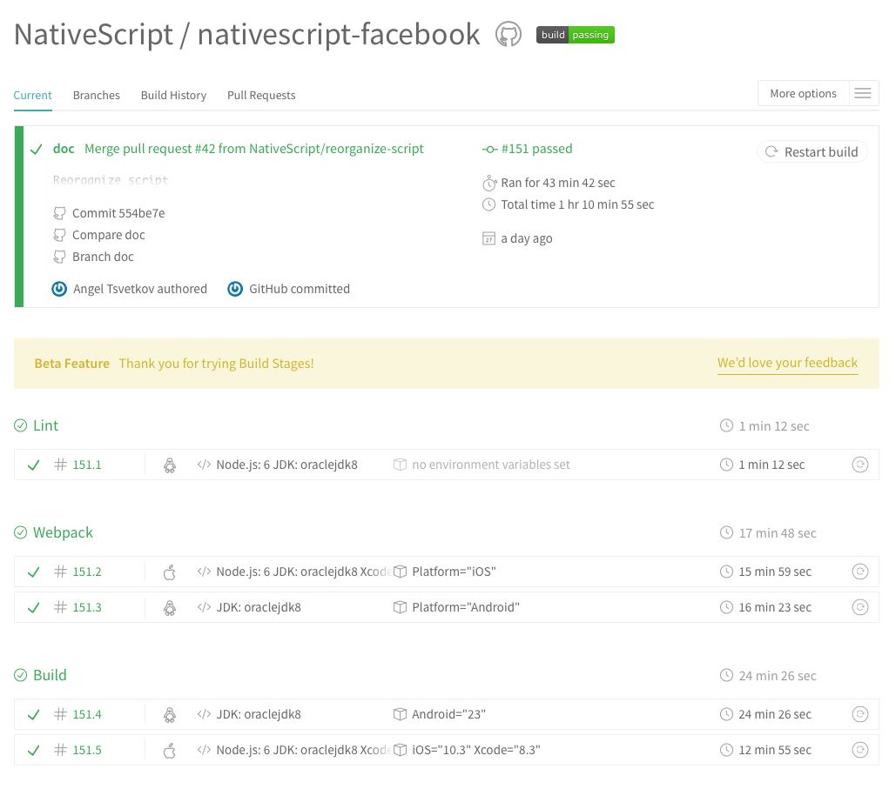

# Ensure Plugins Quality

NativeScript plugins are the main building blocks for NativeScript applications. These building blocks should work properly installed into applications:
- built for Android
- built for iOS
- bundled with webpack

Ignoring any of these non-functional requirements could lead to an app that doesn’t work as expected. Throughout this article we'll be referring to the verification of those requirements as 'sanity checks' without writing a single line of test. 

This article will cover:
- [Prerequisites](#prerequisites)
- [Checking for Readability, Maintainability, and Functionality Errors](#checking-for-readability-maintainability-and-functionality-errors)
- [Checking in Bundled NativeScript Applications](#checking-in-bundled-nativescript-applications)
- [Checking in Application Built for Android and iOS](#checking-in-application-built-for-android-and-ios)
- [Automate All Checks with Travis CI](#automate-all-checks-with-travis-ci)

## Prerequisites

NativeScript apps can be written in both Angular, or just plain JavaScript/TypeScript and they can also take advantage of the [webpack bundling]() to cut off the excess code. In order to ensure that your plugin runs reliably in any NativeScript application, there are certain prerequisites you may need to complete.

All plugins should have a demo folder that contains a demo application showing how the plugin works. If you use the [NativeScript plugin seed](https://github.com/NativeScript/nativescript-plugin-seed) you will have this folder by default. If your plugin is a user interface plugin, and you need to test the plugin in both Angular and non-Angular apps, you should have an additional demo-angular folder containing an Angular app you can test your plugin in. Refer to the article ["Supporting Angular in UI Plugins"]() for more details.

```
my-plugin
├── demo
├── demo-angular
└── src
     └── package.json
```

> **NOTE**: It is very handy to have the plugin and demo application(s) in the same repository. The [NativeScript official plugin seed](https://github.com/NativeScript/nativescript-plugin-seed#plugin-folder-structure) defines this structure so if the plugin is based on it, the plugin’s source and the demo app are nicely organized.

In order to ease the process add the following scripts in your `package.json` file under `src` folder (the plugins source folder).

```
"ngc": "node --max-old-space-size=8192 ./node_modules/.bin/ngc"
```

This script will initiate Ahead of Time (AOT) compilation. The parameter `max-old-space-size` is a workaround to fix heap out of memory errors when running node binaries. It's a common issue when using TypeScript 2.1+ and webpack.

```
"build": "npm i && tsc && npm run ngc"
```

This script will install all NativeScript plugin’s dependencies, compile TypeScript files and initiate Ahead of Time (AOT) compilation. 

```
"prepublishOnly": "npm run build"
```

This script will be executed before the package is prepared and packed, only on npm publish. More details can be found in the [npm-script documentation](https://docs.npmjs.com/misc/scripts). This approach is important because it ensures the plugin’s TypeScript is compiled and the plugin’s required metadata is generated every time before publishing.

Refer to the [package.json](https://github.com/NativeScript/nativescript-facebook/blob/doc/src/package.json#L12-L15) file of the [nativescript-facebook](https://github.com/NativeScript/nativescript-facebook) plugin where these scripts are also added.

## Checking for Readability, Maintainability, and Functionality Errors

[TSLint](https://palantir.github.io/tslint/) is a great tool for static analysis of your plugin’s code. It will test the plugin for readability and maintainability as well as functionality errors based on customizable rules. A complete list with the available TSLint rules can be found in the [tsling repository](https://palantir.github.io/tslint/rules/).

The official [NativeScript plugin seed](https://github.com/NativeScript/nativescript-plugin-seed) recommends TSLint rules defined in this [tslint.json](https://github.com/NativeScript/nativescript-plugin-seed/blob/master/tslint.json) file.

```
my-plugin
├── demo
├── demo-angular
├── src
|    └── package.json
└── tslint.json
```

TSLint could be easily incorporated into any NativeScript plugin by following these steps:

1.    Add [tslint.json](https://github.com/NativeScript/nativescript-plugin-seed/blob/master/tslint.json) file on root level.
2.    Add the following script in your plugin’s `src/package.json` file.

```
"ci.tslint": "npm i && tslint '**/*.ts' --config '../tslint.json' --exclude '**/node_modules/**'"
```

This script executes the `tslint` command passing the tslint rules defined in `tslint.json` file. The installed `node_modules` will be excluded from the static analysis. 
Having `tslint.json` on root level allows using the same TSLint rules for both demo apps by adding the same script.

Now the command `npm run ci.tslint` will start a static analysis.

## Checking in Bundled NativeScript Applications

Key benefits of bundling a NativeScript app are:
- increase the app start-up time
- decrease the size of the app

> **NOTE**: You can read more details about the benefits of bundling NativeScript apps in the [“Using Webpack to Bundle Your Code”]() article.

NativeScript plugins should work seamlessly in bundled app. This could be verified by testing the bundled demo apps. In order to enable the app for bundling, there is some configuration required. The entire setup is defined in [“Using Webpack to Bundle Your Code”](). 

Once the webpack is setup for the demo app(s), there should be several scripts added into apps' package.json files.

```
 "scripts": {
    "ns-bundle": "ns-bundle",
    "publish-ios-bundle": "npm run ns-bundle --ios --publish-app",
    "start-android-bundle": "npm run ns-bundle --android --run-app",
    "start-ios-bundle": "npm run ns-bundle --ios --run-app",
    "build-android-bundle": "npm run ns-bundle --android --build-app",
    "build-ios-bundle": "npm run ns-bundle --ios --build-app"
  }
```

Now the command `npm run build-ios-bundle` will bundle the NativeScript application and build it for iOS. The result is an optimized iOS application that uses the plugin.

Refer to the nativescript-facebook [demo app](https://github.com/NativeScript/nativescript-facebook/tree/doc/demo) which is configured and webpack ready. Notice the [package.json](https://github.com/NativeScript/nativescript-facebook/blob/doc/demo/package.json#L41-L42), [vendor.ts](https://github.com/NativeScript/nativescript-facebook/blob/doc/demo/app/vendor.ts), [vendor-platform.ts](https://github.com/NativeScript/nativescript-facebook/blob/doc/demo/app/vendor-platform.ts) ([vendor-platform.android.ts](https://github.com/NativeScript/nativescript-facebook/blob/doc/demo/app/vendor-platform.android.ts) and [vendor-platform.ios.ts](https://github.com/NativeScript/nativescript-facebook/blob/doc/demo/app/vendor-platform.ios.ts)) and [bundle-config.ts](https://github.com/NativeScript/nativescript-facebook/blob/doc/demo/app/bundle-config.ts)

That same sample’s demo-angular app shows how to set up and test webpack in NativeScript apps that use Angular. 

## Checking in Application Built for Android and iOS

Perhaps the most important sanity checks is whether the demo application consuming the plugin can actually be built. NativeScript supports Android and iOS so both platforms should be covered. The recommendation is to build with latest SDK for Android and iOS.

The NativeScript command for building Android and iOS apps is:

`tns build android` and `tns build ios`

Read more details regarding [building project with NativeScript CLI](https://github.com/NativeScript/nativescript-cli#build-your-project).

## Automate All Checks with Travis CI

Travis CI is a great way to automate plugin’s sanity checks. It is free for open-source projects. More details can be found in [Travis CI documentation](https://docs.travis-ci.com/). Travis CI will boot a virtual machine and execute commands based on the provided configuration in your `.travis.yml` file. 

First things first! Add an empty `.travis.yml` file on the root level of your plugin.

```
my-plugin
├── demo
├── demo-angular
├── src
|    └── package.json
├── tslint.json
└── .travis.yml
```

> **NOTE**: If you use the [NativeScript plugin seed](https://github.com/NativeScript/nativescript-plugin-seed), you have an initial `.travis.yml` file setup. 

This sample uses [Build Matrix](https://docs.travis-ci.com/user/customizing-the-build#Build-Matrix) to initiate several runs as a result of one and [Build Stages](https://docs.travis-ci.com/user/build-stages) to separate the execution into stages. The flow will be as follows:
1.    Test for Readability, Maintainability and Functionality Errors
2.    WebPack and Build Demo Apps with Your Plugin Installed
3.    Build Demo Apps with Your Plugin Installed

Each step starts after successful completion of the previous one. In this way, if there is a functional error, for example, the entire run will be terminated after the fall of the first step and the rest of the steps will not be executed. This behavior is controlled by [Build Stages](https://docs.travis-ci.com/user/build-stages).

According to the [Build Lifecycle](https://docs.travis-ci.com/user/customizing-the-build#The-Build-Lifecycle) of each Travis CI build, `install` is the right phase to install any required dependencies. 

Add following commands in the `install` phase in `.travis.yml` file:

Install nativescript as a global node module.
```
- npm install -g nativescript
```
Configures anonymous usage reporting for the NativeScript CLI. Read more about [CLI usage reporting](https://github.com/NativeScript/nativescript-cli/blob/master/docs/man_pages/general/usage-reporting.md).

```
- tns usage-reporting disable
```
Configures anonymous error reporting for the NativeScript CLI. Read more about [CLI error reporting](https://github.com/NativeScript/nativescript-cli/blob/master/docs/man_pages/general/error-reporting.md).

```
- tns error-reporting disable
```

As a result the `install` phase should be:

```
install:
    - npm install -g nativescript
    - tns usage-reporting disable
    - tns error-reporting disable
```
Refer to nativescript-facebook [.travis.yml file](https://github.com/NativeScript/nativescript-facebook/blob/doc/.travis.yml#L60-L62) to see this in reality.

As we mentioned earlier, the plugin should be sanity checked on Android as well as on iOS. The Android specific requirements can be defined in `.travis.yml` file in `android` section:

```
android:
  components:
    - tools
    - platform-tools
    - build-tools-25.0.2
    - android-25
    - extra-android-m2repository
```

`tools` and `platform-tools` components define that the latest revision of Android SDK Tools will be installed. Read more about [Travis CI Environment for Android Project](https://docs.travis-ci.com/user/languages/android/#Overview).

`build-tools-25.0.2` component defines the BuildTools version that will be used.

`android-25` component defines the SDK version used to compile the project.

`extra-android-m2repository` component defines the support library repositories.

Let's add the required stages using the [Build Matrix](https://docs.travis-ci.com/user/customizing-the-build#Build-Matrix).

Add the following snippet at the beginning of `.travis.yml` file:
```
matrix:
  include:
```
Then add the required stages:

### 1. Test for Readability, Maintainability and Functionality Errors

```
- stage: "Lint"
  language: node_js
  os: linux
  node_js: "6"
  script: cd src && npm run ci.tslint && cd ../demo && npm run ci.tslint && cd ../demo-angular && npm run ci.tslint
```
The machine that is going to be provisioned will be Linux with nodejs v6 installed on it as well as Oracle JDK v8. Finally the `ci.tslint` script will be executed for the plugin's code and for the demo apps.

### 2. WebPack and Build Demo Apps with Your Plugin Installed

```
- stage: "WebPack"
    os: osx
    env:
      - Platform="iOS"
    osx_image: xcode8.3
    language: node_js 
    node_js: "6"
    jdk: oraclejdk8
    script: cd demo && npm run build.plugin && npm i && npm run build-ios-bundle && cd ../demo-angular && npm run build.plugin && npm i && npm run build-ios-bundle
  - language: android
    os: linux
    env:
      - Platform="Android"
    jdk: oraclejdk8
    before_install: nvm install 6.10.3
    script: cd demo && npm run build.plugin && npm i && npm run build-android-bundle && cd ../demo-angular && npm run build.plugin && npm i && npm run build-android-bundle
```
This stage includes two builds that run in parallel — one for Android, and one for iOS. Note that the nodejs on the Linux machine is installed because it is not included in the image. 
The environment variables defined under `env` are used for informational purposes. These variables are not used anywhere in the code.
The scripts that are executed build the plugin (take a look at [package.json file](https://github.com/NativeScript/nativescript-facebook/blob/master/demo/package.json) of the demo apps) and then bundle and build each of the demo apps.

### 3. Build Demo Apps with Your Plugin Installed

```
- stage: "Build"
  env: 
    - Android="25"
  language: android
  os: linux
  jdk: oraclejdk8
  before_install: nvm install 6.10.3
  script: cd demo && npm run ci.android.build && cd ../demo-angular && npm run ci.android.build
- os: osx
  env: 
    - iOS="10.3"
    - Xcode="8.3"
  osx_image: xcode8.3
  language: node_js 
  node_js: "6"
  jdk: oraclejdk8
  script: cd demo && npm run ci.ios.build && cd ../demo-angular && npm run ci.ios.build
```
The scripts (`ci.android.build` and `ci.ios.build`) that are executed to build for iOS and Android are located in [package.json](https://github.com/NativeScript/nativescript-facebook/blob/master/demo/package.json#L49) file of any of the demo apps.

If everything is configured properly, the sanity checks will execute on every code change. The result, and whether the checks pass or not, will look like this:



The main benefit of having sanity checks in place for your NativeScript plugins is that you can develop without spending additional time to ensure your changes don't break existing applications depending on your plugin.

Do not forget to [add a Travis CI badge](https://docs.travis-ci.com/user/status-images/) in your NativeScript plugin's project! It reports live status of your CI build and makes your plugin look more reliable.