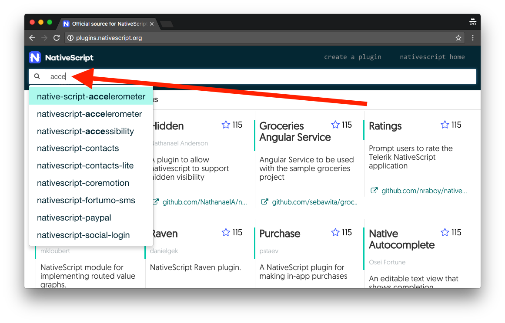

# Using Plugins

NativeScript plugins are npm packages with some added native functionality. Therefore, finding, installing, and removing NativeScript plugins works a lot like working with npm packages you might use in your Node.js or front-end web development.

* [Finding Plugins](#finding-plugins)
* [Installing Plugins](#installing-plugins)
* [Removing Plugins](#removing-plugins)

## Finding plugins

Because NativeScript plugins are npm packages, you can find NativeScript plugins on npm’s own site by searching for “nativescript-plugin-name”. For example a search of “nativescript accelerometer” would point you right at the [NativeScript accelerometer plugin](https://www.npmjs.com/package/nativescript-accelerometer).

The NativeScript team also maintains an [official plugins marketplace](http://plugins.nativescript.org/), which displays a filtered list of NativeScript-related plugins from npm. A search for “accelerometer” on the plugins marketplace will point you at the plugin you need.



If you don’t find a plugin you need try asking for help on the [NativeScript community forum](https://discourse.nativescript.org/). The NativeScript team and community may be able to help find what you’re looking for.

Also, make sure to look through the [NativeScript core modules](https://docs.nativescript.org/core-concepts/modules), which ship as a dependency of every NativeScript app. There’s a chance that the functionality you need is built in. If you’re still not finding what you need, you can request the plugin as an idea on the [NativeScript ideas portal](https://nativescript.ideas.aha.io/), or you can take a stab at [building the plugin yourself](/plugins/building-plugins/).

## Installing Plugins

Once you’ve found the plugin you need, install the plugin into your app using the `tns plugin add` command.

```
tns plugin add <plugin-name>
```

For example, the following command installs the [NativeScript camera plugin](http://plugins.nativescript.org/plugin/nativescript-camera).

```
tns plugin add nativescript-camera
```

The installation of a NativeScript plugin mimics the installation of an npm package. The NativeScript CLI downloads the plugin from npm, and adds the plugin to the `node_modules` folder in the root of your project. During this process, the NativeScript CLI adds the plugin to your project’s root `package.json` file, and also resolves the plugin’s dependencies (if any).

## Removing Plugins

To remove a NativeScript plugin from your project, run the following command from your command line.

```
tns plugin remove <plugin-name>
```

For example, the following command removes the NativeScript camera plugin.

```
tns plugin remove nativescript-camera
```

As with installation, the removal of a NativeScript plugin mimics the removal of an npm package.

The NativeScript CLI removes any plugin files from your app’s `node_modules` folder in the root of your project. The CLI also removes any of the plugin’s dependencies, and also removes the plugin from your project’s root `package.json` file.
