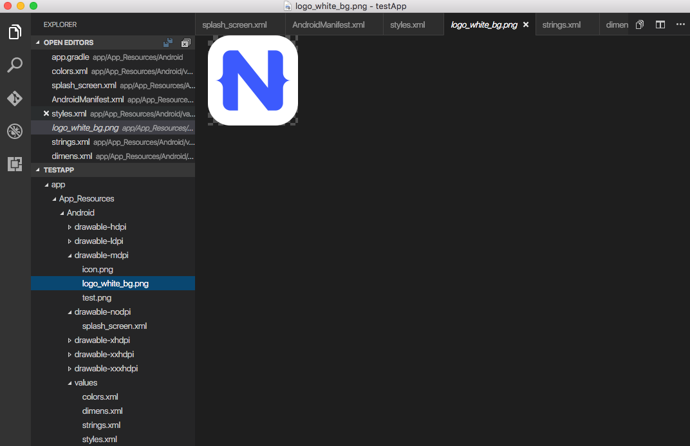

# Creating Launch Screens for Android 

Launch screens are essential as they provide users's first experience with your mobile application.
Based on [Google's Material Design launch screens guidelines](https://material.google.com/patterns/launch-screens.html#launch-screens-branded-launch) there are two 
main types of launch screens:

- Placeholder UI - a simple seamless transaction type screen
- Branded Launch Screens - screen providing the user with momentary brand exposure and focus on the content

Instead of displaying a blank white canvas while your app is loading, 
creating a launch screen will not only "fill the gap" but also provide the basic introduction
for your users. Essentially, there are some basic rules applicable for both types of launch screens 
which are good to follow to create good first impressions:

- avoid using text (except for your Logo and tagline)
- avoid using animations (your launch should be as light as possible)
- avoid reusing your launch screen inside your application
- follow Goggle's [Material design](https://material.google.com) rules

## Setting launch screen and App Icons

In NativeScript, your application template (created with `tns create myApp`) ships with a basic launch screen template.
In this article, we are going to introduce the workflow to create/modify your own launch screen.

### Application resources used for launch screen creation

The default template in NativeScript (created with `tns create myApp`) provides you with predefined 
**splash_screen.xml** file with the NativeScript logo on a blue background and with sample app icons. 
To modify that template and create your own launch screen using your own assets and design, you will need to access
the files located under **app/App_Resources/Android** folder.
Let’s look at what the various files and folders in App_Resources/Android are, 
and then look at the specific steps you’ll need to take to change them and configure your launch screen.

* **drawable** folders: In your **app/App_Resources/Android** you will find a number of folders named drawable-X (where x is the different DPI for the different devices)
These folders will store your properly scaled images for your app icons, launch screens and in app images (optional).
Here is the full list of your drawable resources folders.

    * **drawable-ldpi** - Resources for low-density (ldpi) screens (~120dpi).
    * **drawable-mdpi** - Resources for medium-density (mdpi) screens (~160dpi). (This is the baseline density.)
    * **drawable-hdpi** - Resources for high-density (hdpi) screens (~240dpi).
    * **drawable-nodpi** - Resources for all densities. These are density-independent resources. The system does not scale resources tagged with this qualifier, regardless of the current screen's density.
        > **Important:** In NativeScript this is the folder which holds **splash_screen.xml**  - the file that creates your launch screen. 
    
    * **drawable-xdpi** - Resources for extra-high-density (xhdpi) screens (~320dpi).
    * **drawable-xxdpi** - Resources for extra-extra-high-density (xxhdpi) screens (~480dpi).
    * **drawable-xxxdpi** - Resources for extra-extra-extra-high-density (xxxhdpi) uses (~640dpi). Use this for the launcher icon only.

* **values** folder: XML files that contain simple values, such as strings, integers, and colors.
Here is the full list of the files that ships with the basic NativeScript template.  

    * **colors.xml** - XML file in which the app colors are declared.
    * **strings.xml** - XML file in which the app string are declared.
    * **styles.xml** - XML file in which the app styles are declared. 
    This is the file which holds your `LaunchScreenTheme` style 
    which you can customize with chainging the `splash_screen.xml` mentioned above.
    Once your application is loaded the `LaunchScreenTheme` is changed with the `AppTheme` style.

* **values-v21** folder: XML files that contain simple values, such as strings, integers, and colors.
Used when you need to provide themes supported only on API Level 21+ (e.g. Theme.Material)   

* **AndroidManifest.xml** file: Every application must have an `AndroidManifest.xml` file (with precisely that name) 
in its root directory. The manifest file presents essential information about your app to the Android system, 
information the system must have before it can run any of the app's code.
Changing your application icon file is done with modifying the `android:icon` key in `applcation` tag.
The default app icon set up:

    `android:icon="@drawable/icon"`

    The code above will look for file named __icon.png__ in drawables folders and will load the properly scaled image for the current device.

    > Note: In `AndroidManifest` you will find the following key 
    >
    >`<meta-data android:name="SET_THEME_ON_LAUNCH" android:resource="@style/AppTheme" />`
    >
    > This key is used by NativeScript to change your `LaunchScreenTheme` with `AppTheme` when your application is loading. 

### How to setup a custom launch screen

In order to change the default NativeScript launch screen (defined in `drawable-nodpi/splash_screen.xml`) and create your own, follow these steps:

1. Provide your properly scaled images accordingly to the **drawable** folders.
This folder can be used not only for your launch screen images, but also for your app icons and for your
in-app images (you can refer to this resource from your application logic with `"res://image-name"` )
The default template app ships with three images: **icon.png** (used for app icon), **logo.png** (centered sample image)
and **background.png** (image used to fill the background).

The default **splash_screen.xml** with centered `logo.png` and filled `background.png`.

```
<layer-list xmlns:android="http://schemas.android.com/apk/res/android" android:gravity="fill">
    <item>
        <bitmap android:gravity="fill" android:src="@drawable/background" />
    </item>
    <item>
        <bitmap android:gravity="center" android:src="@drawable/logo" />
    </item>
</layer-list>
```



2. Define the colors you want to use in **values/colors.xml** and in **values-v21/colors.xml**.
You can set your own colors here and reuse them in splash_screen.xml file for your launch screen (or reuse them in your app).


3. Define the strings you want to use in **values/strings.xml** and in **values-v21/strings.xml**
You can set your own string here and reuse them in **splash_screen.xml** file for your launch screen (or reuse them in your app).


4. Define the styles and themes you want to use in **values/styles.xml** and in **values-v21/styles.xml**
Note that styles applied in the values-v21 folder will be applied only to devices with API 21+.

The default NativeScript template ships with two themes: `LaunchScreenTheme` (used for your initial launch)
and `AppTheme` (used for your main application).


> **Note:** If your project comes with no folders **values** , **values-v21** and/or **drawable-xxx** you can create
them manually and add the files needed accordingly. Or you can use [the default set of styles and themes used in NativeScript](https://github.com/NativeScript/nativescript-marketplace-demo/tree/production/app/App_Resources/Android) 

Notice that you can **NOT** have custom folders inside your App_Resources.
Only folders that are required by the Android convention are allowed and they must be created with the exact names
provided (e.g. **values**, **values-v21**, **drawable**). When adding new folders in your App_Resources you should reset your
platform folder.

`tns platform remove android`

`tns platform add android`

Once your launch screen is fully set, rebuild your application and your launch screen is ready.
In some occasions, you might need to reset your platform folder as mentioned above.