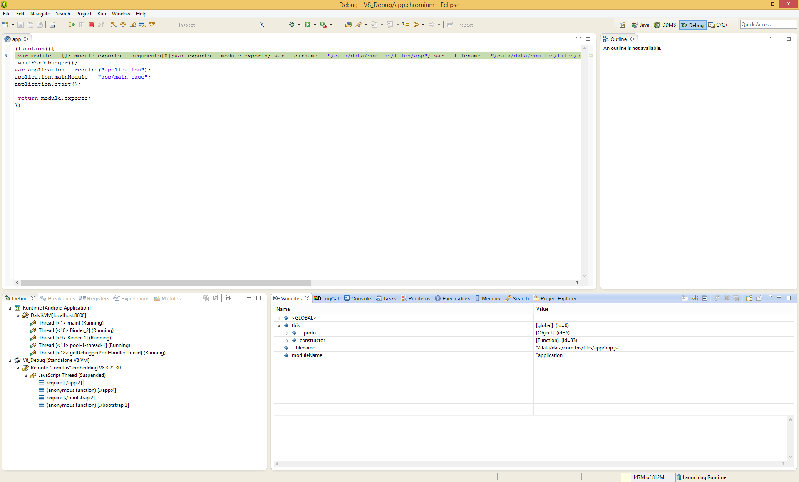

# Overview

NativeScript for Android uses Google's V8 JavaScript engine. As a consequence you can use any V8 debugger to debug your application. In this article we will see how to use two different V8 debuggers. Please note as NativeScript is in beta version some of the details may change in future.

# Using Remote Chromium Javascript Debugger for Eclipse

You can use [Remote Chromium Javascript Debugger for Eclipse](https://code.google.com/p/chromedevtools/wiki/EclipseDebugger) to debug NativeScript for Android appliction. Please note that this [project](https://code.google.com/p/chromedevtools/) is no longer maintained but is perfectly capable to debug any V8 instance. For the purpose of this article, we will outline how to install and congigure the Remote Chromium Javascript Debugger plugin for Eclipse. You can read about it in more details at [https://code.google.com/p/chromedevtools/wiki/EclipseDebugger](https://code.google.com/p/chromedevtools/wiki/EclipseDebugger)

You can install the plugin from Hepl->Install New Software menu in Eclipse. You have to specify the following url `http://chromedevtools.googlecode.com/svn/update/dev/` and then select `Chromium Javascript Remote Debugger` option.


After the installation Eclipse will ask you for restart. Once you restart it, you can configure V8 debugger from Run->Debug Configurations menu.


Please note that the selected port here is `8181` but you can specify any availabe port. Once you specify the debugger port you have to make sure that the port is accessible from your computer. The following command will forward the debugger port to the local one.

```bash
adb forward tcp:8181 tcp:8181
```

Once the debugger port is forwarded you should be able to debug your JavaScript code. To enable the debugger from within JavaScript you can call `__debugbreak()` function. This function call will start the debugger on port `8181`. The full function signature is as follows.

```JavaScript
__debugbreak(portNumber);
```

> **NOTE:** `__debugbreak` is part from the internal NativeScript APIs and may be subject to a change in future. We recommend to use the starndard JavaScript `debugger;` statement instead.

Here is a complete scenrio.
  *  install Remote Chromium Javascript Debugger plugin for Eclipse
  *  forward port `8181`
  *  write `__debugbreak();` at the desired place
  *  run your Eclipse project
  *  run V8 debugger as configured above
  *  debug your JavaScript code



# Using Node Inspector

Another option is to use [Node Inspector](https://github.com/node-inspector/node-inspector). While Node Inspector is Node.js oriented some of the earlier versions are capable of debugging NativeScript for Android applications. As in the previous scenario you should make sure that the debugger port is forwarded via `adb forward` command. Then you can start Node Inspector with the following command.

```bash
node-inspector --debug-port=8181
```

Once you get the confirmation message `Visit http://127.0.0.1:8080/debug?port=8181 to start debugging.` you can open in Chrome browser url Node Inspector specified.
