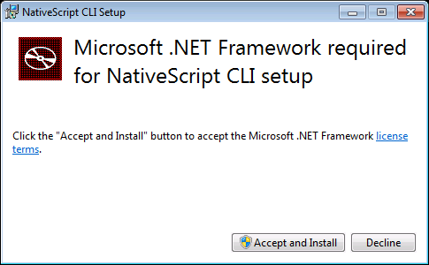
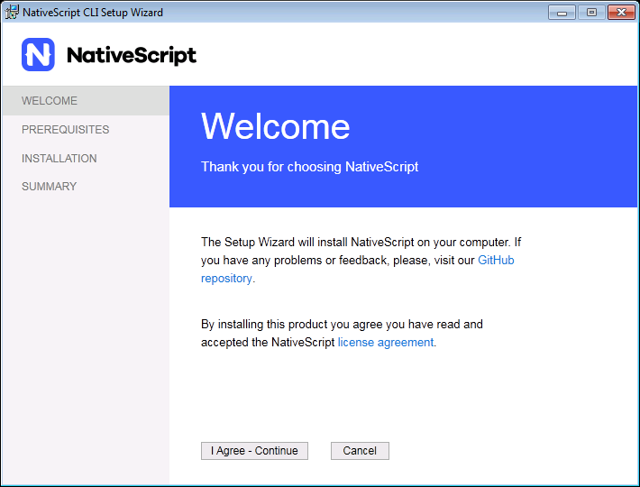
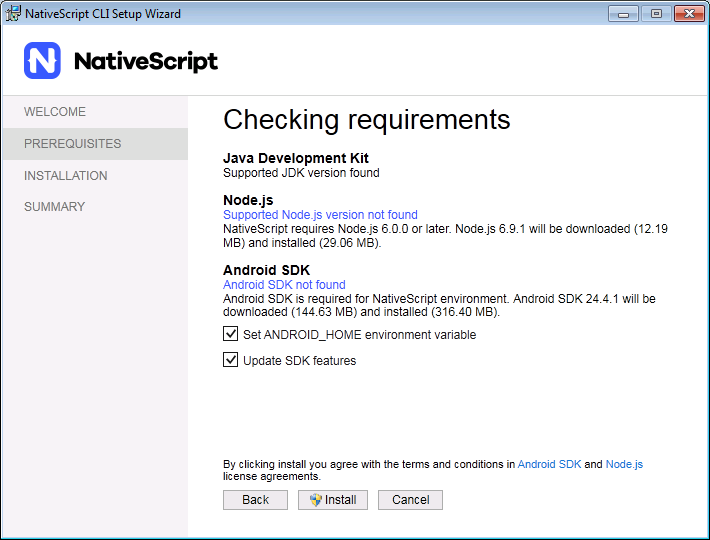
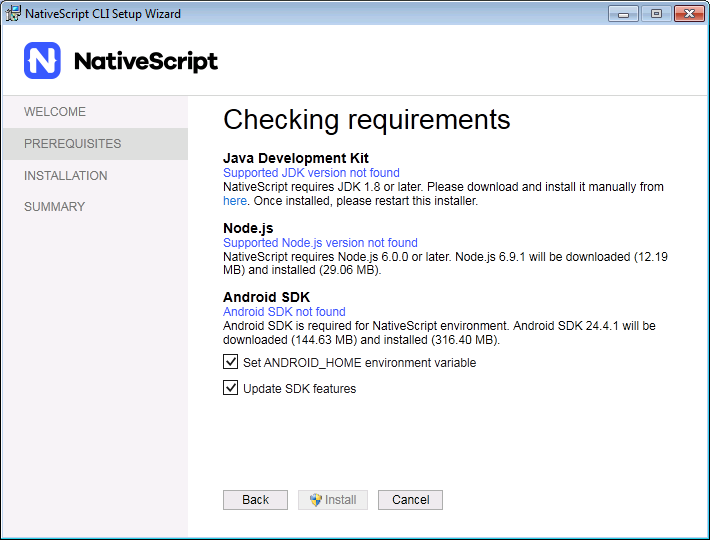

# NativeScript CLI installer

## Installation

Install the latest version of NativeScript CLI and its missing prerequisites for Windows OS via an executable installer.

[Download Installer](https://www.nativescript.org/docs/default-source/default-document-library/nativescript-cli-setup-wix.exe)

> **WARNING**:
> * The NativeScript Windows installer only works on machines that do not currently have an Android SDK installed. If you’re working on a machine with Android SDKs already in place, go through the manual installation steps on [this page](https://docs.nativescript.org/start/ns-setup-win) to set up NativeScript.
> * The NativeScript Windows installer can **not** be used to update existing NativeScript installations. To get the latest version of NativeScript, refer to our article on [updating your NativeScript versions](http://docs.nativescript.org/releases/upgrade-instructions).

### Prerequisites

The installation requires .NET Framework 4 and Windows 7 SP1 or later.

In case .NET Framework 4 is missing the installer offers to download and install it.

In case the OS prerequisite is not met, a message pops up and the installer is shut down.

### Welcome Page

The welcome page describes what will be done by the installer. It also allows the user to review the GitHub repository and the license agreement of the product.

- _**I Agree – Continue**_ button proceeds to the next step of the setup wizard.

- _**Cancel**_ button opens a dialog to confirm the cancelation. If &quot;Yes&quot; is clicked the setup is canceled and the application is closed. If &quot;No&quot; is clicked the dialog is closed and the user can continue with the setup.

When there is no Internet connection an appropriate text appears on the page and the &quot;I Agree – Continue&quot; button is disabled.

### Prerequisites Page

Displays all the prerequisites for NativeScript CLI and their status – whether they are installed or need additional setup:

- Java Development Kit 1.8 or later
- Node.js 6.0.0  (inclusive) to 7.0.0 (exclusive)
- Android SDK

License information about the prerequisites that are about to be installed is shown when the &quot;Install&quot; button is enabled.

_**Install**_ button

A dialog is shown to the user to confirm the installation as it can take a lot of time and cannot be canceled. If &quot;Yes&quot; is clicked proceeds to the installation page and the installation process is started. If &quot;No&quot; is clicked the dialog is closed.

#### Java Development Kit

Shows whether a supported JDK version is installed on the machine.

If no such version detected:

- &quot;Supported JDK version not found&quot; message appears and an information about where it can be downloaded from and the &quot;Install&quot; button is disabled

When supported JDK version is detected the Install button is enabled and the user can proceed. An additional setup action is shown in case the `JAVA_HOME` environment variable is not set or it points to a wrong location. If the variable is set and valid the additional setup action is not shown.

#### Node.js

Shows whether a supported Node.js version is installed on the machine.

If no such version detected an information about what version will be installed and how much download and installation space it requires is shown.

If supported Node.js is installed but its NPM feature is not installed or not added to PATH environment variable then an appropriate message is shown and the &quot;Install&quot; button is disabled

If a version higher than the supported is detected – a warning message is shown.

#### Android SDK

Shows whether Android SDK is installed on the machine.

If an Android SDK is not detected, information about what version will be installed and how much download and installation space it requires is shown.

Whether the Android SDK is installed or not, the following setup actions are available:

- &quot;Set ANDROID\_HOME environment variable&quot; – visible only if the ANDROID\_HOME variable is not set or set and not valid
- &quot;Update SDK features&quot; – always visible. Use this option is your SDK is not up-to-date with the latest SDK features. If the installed SDK is regulary updated

### Installation Page

Shows a progress bar and information about the current installation/setup that is executing. All buttons are disabled. The operation cannot be canceled. The installer cannot be closed and the &quot;X&quot; button is disabled, too.

#### Prerequisites Installation

During downloading and installing the prerequisites a progress bar that changes dynamically according to the current progress is shown. All prerequisites setup actions are shown with infinite progress bar. After the prerequisites are all setup a summary page will be displayed showing the success or error end page.

#### Success

If the &quot;Open installation log&quot; checkbox is checked when &quot;Finish&quot; is clicked – the detailed installation log is opened. In case the installer ends up with  an error summary page then you need to go through the advanced setup for Windows and manually install of the prerequisites.