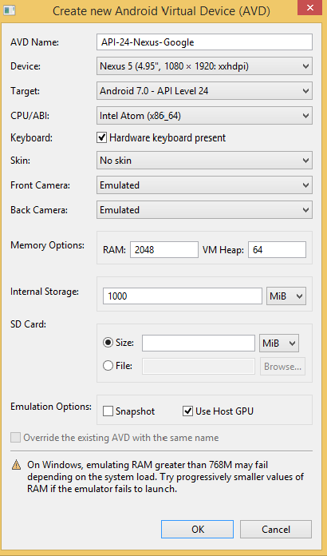
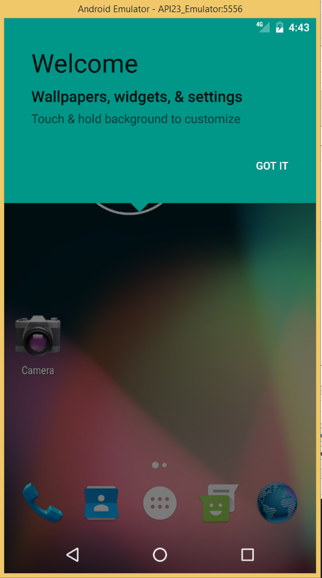

# Setup Android Emulators (AVD)

Using Android emulator a.k.a. Android Virtual Device (AVD) eases the development process by providing an option
to test mobile applications on various virtual devices. By default, the Android SDK does not provide an instance of an AVD, so in this article we are going to cover the process of creating and using one.

## Create a new emulator 

1. Open **Android SDK Manager** 

     - From your terminal run  `start %ANDROID_HOME%/"SDK Manager.exe"`
     - In macOS run `android sdk`
     
2. Make sure that the system images for the AVDs are installed. 

    The screenshow below shows the Android API 23 system images installed on the computer. If additional system images are needed (e.g. for different API level) select them and press **Install Packages** button at the bottom right corner.

    

    You can accelerate the virtual device using Virtualization Technology. For hardware with Intel CPUs, this can be achieved with HAXM installer. Acquire the installer from the [official download site of HAXM](https://software.intel.com/en-us/android/articles/intel-hardware-accelerated-execution-manager).
    After successful download, execute the installer and follow the installation instruction.

    > **Note:** To Use HAXM make sure that the system image is of type **Intel x86 Atom**. ARM emulators are much slower, but can be useful when your hardware does not support HAXM or when you have enabled Hyper-V technology.

3. Go to **Tools > Manage AVDs**

    This will load the **Android Virtual Device Manager** 
    On the first tab called "Android Virtual Devices" you will see a list of your enabled AVDs.
    By default, with a fresh Android SDK installation, this list will be empty. 

4. Press **Create**

    This step will load the AVD creation tool. Set the following parameters:

    - **AVD Name** : The emulator name in "Android Virtual Devices"
    - **Device** : Choose the hardware device to emulate (e.g. Nexus 5)
    - **Target** : Choose the API Level (e.g. Android Nougat API Level 23)
    - **CPU/ABI** : Choose the CPU architecture (e.g. Intel Atom x86) for use with HAXM use Intel Atom images!
    - **Keyboard** : Check "hardware keyboard present"
    - **Skin** : Choose the skin type for the emulator
    - **Front & Back Camera** : Enable/disable support for emulated or web cameras
    - **Memory Options** : Recommended to leave this as set by default!
    - **Internal Storage** : Default value 200MB - Increase this value to ensure that there is enough space for the applications that will be deployed later.
    - Check "Use Host GPU" to improve performance if your GPU provides enough resources.

    

    Once you have the AVD parameters set click **"OK"** then confirm all params and once again click **"OK"** and the emulator will be created.

5. Press **Start**

    From "Android Virtual Devices" select the created emulator and press **Start**.
    An additional popup screen will give options to scale the emulator and to wipe previously used data.
    Once all is set press **Launch**.

    

# Using the emulators with NativeScript

Once the emulator is launched, we can start the development process with NativeScript.
In many occasions the developers would like to work with several emulators simultaneously.
The best practice for this scenarios is to have all emulators opened in advance (to avoid launch timings and possible timeouts during build).
Once all the selected emulators are launched and all the real devices are attached we can check their status.

```
tns device

┌───┬──────────────────┬──────────┬──────────────────────┬──────────┬───────────┐
│ # │ Device Name      │ Platform │ Device Identifier    │ Type     │ Status    │
│ 1 │ bullhead         │ Android  │ 00bd261c1580a7d3     │ Device   │ Connected │
│ 2 │ sdk_phone_x86_64 │ Android  │ emulator-5554        │ Emulator │ Connected │
│ 3 │ vbox86p          │ Android  │ 192.168.206.103:5555 │ Emulator │ Connected │
└───┴──────────────────┴──────────┴──────────────────────┴──────────┴───────────┘
```

In the example case we have three devices connected. The first one is real device, the second one is Android Virtual Device and the third one is a third party emulator.

To launch a NativeScript application on a specific device you can pass `--device <id>` or `--device <device-identifier>` .

e.g. run on device with ID
```
tns run android --device 2
```

e.g. run on device with Device Identifier
```
tns run android --device 00bd261c1580a7d3
```

The example above will start the application on device with id 2 (sdk_phone_x86_64).

To launch a NativeScript application on all connected devices simultaneously, simply ignore the `--device <id>` flag.

```
tns run android
```


