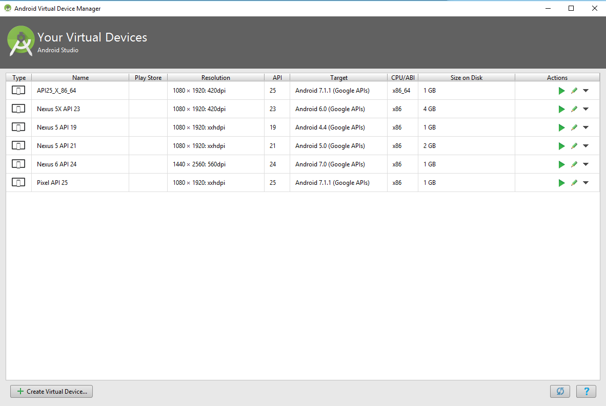
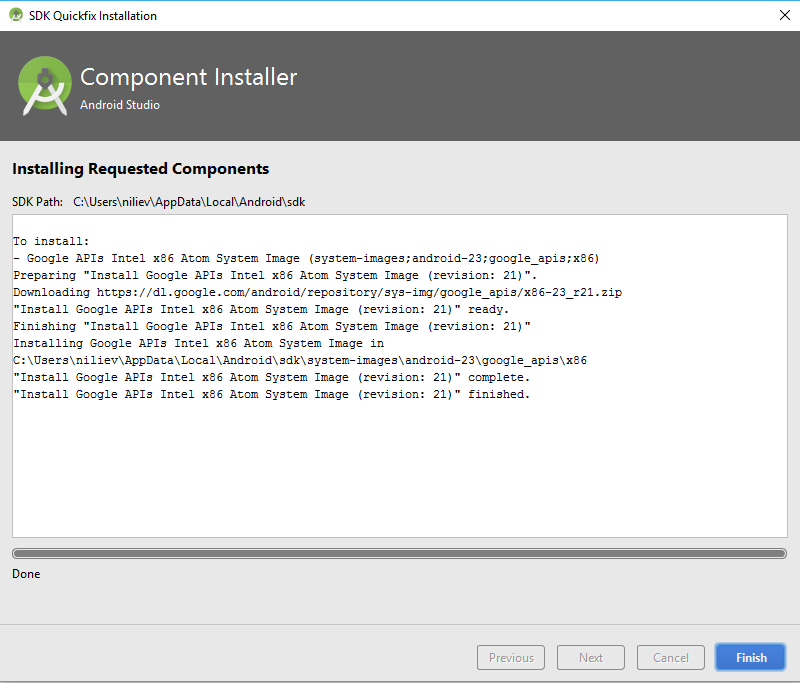
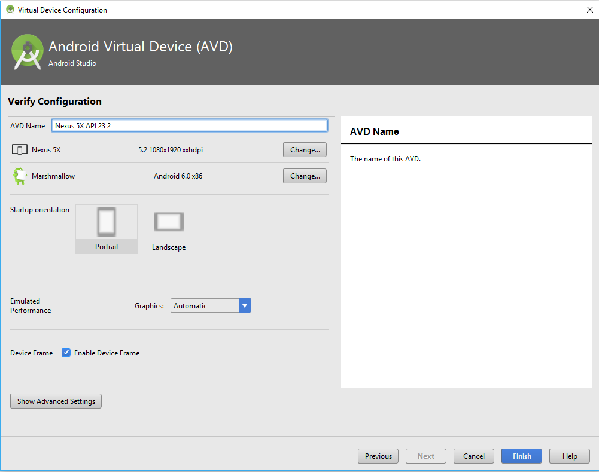
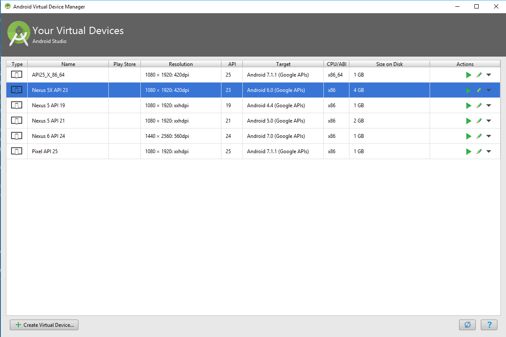

# Setup Android Emulators (AVD)

Using Android emulator a.k.a. Android Virtual Device (AVD) eases the development process by providing an option to test mobile applications on various virtual devices. By default, the Android SDK does not provide an instance of an AVD, so in this article, we are going to cover the process of downloading, creating and using one via Android Studio.

## Create a new emulator 

Open **Android Studio** and start AVD manager located in `Tools > Android > AVD Manager`

_Figure 1: Start AVD Manager:_


The AVD Manager will load the list of already installed system images (if any) and will also provide you with an option to create new emulator via `Create Virtual Device` button located at the bottom left corner.

_Figure 2: List all AVDs:_


Pressing `Create Virtual Device` will load the `Select Hardware` screen. A list of device definitions will load. Choose the preferred device from the `Phone` tab and press `Next`.

_Figure 3: Select Hardware:_


The `System Image` screen will give you the list of available system images for all supported Android API Levels. To be able to create an emulator, the system image must be downloaded locally. In the screen above, an Android 6 Google APIs system image is selected. Press `Download` to obtain the image.

_Figure 4: Choose system image:_


In the screen shown above, an Android 6 Google APIs system image is selected. Press `Download` to obtain the image. Once the system image is successfully downloaded and unzipped, press `Finish`.

_Figure 5: Download system image:_


The `System Image` screen will appear again with the downloaded system image. Select the system image and press `Next`.

_Figure 6: Install system image:_


The final configuration screen will load. If fine-tuning is needed, you can change the default settings of the new emulator (e.g. default screen orientation, device frame, memory options, etc.). When all settings are set and ready press `Finish`.

_Figure 7: Verify Configuration Screen:_


The newly created Android Virtual Device is now listed in the AVD Manager. Select the system image and press the green arrow to the right to manually start the emulator.

_Figure 8: Start the Android Virtual Device:_



# Using the emulators with NativeScript

Once you launch an emulator, you’re ready to start developing NativeScript apps on this emulated device. Oftentimes during development you’ll want to work with several emulators simultaneously. The best practice for this scenarios is to have all emulators opened in advance (to avoid launch timings and possible timeouts during build). Once all the selected emulators are launched, and all the real devices are attached we can check their status.

```
tns devices

┌───┬──────────────────┬──────────┬──────────────────────┬──────────┬───────────┐
│ # │ Device Name      │ Platform │ Device Identifier    │ Type     │ Status    │
│ 1 │ bullhead         │ Android  │ 00bd261c1580a7d3     │ Device   │ Connected │
│ 2 │ sdk_phone_x86_64 │ Android  │ emulator-5554        │ Emulator │ Connected │
│ 3 │ vbox86p          │ Android  │ 192.168.206.103:5555 │ Emulator │ Connected │
└───┴──────────────────┴──────────┴──────────────────────┴──────────┴───────────┘
```

In the example case, we have three devices connected. The first one is a real device, the second one is Android Virtual Device, and the third one is a third party emulator.

To launch a NativeScript application on a specific device you can pass `--device <id>` or `--device <device-identifier>` .

e.g. run on device with ID
```
tns run android --device 2
```

e.g. run on device with Device Identifier
```
tns run android --device 00bd261c1580a7d3
```

The example above will start the application on the device with id 2 (sdk_phone_x86_64).

To launch a NativeScript application on all connected devices simultaneously, simply ignore the `--device <id>` flag.

```
tns run android
```


