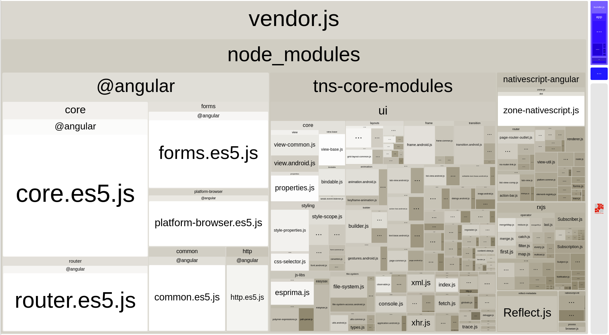

# Using Webpack to Bundle Your Code

1. [Overview](#overview)
1. [Introducing Webpack](#introducing-webpack)
1. [Installation](#installation)
1. [How nativescript-dev-webpack works](#how-nativescript-dev-webpack-works)
1. [Bundling](#bundling)
1. [Uglify.js](#uglify.js)
1. [Angular and Ahead-of-Time Compilation](#angular-and-ahead-of-time-compilation)
1. [Dynamic Imports](#dynamic-imports)
1. [Advanced Usage](#advanced-usage)
1. [Debugging Bundling Errors](#debugging-bundling-errors)
1. [Inspecting Bundles](#inspecting-bundles)
1. [Bundling Extra Assets](#bundling-extra-assets)
1. [Recommendations for Plugin Authors](#recommendations-for-plugin-authors)
1. [Webpack resources](#webpack-resources)

## Overview

JavaScript code and general asset bundling has been a member of the web developer toolbox for a long time. Tools like [webpack](https://webpack.github.io/) have been providing support for an enjoyable development experience that lets you assemble client-side code from various module sources and formats and then package it together. Most importantly, they allow for page load time optimizations that reduce or parallelize the number of requests a browser makes to the server.

Why bundle scripts in a mobile app though? Aren't all files stored on the local device, so requesting them should be faster than an HTTP request?! Yes, that is the case, but bundling still has an important place in mobile app optimizations:

* Fewer filesystem operations on app startup since all code is loaded from a single bundle file. Mobile file storage is not known for being very performant.
* Smaller code size. Bundlers traverse the module import graph and do not bundle unused modules. Not using that obscure feature in module X? Don't make your users pay for it then.
    * Tree-shaking. With the advent of ECMAScript 2015 modules, we have new tools that allow stripping unused parts of big modules and further reduce our application size.
* Preprocessing and interoperability hooks (not covered in this article). Webpack provides a way to resolve modules and expressions differently according to its configuration. It also contains a lot of plugins and loaders that let you embed different content in your application or use code written in different programming languages.

## Introducing Webpack

Webpack works by traversing your source tree starting from a number of "entry" modules and navigating through module imports. This makes it possible to collect just modules that are actually used in your program. Webpack is very extensible -- you can customize every step of the bundling process and add support for all sorts of asset generation and manipulation procedures.

Since bundling can be a slow and resource intensive operation, we do not enable it for every build. It is easiest to develop and debug your code without bundling, and use bundled code for QA/release builds.


## Installation and Configuration

Since every project is unique and can have quite complex requirements for bundling we tried to make webpack configuration as simple as possible. After installation, the plugin will configure the bundling dependencies, and add a basic configuration that should work for most projects. Developers can (and should) extend that to fit their specific project needs.

The easiest way to enable webpack support for your application is to install the `nativescript-dev-webpack` plugin. To do that, run this in your application folder:

```
$ npm install --save-dev nativescript-dev-webpack
```

The plugin adds a few dependencies to the project. Don't forget to install them:
```
$ npm install
```

## How nativescript-dev-webpack Works

Installing the plugin adds several updates to your project:

- `devDependencies` settings that will contain the most popular webpack package and several loaders and plugins.
- `webpack.config.js` -- this is the configuration file. It contains sensible defaults, but it is designed to be as readable and easy to modify as possible.
- Application source files configuring bundle chunks:
    - `app/vendor`. Defines vendor modules which get bundled separately from application code.
    - `app/vendor-platform.android` and `app/vendor-platform.ios`. Define platform-specific vendor modules.
- Several helper scripts in your project's `package.json` files that let you build a bundled version: `build-<platform>-bundle` and `start-<platform>-bundle`.


## Bundling

`nativescript-dev-webpack` changes the usual workflow of working with your project. Instead of using `tns` CLI commands, we will use `npm run` commands to invoke scripts that prepare the release build.

Given that you have your project running in its non-bundled state, you can test the bundled version with the following command(s):

```
$ npm run start-android-bundle
```

or

```
$ npm run start-ios-bundle
```

If you want to package your application, you need the `build-...` commands:

```
$ npm run build-android-bundle
```

or

```
$ npm run build-ios-bundle
```

The former will produce an android `.apk` archive, while the latter will create an `.app` or `.ipa` package.

Note that the `build-<platform>-bundle` commands will ultimately call `tns build <platform>` behind the scenes. By default it will not pass any extra parameters to the `tns` tool, so, if you need a release build, signed with a certain key, you would need to provide the parameters prefixed by a `--` marker. For example, here is how you'd create a release build for an iOS device containing bundled scripts:

```
$ npm run build-ios-bundle -- --release --forDevice --teamId TEAM_ID
```
The corresponding command for android looks like:
```
$ npm run build-android-bundle -- --release --keyStorePath ~/path/to/keystore --keyStorePassword your-pass --keyStoreAlias your-alias --keyStoreAliasPassword your-alias-pass
```

Under the hood these commands use the `ns-bundle` script which you can find in `./node_modules/.bin`. If you don't want to build/start your application but only prepare it for release, you can invoke the script with the following commands:
```
$ npm run ns-bundle --android
```
or
```
$ npm run ns-bundle --ios
```

### Uglify.js

The webpack configuration includes the `uglifyjs-webpack-plugin`(https://github.com/webpack-contrib/uglifyjs-webpack-plugin). The plugin performs code minification and improves the size of the bundle.
That plugin is disabled by default because it slows down the building process. You can enable it by providing the `--uglify` flag to the bundling command. Example usage:

```
$ npm run build-android-bundle --uglify

```

or, if you are building for release:
```
$ npm run build-ios-bundle --uglify -- --release --forDevice --teamId TEAM_ID
```

### Angular and Ahead-of-Time Compilation

NativeScript Angular projects will also have the [`@ngtools/webpack`](https://www.npmjs.com/package/@ngtools/webpack) plugin added. The former performs Ahead-of-Time compilation and code splitting for lazy loaded modules. Also, if your application is Ahead-of-Time compiled, you won't have Angular compiler included in your bundle which results in smaller application size and improved start up time.
To take advantage of Ahead-of-Time compilation, you need to bootstrap your app with the static NativeScript Angular platform instead of the dynamic one. For that, you will have to create a `main.aot.ts` file next to your `app/main.ts` file. Also make sure, that the `main` property in your `app/package.json` is `main.js`. If your root NgModule is named `AppModule` and is located in `app/app.module.ts`, the content of the `main.aot.ts` file should be the following:

```ts
// app/main.aot.ts
import { platformNativeScript } from "nativescript-angular/platform-static";
import { AppModuleNgFactory } from "./app.module.ngfactory";

platformNativeScript().bootstrapModuleFactory(AppModuleNgFactory);
```

Note that the `./app.module.ngfactory` file still does not exist. It will be in-memory generated by the Angular compiler (ngc) during build time. That's why you don't want TypeScript to try to compile the `main.aot.ts` file and fail. You can exclude it from compilation by configuring your `tsconfig.json`:

```ts
// tsconfig.json
{
    "compilerOptions": {
    ...
    },
    "exclude": [
        ...
        "app/main.aot.ts"
    ]
}

```

PS: If you created your project with `tns create AppName --ng`, it will already be prepared for Ahead-of-Time compilation.

### Dynamic Imports

A significant drawback to using bundled code is that you have to know the names of all imported modules in advance at bundle time. That means code using variables and passing them to `require` will not work:

```JavaScript
// THROWS AN ERROR!
require(myPlugin);
```

You can solve this if you have a known set of resolvable modules and you need to switch between them by registering those so that webpack discovers them. You do that by adding a set of `global.registerModule` calls to your application bootstrap code (or some other module that is discovered by webpack when traversing the module import graph):

```JavaScript
require("globals");
global.registerModule("my-plugin", function() { return require("my-plugin"); });
```

Then you will be able to import this module using the `global.loadModule` API:

```JavaScript
var myPlugin = "my-plugin";
//...
global.loadModule(myPlugin);
```

### XML Pages and Code-behind Files

XML page definitions load JavaScript modules named with the same name as the XML file that contains the UI markup. To make those work with webpack bundles, you need to register them as dynamic modules:

```JavaScript
global.registerModule("main-page", () => require("./main-page"));
```


## Advanced Usage

Webpack bundling can fail for different reasons. It sometimes fails to resolve certain modules, or it generates code that breaks at runtime (like the dynamic imports scenario outlined above). To debug those problems, you need to turn on detailed error messages and/or inspect the produced bundles.


### Debugging Bundling Errors

Webpack may not show all error details by default, but you can always enable that by passing the `--display-error-details` [configuration option](https://webpack.github.io/docs/cli.html#display-error-details). You can manually invoke the webpack tool, and pass the extra options using the same `--` trick we mentioned above:

```
$ npm run webpack-android -- --display-error-details
```

Note that the above command will not run a full build. Use it only to run the webpack process manually and troubleshoot failed builds.

Other options that can be useful when diagnosing a problem are: `--display-modules`, `--display-reasons`, `--display-chunks`.

### Inspecting Bundles

Bundles are generated in the platform output folders. Look for the `bundle.js` and `tns-bundle.js` files in your `platforms/android/...` and `platforms/ios/...` "app" folders. You could change the destination directory by editing your configuration.

You could also rely on webpack analysis and visualization plugins that can help you diagnoze bundle problems and reduce bundle size:

- [webpack-bundle-analyzer](https://www.npmjs.com/package/webpack-bundle-analyzer)


Here's a simple configuration of the above plugin, that you can add to your `webpack.config.js`:

```js
// webpack.config.js
const { BundleAnalyzerPlugin } = require("webpack-bundle-analyzer");

...

let plugins = [
    ...
    new BundleAnalyzerPlugin({
        analyzerMode: "static",
        openAnalyzer: false,
        generateStatsFile: true,
        reportFilename: path.join(__dirname, "report", `${platform}-report.html`),
        statsFilename: path.join(__dirname, "report", `${platform}-stats.json`),
    }),
];
```

When you build your project, the analyzer plugin will generate a `report` directory in the app root, which contains two files - `${platform}-report.html` and `${platform}-stats.json`. You can open the html in any web browser and inspect the generated bundles.



For analyzing the dependency graph between the modules, you can use `webpack.github.ui/analyse` and open the `${platform}-stats.json` file.

### Bundling Extra Assets

The default webpack configuration tries to copy certain files to your app folder:

- HTML/XML markup files.
- App/theme CSS files.
- Images: png/jpg/etc.

If you need other files bundled with your app, find the `CopyWebpackPlugin` configuration in `webpack.config.js`, and add a new config:

```JavaScript
new CopyWebpackPlugin([
    ...
    {from: "**/*.pdf"},
    ...
], {ignore: ["App_Resources/**"]}),

```

## Recommendations for Plugin Authors

Most third party packages are problem free, and get picked up by webpack without any issues. Some libraries though require a bit of tweaking. When you encounter a library that does not get recognized by your webpack configuration, please open up an issue on that library's GitHub repository.

### Referencing Platform-specific modules from "package.json"

This is the most common problem with third party plugins. Most plugins provide two platform-specific implementations stored in modules named like `my-plugin.android.js` and `my-plugin.ios.js`. The `package.json` file for the plugin looks like this:

```JSON
{
    "main": "my-plugin.js"
}
```

Webpack will read the `package.json` file and try to find a `my-plugin.js` module and will fail. The correct way to reference a platform-specific module would be to remove the `.js` extension:

```JSON
{
    "main": "my-plugin"
}
```

That will allow webpack to correctly reference `my-plugin.android.js` or `my-plugin.ios.js`.

### Emitting Helper Functions in TypeScript Plugins

The TypeScript compiler implements class inheritance, decorators and other features using a set of helper functions that get emitted at compile time. NativeScript ships with its own implementations of those helpers to allow features like extending platform native classes. That is why plugin authors need to configure their compiler **NOT** to emit helpers. The easiest way is to edit the `tsconfig.json` file and set the `noEmitHelpers` option to `true`:

```JSON
{
    "compilerOptions": {
        ...
        "noEmitHelpers": true,
        ...
    },
    ...
}
```


## Webpack Resources

Bundling JavaScript code can get complex quickly, and encountering webpack for the first time can be daunting. A full introduction to webpack and related technologies is beyond the scope of this article, and we recommend the following resources:

* [Introduction](https://webpack.js.org/guides/get-started/)
* [Tutorial](https://webpack.js.org/concepts/)
* [Webpack CLI Reference](https://webpack.js.org/api/cli/#components/sidebar/sidebar.jsx)
