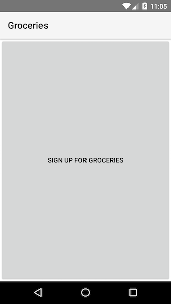
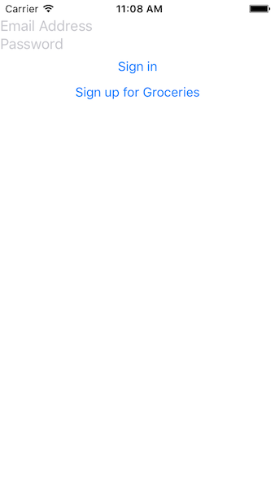
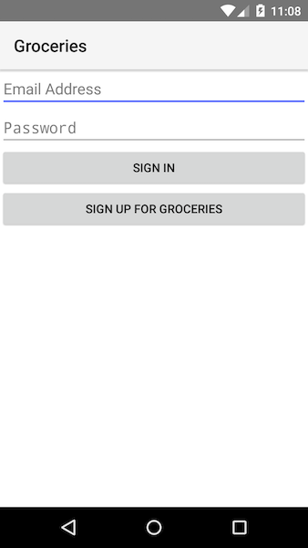
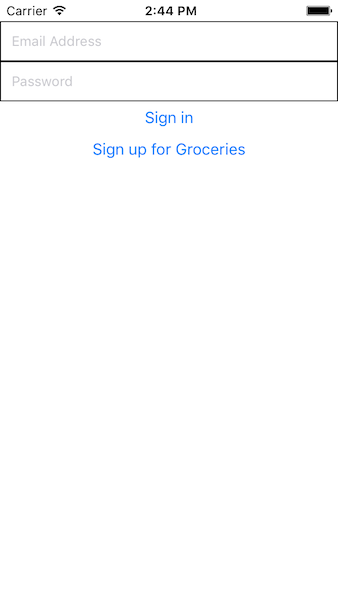
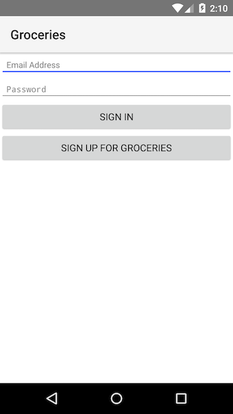
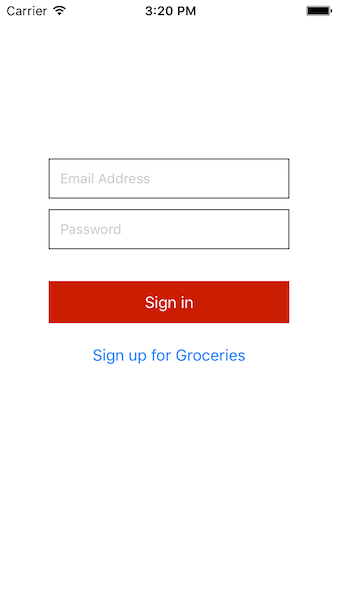
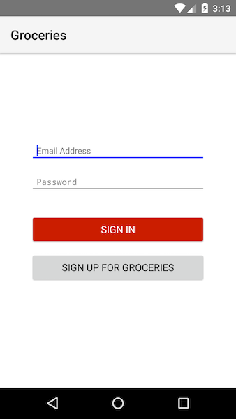
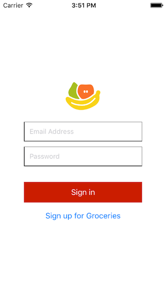

# Chapter 2—Creating User Interfaces

In this chapter you’re going to learn how to build NativeScript user interfaces, including markup, styling, images, and more.

But to do that you’re going to start on a new app that you’ll continue building throughout the rest of the tutorial. Working on a real-world app will help teach concepts that are hard to show in simple examples, such as how to best organize your code. With that in mind let’s start by looking at what you’ll be building.

## Table of contents

- [2.1: What you’re building](#21-what-youre-building)
- [2.2: Folder structure](#22-folder-structure)
- [2.3: Adding UI components](#23-adding-ui-components)
- [2.4: Layouts](#24-layouts)
- [2.5: Global CSS](#25-global-css)
- [2.6: Page-specific CSS](#26-page-specific-css)
- [2.7: Images](#27-images)

## 2.1: What you're building

The rest of this guide will walk you through building [Groceries](https://github.com/NativeScript/sample-Groceries), a groceries management app that does the following things:

- Connects to an existing RESTful service.
- Provides user registration and login.
- Lets authenticated users add and delete groceries from a list.
- Runs cross-platform (iOS and Android).

If you follow along to the end, here's what the finished app will look like on iOS:


And here's what the app will look like on Android:


Let’s get the starting point of this app so you can follow along with the rest of this guide.

<h4 class="exercise-start">
    <b>Exercise</b>: Get the Groceries starting point
</h4>

Your first step will be to find a place on your development machine to store this new project. You might want to set up a folder structure that looks something like this:

<div class="no-copy-button"></div>

```
.
└── NativeScript-Projects
    ├── HelloWorld
    └── ...
```

Once you have a folder structure you’re comfortable with in place, navigate to that folder using your terminal’s `cd` command, and run the `tns create` command below to create a new app named Groceries.

```
tns create Groceries --template nativescript-template-groceries
```

The command will again take a minute to complete, as the Groceries template contains a number of images you’ll be using as part of this tutorial. When the process finishes, use the `cd` command to navigate into the new app.

```
cd Groceries
```

And then open the new app in your text editor of choice. If you’re using Visual Studio Code you can use the `code` command to do so.

```
code .
```

<div class="exercise-end"></div>

Now that you have the app locally, let’s take a look at the files that make up this application.

## 2.2: Folder structure

To keep things simple, let's start by looking at the outer structure of the Groceries app:

```
.
└── Groceries
    ├── app
    │   └── ...
    ├── node_modules
    │   └── tns-core-modules
    ├── package.json
    └── platforms
        ├── android
        └── ios
```

Here's what these various files and folders do:

- **app**: This folder contains all the development resources you need to build your app. You'll be spending most of your time editing the files in here.
- **node_modules**: This folder contains your app's npm module dependencies. All new NativeScript projects start with a single dependency on tns-core-modules.
- **node_modules/tns-core-modules**: This folder contains your app's NativeScript modules, which are a series of NativeScript-provided JavaScript modules you'll use to build your app. Each module contains the platform-specific code needed to implement some feature—http calls, the file system, and so forth—exposed through a platform-agnostic API (e.g. `http.getJSON("https://httpbin.org/get")`). We'll look at some examples in [chapter 4](chapter-4). The source code for these modules lives at <https://github.com/NativeScript/nativescript>.
- **package.json**: This file contains your app's configuration details, such as your app id, the version of NativeScript you're using, and also which npm modules your app uses. We'll take a closer look at how to use this file when we talk about using npm modules in [chapter 5](chapter-5).
- **platforms**: This folder contains the platform-specific code NativeScript needs to build native iOS and Android apps. For example in the `android` folder you'll find things like your project's `AndroidManifest.xml` and .apk executable files. Similarly, the `ios` folder contains the Groceries' Xcode project and .ipa executables. Note, users on Windows and Linux machines will not have an `ios` folder.

The NativeScript CLI manages the `platforms` folder for you as you develop and run your app; therefore, it's a best practice to treat the `platforms` folder as generated code. The Groceries app includes the `platforms` folder in its [`.gitignore`](https://github.com/NativeScript/sample-Groceries/blob/master/.gitignore) to exclude its files from source control.

Next, let's dig into the `app` folder, as that's where you'll be spending the majority of your time.

```
.
└── Groceries
    ├── app
    │   ├── App_Resources
    │   │   ├── Android
    │   │   └── iOS
    │   ├── shared
    │   │   └── ...
    │   ├── pages
    │   │   └── login
    │   │       ├── login.js
    │   │       └── login.xml
    │   ├── app.css
    │   ├── app.js
    │   └── ...
    └── ...
```
Here's what these various files and folders do:

- **App_Resources**: This folder contains platform-specific resources such as icons, splash screens, and configuration files. The NativeScript CLI takes care of injecting these resources into the appropriate places in the `platforms` folder when you execute `tns run`.
- **shared**: This folder, specific to the Groceries app, contains any files you need to share across pages in your app. In the Groceries app, you'll find a few view model objects and a `config.js` file used to share configuration variables like API keys.
- **pages**: This folder contains the code to build your app's pages, each of which will have a subfolder in `pages`. Each page is made up of an XML file, a JavaScript file, and an optional CSS file. The groceries app contains two folders for its two pages.
- **app.css**: This file contains global styles for your app. We'll dig into app styling later in this chapter.
- **app.js**: This file sets up your application's starting module and initializes the app.

Let's start with `app/app.js`, as it's the starting point for NativeScript apps. Your `app.js` contains the two lines below: 

``` JavaScript
var applicationModule = require("application");
applicationModule.start({ moduleName: "pages/login/login" });
```

Here, you're requiring, or importing, the [NativeScript application module](). Then, you call its `start()` method with the starting screen of your app (the login screen), which lives in your app's `pages/login` folder.

> **TIP**: JavaScript modules in NativeScript follow the [CommonJS specification](http://wiki.commonjs.org/wiki/CommonJS). This means you can use the [`require()` method](http://wiki.commonjs.org/wiki/Modules/1.1#Module_Context) to import modules, as is done above, as well as use the `export` keyword to expose a module's properties and methods, which we'll look at later in this chapter. These are the same constructs Node.js uses for JavaScript modules, so if you know how to use Node.js modules, you already know how to use NativeScript modules.

Now that your app is ready for development, let's add some UI components to make your login screen show more than some basic text.

## 2.3: Adding UI components

The primary difference between building an Angular app for the web and an Angular app with NativeScript is in the UI components that you use. NativeScript apps do not use a browser and do not have a DOM; therefore, elements like `<div>` and `<span>` simply do not work.

No worries though, as NativeScript provides an [extensive suite of UI components](http://docs.nativescript.org/ui/ui-views), each of which are implemented with native iOS and Android controls. For instance, the NativeScript [`<Label>` control](http://docs.nativescript.org/ui/ui-views#label) our previous example used is actually rendered as a [`UILabel`](https://developer.apple.com/library/ios/documentation/UIKit/Reference/UILabel_Class/) on iOS and an [`android.widget.TextView`](http://developer.android.com/reference/android/widget/TextView.html) on Android. The great thing about using NativeScript though, is that these native details are transparent to use as a developer. You type `<Label>` and let NativeScript handle the rendering details.

To see how these work let's dig into the files used to create your app's UI, which reside in the `app/pages` folder. Each folder in `app/pages` contains the code for one of the two pages in Groceries: `list` and `login`. If you look in the `app/pages/login` folder, you'll see a `login.js` file, a `login.xml` file, and a few CSS files. When you open `login.xml` you should see the following code:

``` XML
<Page>
    <Label text="hello world" />
</Page>
```

This page currently contains two UI components: a `<Page>` and a `<Label>`. To make this page look more like a login page, let's add a few additional components, namely two `<TextField>` elements and two `<Button>` elements.

<h4 class="exercise-start">
    <b>Exercise</b>: Add UI components to <code>login.xml</code>
</h4>

Open `app/pages/login/login.xml` and replace the contents of the file with the following code:

``` XML
<Page>
  <TextField hint="Email Address" keyboardType="email" autocorrect="false" autocapitalizationType="none" />
  <TextField hint="Password" secure="true" />

  <Button text="Sign in" />
  <Button text="Sign up for Groceries" />
</Page>
```

<div class="exercise-end"></div>

This code adds two new NativeScript UI elements: a text field and a button. Much like HTML elements, NativeScript UI elements provide attributes to let you configure their behavior and appearance. The code you just added uses the following attributes:

- `<TextField>`
    - `hint`: Shows placeholder text that tells the user what to type.
    - `keyboardType`: The type of keyboard to present to the user for input. `keyboardType="email"` shows a keyboard optimized for entering email addresses. NativeScript currently supports [five types of keyboards](/ui/keyboard.html) for text fields.
    - `autocorrect`: A boolean attribute that determines whether the mobile operating system should autocorrect user input. In the case of email address text fields, the autocorrect behavior is undesirable.
    - `autocapitalizationType`: Determines how the operating system should autocapitalize user input. `autocapitalizationType="none"` turns autocapitalization off altogether. NativeScript supports [four autocapitalization types](http://docs.nativescript.org/api-reference/modules/_ui_enums_.autocapitalizationtype.html) on text fields.
    - `secure`: A boolean attribute that determines whether the TextField's text should be masked, which is commonly done on password fields.
- `<Button>`
    - `text`: Controls the text displayed within the button.

After your app updates with this change, you may expect to see a polished login screen, but instead you will see a single `<Button>` element on the screen:




What went wrong? In NativeScript whenever you use more than one UI component, you need to tell NativeScript how to arrange those components on the screen. Since you’re not doing that currently, NativeScript is incorrectly assuming you want the last component—the `<Button>`—to take up the whole screen. To arrange these component, let’s move onto the NativeScript feature for aligning components on the screen: NativeScript layouts.

> **TIP**: If you’re coming from a web or hybrid development background, you may find Nic Raboy’s guide for [Upgrading Hybrid Apps to Native with NativeScript](http://www.hybridtonative.com/) helpful, as it compares and contrasts web and native user interface implementations.

## 2.4: Layouts 

NativeScript provides several different layout containers that allow you to place UI components precisely where you want them to appear. 

- The [Absolute Layout]() lets you position elements using explicit x and y coordinates. This is useful when you need to place elements in exact locations, for example showing an activity indicator widget in the top-left corner of your app.
- The [Dock Layout]() is useful for placing UI elements at the outer edges of your app. For example, a container docked at the bottom of the screen would be a good location for an ad.
- The [Flexbox Layout]() lets you arrange UI components using the syntax as `display: flex` on web.
- The [Grid Layout]() lets you divide your interface into a series of rows and columns, much like a `<table>` in HTML markup.
- The [Stack Layout]() lets you stack child UI components either vertically or horizontally.
- The [Wrap Layout]() lets child UI components flow from one row or column to the next when space is filled.

For your login screen, all you need is a simple `<StackLayout>` to stack the UI components on top of each other. In later sections, you'll use some of the more advanced layouts.

<h4 class="exercise-start">
    <b>Exercise</b>: Add a stack layout to the login screen
</h4>

In `login.xml`, add a `<StackLayout>` component within the `<Page>` component. `login.xml` should look like this:

``` XML
<Page>
  <StackLayout>

    <TextField hint="Email Address" keyboardType="email" autocorrect="false" autocapitalizationType="none" />
    <TextField hint="Password" secure="true" />

    <Button text="Sign in" />
    <Button text="Sign up for Groceries" />

  </StackLayout>
</Page>
```

<div class="exercise-end"></div>

After your app updates with this change, you'll see that your login page’s UI elements stack up:




Although the UI elements are in the correct order, they could use some spacing and color to make the app look a bit nicer. To do that let's look at another NativeScript feature: CSS.

> **TIP**:
> * Refer to the NativeScript docs for a [look at how NativeScript layouts work](/layouts) and the various things you can do to configure them.
> * Check out Jen Looper's article on [demystifying NativeScript layouts](https://www.nativescript.org/blog/demystifying-nativescript-layouts) for a thorough look at NativeScript layouts in action.

## 2.5: Global CSS

NativeScript uses a [subset of CSS](http://docs.nativescript.org/styling) to change the visual appearance of your app. Why a subset? In NativeScript you’re building native iOS and Android apps, and some CSS properties either aren’t possible to replicate with native iOS and Android APIs, or would incur too great of a performance penalty. Don’t worry though; most common CSS properties are supported, and the CSS language syntax is the same—so styling native apps in NativeScript really does feel like styling web apps.

> **TIP**: The NativeScript docs have [a full list of the supported CSS properties you can use](http://docs.nativescript.org/ui/styling#supported-css-properties).

You can use three mechanisms to add CSS properties to UI components: [application-wide CSS](/styling#application-wide-css) (`app.css`), [page-specific CSS](/styling#page-specific-css), and an [inline `style` attribute](/styling#inline-css). In this section we’ll cover application-wide, or global CSS, and in the next section we’ll look at how to apply CSS rules to individual pages.

> **TIP**: Although inline styles are great for quick testing—e.g. `<Page style="background-color: green;">` you should avoid them in general because the `style` attributes tend to clutter up XML files, especially if you need to apply multiple rules.

Let's start by adding a few application-wide CSS rules.

<h4 class="exercise-start">
    <b>Exercise</b>: Create global styles
</h4>

Open your `app/app.css` file and paste in the following code:

``` CSS
Page {
  background-color: white;
  font-size: 15;
}
TextField {
  padding: 10;
  font-size: 13;
}
```

<div class="exercise-end"></div>

If you've done any web development before, the syntax should feel familiar here. You select two UI components by their tag names (Page and TextField), and then apply a handful of CSS rules as name/value pairs.

Let's make one more change. Although often you want CSS rules to apply equally to your iOS and Android app, occasionally it makes sense to apply a CSS rule to only one platform. For example, iOS text fields frequently have borders around them, but Android text fields do not. Let's look at how to make platform-specific style changes in NativeScript.

<h4 class="exercise-start">
    <b>Exercise</b>: Add platform-specific CSS
</h4>

Add the following as the first line of your app's `app.css` file:

``` CSS
@import url("~/platform.css");
```
> **IMPORTANT**: NativeScript is consistent with browser implementations, in that `@import` statements must precede all other CSS rules in a file.

Next, open your app’s `app/platform.ios.css` file and paste in the following code:

``` CSS
TextField {
  border-width: 1;
  border-color: black;
}
```

> **NOTE**: We’ll leave the `platform.android.css` file empty as we have no Android-specific changes to make yet.

<div class="exercise-end"></div>

Let's break down what just happened. First, NativeScript supports CSS's `@import` statement for importing one CSS file into another. So this new line of code imports the CSS rules from `platform.css` into `app.css`. But, you might have noticed that Groceries does not have a file named `platform.css`—only `app/platform.android.css` and `app/platform.ios.css` exist. What's going on here?

<a id="platform-specific-files"></a>When you execute `tns run`, or `tns livesync`, the NativeScript CLI takes your code from the `app` folder and places it in the native projects located in the `platforms/ios` and `platforms/android` folders. Here the naming convention comes in: while moving files, the CLI intelligently selects `.android.*` and `.ios.*` files. To give a specific example, the CLI moves `platform.ios.css` into `platforms/ios` and renames it to `platform.css`; similarly, the CLI moves `platform.android.css` into `platforms/android`, and again renames it to `platform.css`. This convention provides a convenient way to branch your code to handle iOS and Android separately, and it's supported for any type of file in NativeScript—not just CSS files. You'll see a few more examples of this convention later in this guide.

With these changes in place, you'll notice that the app has a bit more spacing, and also that the text fields have borders on iOS but that Android:




Despite our changes the app still looks pretty ugly, and that’s because we’re going to apply another batch of styles at the page level. Let’s look at how that works.

## 2.6: Page-specific CSS

Much like on the web, sometimes in your NativeScript apps you want to write CSS rules that apply to your entire application, and sometimes you want to write CSS rules that apply to a specific portion of the interface. In the previous section you saw how to use NativeScript’s `app.css` file to write global rules, and in this section you’ll learn how to use page-specific CSS files to apply rules that are scoped to individual pages.

<h4 class="exercise-start">
    <b>Exercise</b>: Add page-specific CSS rules
</h4>

Next, open your app’s `app/pages/login/login-common.css` file and paste in the following code:

``` CSS
StackLayout {
  margin-left: 30;
  margin-right: 30;
  padding-bottom: 15;
  background-color: white;
}
Image {
  margin-top: 5;
  margin-bottom: 20;
}
Button, TextField {
  margin-left: 16;
  margin-right: 16;
  margin-bottom: 10;
}
.submit-button {
  background-color: #CB1D00;
  color: white;
  margin-top: 20;
}
```

<div class="exercise-end"></div>

The `pages/login` folder contains three CSS files designed to give you the same flexibility you used at the global level with `app.css`, `platform.ios.css`, and `platform.android.css`. You can place common login styling in `login-common.css`, iOS-specific login styling `login.ios.css`, and Android-specific login styling in `login.android.css`.

> **TIP**: If you find this modularity to be overkill for your own pages, you can use a single CSS file with the with the same name as your page’s XML file, for example `login.css`.

The great thing about placing CSS rules at the page level is you can use concise CSS selectors such as `Button` and `TextField`, and not worry about those rules applying to all buttons and text fields in your application, as NativeScript ensures those rules remain scoped to your page.

Before we see what your app looks like now, there’s one small change you need to make. Notice that the last selector used in `login-common.css` is `.submit-button`. Much like using CSS on the web, in NativeScript you can add both `id` and `class` attributes to target specific user interface elements, but at the moment there’s no UI component in your app with an `class` of `"submit-button"`. Let’s change that.

<h4 class="exercise-start">
    <b>Exercise</b>: Add a <code>class</code> attribute
</h4>

Open your `app/pages/login/login.xml` file, find `<Button text="Sign in" />` component, and replace it with the code below:

``` XML
<Button text="Sign in" class="submit-button" />
```

<div class="exercise-end"></div>

With this last `class` change in place your app is starting to look a little nicer:




As you can see, in NativeScript you have a lot of options for how you can apply CSS rules. You can apply rules globally either for both platforms in `app.css`, for iOS in `platform.ios.css`, or for Android in `platform.android.css`. And you can also apply rules at the page level, while maintaining the same flexibility to target different platforms if required.

To continue polishing the visuals of this login screen, let’s look at how we can add an image of this app’s logo.

## 2.7: Images

In NativeScript you use the `<Image>` UI component and its `src` attribute to add images to your pages. The `src` attribute lets you specify your image in three ways. The first (and simplest) way is to point at the URL of an image:

``` XML
<Image src="https://www.nativescript.org/images/default-source/landingpages/logo.png" />
```

The second way is to point at an image that lives within your app's `app` folder. For example if you have an image at `app/images/logo.png`, you can use it with:

``` XML
<Image src="~/images/logo.png" />
```

The third way, and the one Groceries uses, is to use platform-specific image resources. Let's add an image to the login screen and then discuss exactly what's happening.

<h4 class="exercise-start">
    <b>Exercise</b>: Add a logo
</h4>

In `login.xml`, add the `<Image>` below as the first child of the existing `<StackLayout>` tag:

``` XML
<Image src="res://logo" stretch="none" horizontalAlignment="center" />
```

<div class="exercise-end"></div>

The `res://` syntax tells NativeScript to use a platform-specific resource, in this case an image. Platform-specific resources go in your app's `app/App_Resources` folder. If you look there you'll find a few different image files, several of which are named `logo.png`.

Although more complex than putting an image directly in the `app` folder, using platform-specific images gives you more control over image display on different device dimensions. For example iOS lets you provide three different image files for devices with different pixel densities. As such you'll find logos named `logo.png`, `logo@2x.png`, and `logo@3x.png` in your `App_Resources/iOS` folder. For Android you'll find similar image files in `App_Resources/Android/drawable-mdpi` (for "medium" dpi, or medium dots-per-inch), `App_Resources/Android/drawable-hdpi` (for high-dpi), `App_Resources/Android/drawable-xhdpi` (for extra-high-dpi), and so forth.

Once these files are in place the NativeScript framework knows how to pick the correct file; all you have to do is reference the image using `res://` and its base file name—i.e. `res://logo`. Here's what your login screen should look like on iOS and Android:




At this point your UI looks better visually, but the app still doesn't actually do anything. Let's look at how you can use JavaScript to add some functionality.

> **TIP**: The community-written [NativeScript Image Builder](http://nsimage.brosteins.com/) can help you generate images in the appropriate resolutions for iOS and Android.

<div class="next-chapter-link-container">
  <a href="/tutorial/chapter-3">Continue to Chapter 3—Application Logic</a>
</div>
