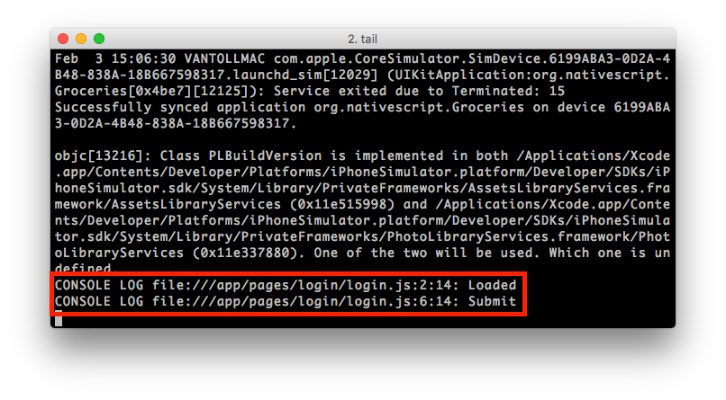
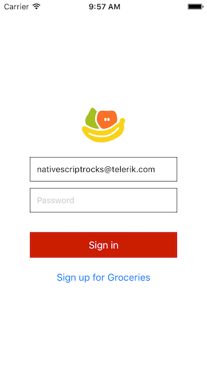
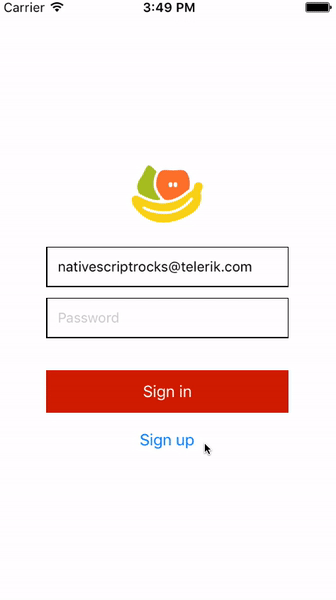

# Chapter 3—Application Logic

In this chapter, you'll learn how to add JavaScript logic to your NativeScript app, and you'll be doing so using the base pattern on which the NativeScript framework is built, MVVM, or "model view view model". Here's what those words mean:

- **Model**: The model defines and represents the data. Separating the model from the various views that might use it allows for code reuse.
- **View**: The view represents the UI, which in NativeScript is written in XML. The view is often data-bound to the view model so that changes made to the view model in JavaScript instantly trigger visual changes to UI components.
- **View Model**: The view model contains the application logic (often including the model), and exposes the data to the view. NativeScript provides a module called 'Observable', which facilitates creating a view model object that can be bound to the view.

The biggest benefit of separating models, views, and view models, is that you are able to use two-way data binding; that is, changes to data in the model get instantly reflected on the view, and vice versa. The other big benefit is code reuse, as you're often able to reuse models and view models across views.

In Groceries, so far you've only touched the view (`login.xml`), and in this chapter you'll be creating a view model. To do so we first need to introduce one other type of file, the code-behind, and use the code-behind to implement event and data binding

## Table of contents

- [3.1: Event binding](#31-event-binding)
- [3.2: Data binding](#32-data-binding)


## 3.1: Listening for events

In NativeScript a code-behind file is a JavaScript file that shares the same name as the view. For example, the login page's view is named `login.xml`, so its code-behind file is named `login.js`. The code-behind file is where you put all code that interacts with the view itself.

Let's look at what you can do in a code-behind file with a simple example that introduces NativeScript’s event binding.

<h4 class="exercise-start">
    <b>Exercise</b>: Implementing event binding
</h4>

Open `login.xml` and add a `loaded` attribute to the `<Page>` UI component at the top. It should look like this:

``` XML
<Page loaded="pageLoaded">
```

While still in `login.xml`, add `tap` attribute to the first `<Button>` component. It should look like this:

``` XML
<Button tap="submit" text="Sign in" class="submit-button" />
```

Finally, paste the code below in `app/pages/login/login.js` to define new `pageLoaded()` and `submit()` functions:

``` JavaScript
exports.pageLoaded = function() {
  console.log("Loaded");
};

exports.submit = function() {
  console.log("Submit");
}
```
<div class="exercise-end"></div>

> **NOTE**: The keyword `exports` is part of [CommonJS](http://wiki.commonjs.org/wiki/Modules/1.1), the standard on which both NativeScript and Node.js' implementations of modules are based. In CommonJS-based JavaScript modules, a free variable called `exports` is an object to which a module might add properties and methods to configure its external API. Using `exports` in a code-behind file exposes the function for use in the view, or XML file. That is, the `exports.pageLoaded` assignment in the code-behind file is what makes `loaded="pageLoaded"` in the view work.

All NativeScript UI components have events associated with them, and by using the `eventName="functionName"` syntax you can bind functions to handle these various events.

When this page loads NativeScript fires a `loaded` event on the `<Page>`, which triggers the `pageLoaded()` function in your code-behind file. If you tap the “Sign in” button NativeScript fires a `tap` event, which triggers the `submit()` function in your code-behind file.

After loading your app and tapping the button you should see two new log entries in your terminal.



This simple example shows how you can listen to user interface events and react in your code-behind file. We’ll be using a variety of these events as we move through this guide, but for now let’s look at some of the other things you can do in code-behind files.

> **TIP**: You can find a list of events available for each UI element on that component’s respective API documentation. For instance, the [page component’s API documentation](http://docs.nativescript.org/api-reference/classes/_ui_page_.page.html) lists its `loaded` event.

## 3.2: Changing attributes and data

Oftentimes you need to change the attributes of your UI components in reaction to a change in your app. For instance you might need to update a label in a weather app when you get a new reading, or update a stock ticker when new data comes in.

Let’s start by looking at some basic approaches you have for altering UI components in NativeScript, and then move on to more robust two-way data binding implementations.

<h4 class="exercise-start">
    <b>Exercise</b>: Changing attributes of UI components
</h4>

Let’s change our login screen so that an email address is prefilled when the page loads. Open you app’s `app/pages/login/login.xml` file and add an `id="email"` attribute to the email text field. Its markup should look like this:

``` XML
<TextField id="email" hint="Email Address" keyboardType="email" autocorrect="false" autocapitalizationType="none" />
```

With an `id` attribute in place, you can access this text field in your code-behind file. To do that, start by opening `app/pages/login/login.js` and adding the line of code below at the top of the file.

``` JavaScript
var page;
```

Next, edit the `pageLoaded()` function in `login.js` to get a reference to the current page:

``` JavaScript
exports.pageLoaded = function(args) {
  page = args.object;
  var email = page.getViewById("email");
  email.text = "nativescriptrocks@telerik.com";
};
```

<div class="exercise-end"></div>

When these changes livesync you should see an email address in the page’s first textfield.




Let’s back up a minute and discuss what happened here.

```
``` JavaScript
exports.pageLoaded = function(args) {
  page = args.object;
  var email = page.getViewById("email");
  email.text = "nativescriptrocks@telerik.com";
};
```

The first thing you need to know is NativeScript passes `loaded` event handlers a reference to the <Page> in the function's argument, which is named `args` by convention.

Once you have access to the `<Page>` you can then gain access to the `<TextField>`. All NativeScript UI components, including `<Page>`, inherit from the [`View` class](http://docs.nativescript.org/api-reference/classes/_ui_core_view_.view.html), which gives them a number of methods for working the UI. In this case you use the [`getViewById()` method](http://docs.nativescript.org/api-reference/classes/_ui_core_view_.view.html#getviewbyid) to get a reference to the email text field by its `id` attribute.

And once you have access to the `<TextField>` you can change any of its attributes and see the result of those changes immediately. The same is true of `<Label>` and all of the many other NativeScript UI components. 

However, accessing these UI components individually is a very manual process, and it makes it hard to track the state of the UI. Updating one textbox is not hard, but what about 10? Or what if you want changes the user makes to form controls to be reflected in backend data automatically? This is where view models come in.

## 3.3: Working with view models

NativeScript provides view model functionality in the form of a module called 'Observable'.

The Observable is the view model in the MVVM design pattern. It provides a mechanism used for two-way data binding, to enable direct communication between the UI and code-behind file. This means that if the user updates the data in the UI, the change will be automatically reflected in the view model, and vice versa. 

<h4 class="exercise-start">
    <b>Exercise</b>: Create a view model and bind it to the view
</h4>

To allow for two-way data binding using an Observable, open your `app/pages/login/login.xml`, and replace the two existing TextField UI components with the two shown below, each including a new `text` attribute:

``` XML
<TextField id="email" text="{{ email }}" hint="Email Address" keyboardType="email" autocorrect="false" autocapitalizationType="none" />
<TextField id="password" secure="true" text="{{ password }}" hint="Password" />
```

> **NOTE**: The use of two curly brackets surrounding the `text` attribute's value delineates a data-bound value. You will be setting corresponding properties with the same name in the view model.

Add the following code to the very top of `app/pages/login/login.js`. The code gets a reference to the `Observable` constructor from the observable module, and invokes the constructor to define a new `user` object, which you'll be using as this page's view model:

``` JavaScript
var Observable = require("data/observable").Observable;

var user = new Observable({
  email: "nativescriptrocks@telerik.com",
  password: ""
});
```

Now, replace the existing `pageLoaded()` function with the one below, which sets `user` as the binding context for the page.

``` JavaScript
exports.pageLoaded = function(args) {
  page = args.object;
  page.bindingContext = user;
};
```

<div class="exercise-end"></div>

What's going on here?

1. You're creating a `user` view model that is based on the NativeScript Observable module. You create the view model with two properties, `email` and `password`, that are pre-populated with some dummy values.
2. You bind the page to the `user` view model by setting it as the page's `bindingContext` property. This is specifically what makes the curly bracket syntax work.

Simply put, properties placed on a page's binding context are available to XML elements using the `{{ propertyName }}` syntax. Because JavaScript sets the view model's `email` to `"nativescriptrocks@telerik.com"`, and because you bound the email address text field to that property using `<TextField text="{{ email }}">`, when you run this app you'll again see "nativescriptrocks@telerik.com" appear on the front end.


What's really cool is that the binding is two-way. Meaning, when the user types text in these text fields, those changes are immediately applied to your view model. You’ll see this in action in a moment, but before we move on, let’s make one additional change to show what else you can do with data binding in NativeScript. The Groceries app uses the same UI for the “Sign In” form and the “Sign Up” form. Therefore, when the user taps “Sign Up”, we need to update the text of the buttons (and eventually the functionality that occurs when you tap them). Let’s see how to make that happen.

<h4 class="exercise-start">
    <b>Exercise</b>: Using the ternary operator
</h4>

Open your `login.xml` file and replace the two existing buttons with the code below, which adds data binding on each button’s `text` attribute, as well as a new `tap` event handler for the second button.

``` XML
<Button text="{{ isLoggingIn ? 'Sign in' : 'Sign up' }}" tap="submit" class="submit-button" />
<Button text="{{ isLoggingIn ? 'Sign up' : 'Back to login' }}" tap="toggleDisplay" />
```

Next, open your `login.js` file and replace the existing `user` declaration with the code below, which adds a new `isLoggingIn` property.

``` JavaScript
var user = new Observable({
  email: "nativescriptrocks@telerik.com",
  password: "",
  isLoggingIn: true
});
```

And finally, while still in `login.js`, add the following function to the bottom of the file.

``` JavaScript
exports.toggleDisplay = function() {
  user.set("isLoggingIn", !user.isLoggingIn);
};
```

<div class="exercise-end"></div>

The previous examples switches each button’s `text` attribute from a simple string—e.g. `<Button text="Sign up">`—to an attribute binding that is dependent on a value defined in the view model—e.g. `<Button text="{{ isLoggingIn ? 'Sign in' : 'Sign up' }}">`. Now, when the value of the `isLoggingIn` attribute changes after the user taps the bottom button, NativeScript is smart enough to update the text of the button automatically. The result looks like this:




At this point, you have a basic login screen setup with two-way data binding—which isn’t bad for 20 some lines of JavaScript. (Think about how much code you’d have to write in Android Studio _and_ Xcode to accomplish the same task.)

But our login page still doesn’t actually do anything. To turn this into a functioning login screen lets next connect this form to a backend.

## 3.4: Connecting to backends

Transition to modules

<div class="next-chapter-link-container">
  <a href="/tutorial/chapter-4">Continue to Chapter 4—NativeScript Modules</a>
</div>
