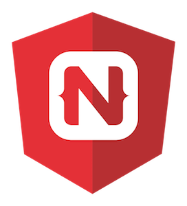
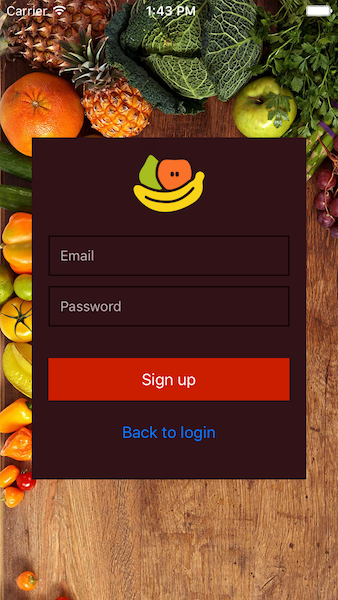
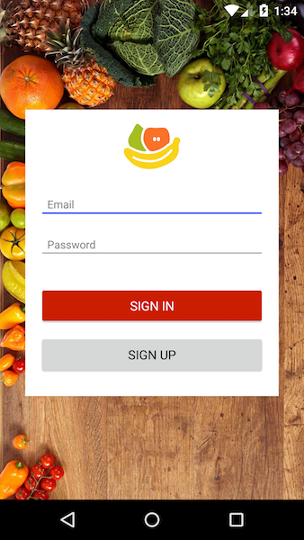
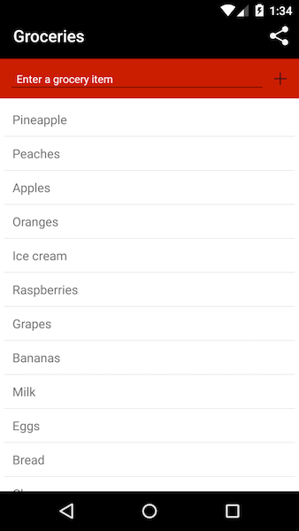

# Building Apps with NativeScript and Angular 2

Welcome to the NativeScript & Angular 2 getting started guide. In this hands-on tutorial, you’ll build a cross-platform iOS and Android app from scratch.

> **IMPORTANT**: NativeScript’s Angular integration is in beta. If you run into any issues completing this guide, please log those issues on our [Angular GitHub repo](https://github.com/NativeScript/nativescript-angular/issues).

## What is NativeScript? What is Angular 2?

  
  
<a href="https://www.nativescript.org/">NativeScript</a> is a framework for building native iOS and Android apps using JavaScript and CSS. NativeScript renders UIs with the native platform’s rendering engine—no <a href="http://developer.telerik.com/featured/what-is-a-webview/">WebViews</a>—resulting in native-like performance and UX.

  
  
<a href="https://angularjs.org/">Angular JS</a> is one of the most popular open source JavaScript frameworks for application development. The latest version of Angular, <a href="https://angular.io/">Angular 2</a>, makes it possible to use Angular outside of a web browser, and developers at <a href="http://www.telerik.com/">Telerik</a>—the company that created and maintains NativeScript—<a href="https://docs.google.com/document/d/1J6fZcVbVa6uONVCJIox2A3Jn5TWgspLufmryfA1OXGk/edit#heading=h.trgonlvb0z3j">have been working closely with developers at Google</a> to make Angular 2 in NativeScript a reality.

  
  
The result is a software architecture that allows you to build mobile apps using the same framework—and in some cases the same code—that you use to build Angular 2 web apps, with the performance you’d expect from native code. Let’s look at how it all works by building an app.

## What you're building

This guide will walk you through building [Groceries](https://github.com/NativeScript/sample-Groceries), a groceries management app that does the following things:

- Connects to an existing RESTful service.
- Provides user registration and login.
- Lets authenticated users add and delete groceries from a list.
- Runs cross-platform (iOS and Android).

If you follow along to the end, here's what the finished app will look like on iOS:

And here's what the app will look like on Android:

## Prerequisites

This guide assumes that you have some basic knowledge of JavaScript, CSS, and your development machine’s terminal. More specifically:

* **JavaScript**: You should know basic JavaScript concepts, such as how functions, if statements, and loops work.
* **CSS**: You should know how to write simple CSS selectors, and know how to apply CSS rules as name/value pairs.
* **The terminal**: You should know how to open a terminal or command-line prompt on your development machine, how to change directories, and how to execute commands.
* **A text editor or IDE**: You should know the basics of your text editor or IDE of choice. You can use any text editor to build NativeScript apps, however, for the best possible experience you may want an editor with built-in TypeScript support, such as [Visual Studio Code](https://code.visualstudio.com/).

This guide will _not_ assume you have any knowledge of Angular 2 or TypeScript. When background Angular 2 or TypeScript expertise will help you understand a concept, this guide will link you to the appropriate places in the [Angular](https://angular.io/docs/ts/latest/) or [TypeScript](http://www.typescriptlang.org/Handbook) documentation.

With that out of the way, let’s get started!

  <a href="ng-chapter-1">Continue to Chapter 1—Getting Up and Running</a>

