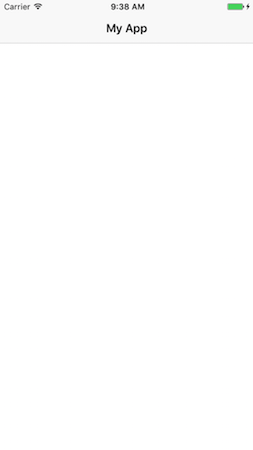
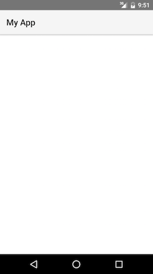
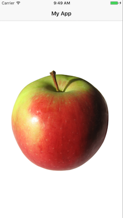
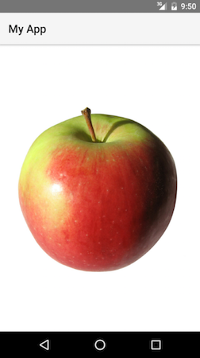

# Chapter 1—Getting Up and Running

In this chapter you're going to start with the basics, including installing the NativeScript command-line interface, starting a new project, and getting your first app up and running.

## Table of contents

- [1.1: Install NativeScript and configure your environment](#11-install-nativescript-and-configure-your-environment)
- [1.2: Start your app](#12-start-your-app)
- [1.3: Add target development platforms](#13-add-target-development-platforms)
- [1.4: Running your app](#14-running-your-app)
- [1.5: Development workflow](#15-development-workflow)

## 1.1: Install NativeScript and configure your environment

The NativeScript CLI has a few system requirements you must have in place before building NativeScript apps. Let’s look at the steps you’ll need to take to get up and running.

> **TIP**: Setting up your machine for native development can be tricky, especially if you’re new to mobile development. If you get stuck, or if you have questions at any point while going through this guide, the [NativeScript Community Slack channel](http://developer.telerik.com/wp-login.php?action=slack-invitation) is a great place to ask questions.

<h4 class="exercise-start">
    <b>Exercise</b>: Setup NativeScript
</h4>

**Step 1: Install Node.js**

The NativeScript CLI is built on Node.js, and as such you need to have Node.js installed to use NativeScript.

You can check whether you have Node.js setup by opening a terminal or command prompt on your development machine and executing `node --version`. If you get an error, head to the https://nodejs.org/ and download and install the latest “LTS” (long-term support) distribution for your development machine.

> **TIP**: The NativeScript CLI supports a wide variety of Node.js versions, so if you already have Node.js installed you should be good to go. If, by chance, you’re running an unsupported version, the `tns doctor` command we’ll run momentarily will flag the problem so you can upgrade.

**Step 2: Install the NativeScript CLI**

Open your terminal or command prompt and execute the following command to install the NativeScript CLI from npm, which is Node.js’ package manager:

```
npm install -g nativescript
```

> **NOTE**: If you’re on OS X and receive an EACCES error, you either need to rerun the previous command with `sudo`—that is, `sudo npm install -g nativescript`—or take a moment to [fix your npm persmissions](https://docs.npmjs.com/getting-started/fixing-npm-permissions) so that you don’t need admin rights to globally install npm packages.

After completing the setup you should have two commands available from your terminal or command prompt: `tns`—which is short for <b>T</b>elerik <b>N</b>ative<b>S</b>cript—and `nativescript`. The two commands are equivalent, so we'll stick with the shorter `tns`.

You can verify the installation was successful by running `tns` in your terminal. You should see something like this:

<div class="no-copy-button"></div>

```
$ tns
# NativeScript
┌─────────┬─────────────────────────────────────────────────────────────────────┐
│ Usage   │ Synopsis                                                            │
│ General │ $ tns <Command> [Command Parameters] [--command <Options>]          │
│ Alias   │ $ nativescript <Command> [Command Parameters] [--command <Options>] │
└─────────┴─────────────────────────────────────────────────────────────────────┘
```

**Step 3: Install iOS and Android requirements**

When you build with NativeScript you’re building truly native iOS and Android apps, and as such, you need to setup each platform you intend to build for on your development machine. To ease the pain of installing all of these requirements manually, the NativeScript CLI provides quick-start scripts for Windows and OS X that handle the necessary setup for you automatically. Let’s look at how they work.

> **NOTE**: If you have existing mobile experience, if you’re on Linux, or if you want full control of the installation process, refer to one of the advanced setup guide below, which walk you through manually setting up your environment for NativeScript development.
> * [Advanced setup: Windows](http://docs.nativescript.org/start/ns-setup-win#setup)
> * [Advanced setup: OS X](http://docs.nativescript.org/start/ns-setup-os-x#setup)
> * [Advanced setup: Linux](http://docs.nativescript.org/start/ns-setup-linux#setup)

<u>Windows</u>

If you’re on Windows, copy and paste the script below into your command prompt and press Enter:

```
@powershell -NoProfile -ExecutionPolicy Bypass -Command "iex ((new-object net.webclient).DownloadString('https://raw.githubusercontent.com/NativeScript/nativescript-cli/production/setup/native-script.ps1'))"
```

During installation you may need to accept a User Account Control prompt to grant the script administrative privileges. Also, be aware that the script downloads and installs some big dependencies—so it’s common for the script to take a while to complete. When the script finishes, close and reopen your command prompt.

<u>OS X</u>

If you’re on a Mac, copy and paste the script below into your terminal and press Enter:

```
ruby -e "$(curl -fsSL https://raw.githubusercontent.com/NativeScript/nativescript-cli/production/setup/native-script.rb)"
```

Much like the Windows script, the OS X script needs administrative access to run some commands using `sudo`; therefore, you may need to provide your password several times during execution. The OS X script also may take some time to complete, as it’s installing the dependencies for both iOS and Android development. When the script finishes, close and restart your terminal.

**Step 4: Verify the setup**

Once you’ve finished installing NativeScript and its dependencies, run the `tns doctor` command, which will check for any issues with your installation.

```
tns doctor
```

If you see “No issues were detected” you’re good to go!

<div class="exercise-end"></div>

## 1.2: Start your app

With the NativeScript CLI installed, it's time to start building your app. Normally, you would [use the `tns create` command to create an empty NativeScript application](https://github.com/NativeScript/NativeScript-cli#create-project). For this guide however, we've scaffolded out a boilerplate project to act as a starting point for [Groceries](https://github.com/NativeScript/sample-Groceries).

<h4 class="exercise-start">
    <b>Exercise</b>: Get the Groceries starting point
</h4>

Navigate to a folder where you want to keep your app code:

<div class="no-copy-button"></div>

```
cd the-folder-you-want-groceries-to-be-in
```

Next, assuming you have [git installed](http://www.git-scm.com/), clone the Groceries repo from GitHub:

```
git clone https://github.com/NativeScript/sample-Groceries.git
```

After that, change to the newly cloned repo's folder:

```
cd sample-Groceries
```

Finally, switch to the “angular-start” branch for this guide's starting point:

```
git checkout angular-start
```

<div class="exercise-end"></div>

> **TIP:**
> * The “angular-end” branch has the final state of this guide's tutorial. Feel free to [refer to the branch on GitHub](https://github.com/NativeScript/sample-Groceries/tree/angular-end) if you get stuck.
> * After completing this guide, if you’d like to start a new NativeScript and Angular 2 app—one that doesn’t clone Groceries—you can use the NativeScript CLI’s `tns create` command as such:
> ```
> tns create my-app-name --template tns-template-hello-world-ng
> ```

## 1.3: Add target development platforms

Your app is now set up, but before you run it, you need to initialize a platform-specific native project for each platform you intend to target.

<h4 class="exercise-start">
    <b>Exercise</b>: Add the iOS and Android platforms
</h4>

If you're on a Mac, start by adding the iOS platform:

```
tns platform add ios
```

Next, add the Android platform with the same `platform add` command:

```
tns platform add android
```

<div class="exercise-end"></div>

>**IMPORTANT:** You can add platforms only for SDKs that you already have installed on your development machine. If you get errors running `tns platform add`, refer back to the section on [setting up your development environment](#install-nativescript-and-configure-your-environment).

The `platform add` command adds a folder called `platforms` to your project, and copies all of the required native SDKs into this folder. When you build the application, the NativeScript CLI will copy your application code into the `platforms` folder so that a native binary can be created.

## 1.4: Running your app

With the platform initialization complete, you can run your app in an emulator or on devices.

<h4 class="exercise-start">
    <b>Exercise</b>: Run your app
</h4>

If you're on a Mac, start by running the app in an iOS simulator with the following command:

```
tns run ios --emulator
```

If all went well, you should see something like this:



Next, run your app on an Android emulator with the following command:

```
tns run android --emulator
```

> **WARNING**:
> * You must have at least one Android AVD (Android Virtual Device) configured for this command to work. If you get an error, try [setting up an AVD](http://developer.telerik.com/featured/using-android-emulator-hybrid-mobile-apps-telerik-appbuilder/#managing-avds) and then run the command again.
> * If you're using [Genymotion](https://www.genymotion.com), launch your Genymotion virtual device first, and then run `tns run android` to deploy your app.

If all went well, you should see your app running in an Android emulator:



<div class="exercise-end"></div>

Here are a few other tips for running NativeScript apps.

> **TIP**:
> * To run on a USB-connected Android or iOS device, use the same `run` command without the `--emulator` flag—i.e. `tns run android` and `tns run ios`.
> * The `tns device` command lists all USB-connected iOS devices, USB-connected Android devices, and Genymotion virtual devices that `tns run` can deploy to. Note that `tns device` does not list iOS simulators.

## 1.5: Development workflow

At this point, you have the NativeScript CLI downloaded and installed, as well as the iOS and Android dependencies that you need to run your app. Now you need a good workflow that lets you make changes and see results fast. For that we’ll use the `tns livesync` command.

<h4 class="exercise-start">
    <b>Exercise</b>: Your first NativeScript change
</h4>

If your previous `tns run ios` or `tns run android` task is still running, type `Ctrl+C` in your terminal to kill it.

If you’re on a Mac, start an iOS livesync watcher by executing the following command:

```
tns livesync ios --emulator --watch
```

If you have your app running on an Android emulator, start an Android livesync watcher by executing the following command:

```
tns livesync android --emulator --watch
```

If you instead have your app running on a USB-connected Android device or Genymotion virtual device, run the same command without the `--emulator` flag:

```
tns livesync android --watch
```

The `tns livesync` command updates your app by transferring the updated source code to the device or simulator. By adding the `--watch` flag, the `livesync` command additionally watches the files in your NativeScript project. Whenever one of those files changes, the command detects the update, and patches your app with the updated code.

> **TIP**: You can learn about how this is possible by reading more about [how NativeScript works](http://developer.telerik.com/featured/nativescript-works/).

To see livesync in action let’s make a small update to your app. Open your project’s `app/app.component.ts` file in your text editor of choice, and replace the file’s contents with the code below, which updates the label’s text:

``` TypeScript
import {Component} from "angular2/core";

@Component({
  selector: "my-app",
  template: "<Label text='hello NativeScript'></Label>"
})
export class AppComponent {}
```

Save `app/app.component.ts` and you should see the app relaunch and the updated text displayed.




<div class="exercise-end"></div> 

Regardless of whether you’re running on iOS or Android, or whether you’re using `tns livesync` or `tns run`, the NativeScript CLI shows the output of `console.log()` statements as your app executes, as well as stack traces when things go wrong. So if your app crashes at any time during this guide, look to the terminal for a detailed report of the problem.

The iOS and Android logs can be a bit noisy, so you might have to scroll up a bit to find the actual problem. For example if I try to call `foo.bar()` when `foo` does not exist, here's the information I get on iOS:

```
/app/path/to/file.js:14:8: JS ERROR ReferenceError: Can't find variable: foo
1   0xe3dc0 NativeScript::FFICallback<NativeScript::ObjCMethodCallback>::ffiClosureCallback(ffi_cif*, void*, void**, void*)
```

And here's the same information in the Android logs:

```
E/TNS.Native( 2063): ReferenceError: foo is not defined
E/TNS.Native( 2063): File: "/data/data/org.nativescript.groceries/files/app/./views/login/login.js, line: 13, column: 4
```

> **TIP**: When you're trying to debug a problem, try adding `console.log()` statements in your JavaScript code—exactly as you would in a browser-based application.

> **WARNING**: Not all changes can be livesync’d in a NativeScript app. For instance, livesync cannot patch native configuration file changes (`Info.plist`, `AndroidManifest.xml`, and so forth), new plugin installations, and any other change that requires a full compilation of the application. In those cases, you’ll want to use `Ctrl+C` to stop livesync, and rerun the application using the `tns run ios` or `tns run android` commands. Don’t worry though; when situations that require a full compilation come up in this guide, these instructions will be explicitly listed.

Now that you've created an app, configured your environment, and set up your app to run on iOS and Android, you're ready to start digging into the files that make up a NativeScript app.

<div class="next-chapter-link-container">
  <a href="ng-chapter-2">Continue to Chapter 2—Building the UI</a>
</div>