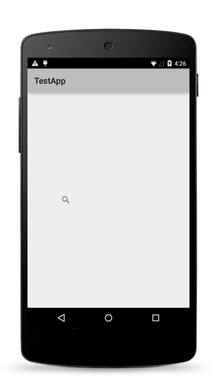
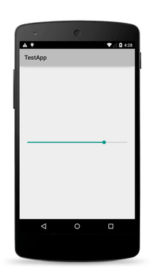
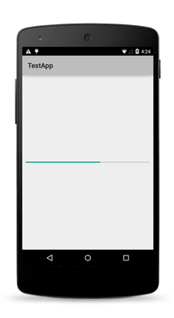

NativeScript ships with set of UI Views which can be used for building the UI of a mobile application. Most of these views wrap the corresponding native view for each platform, while providing a common API for working with them. For example the `Button` view renders an `android.widget.Button` on Android and `UIButton` on iOS. 

In this topic we will to go trough the following views available in NativeScript platform:

* [Button](#button)
* [Label](#label)
* [TextField](#textfield)
* [TextView](#textview)
* [SearchBar](#searchbar)
* [Switch](#switch)
* [Slider](#slider)
* [Progress ](#progress)
* [ActivityIndicator](#activityindicator)
* [Image](#image)
* [ListView](#listview)
* [WebView](#webview)
* [TabView](#tabview)
* [Dialogs](#dialogs)

Defining the layout of the application is also an important part of the application development. You can refer to the [ layouts article ](layouts.md) for more information about the different layout containers that are available in NativeScript.

**Note**: The underlying native widget for each view can be accessed runtime using the following properties:

* Andoird - `<view>.android`
* iOS -  `<view>.ios`

Accessing the native widgets can be useful when you want to use some platform specific functionalities of the widget. You can find information about the underlying native component for each view at the end of its section.

##Button
A standard Button widget that reacts to a 'tap' event.

Native component:

| Android               | iOS      |
|:----------------------|:---------|
| [android.widget.Button](http://developer.android.com/reference/android/widget/Button.html) | [UIButton](https://developer.apple.com/library/ios/documentation/UIKit/Reference/UIButton_Class/) |

##Label
A text label used for displaying read-only text.

Native component:

| Android               | iOS      |
|:----------------------|:---------|
| [android.widget.TextView](http://developer.android.com/reference/android/widget/TextView.html) | [UILabel](https://developer.apple.com/library/ios/documentation/UIKit/Reference/UILabel_Class/) |

##TextField
An editable **single-line** text field.

Native component:

| Android               | iOS      |
|:----------------------|:---------|
| [android.widget.EditText](http://developer.android.com/reference/android/widget/EditText.html) | [UITextField](https://developer.apple.com/library/ios/documentation/UIKit/Reference/UITextField_Class/) |

##TextView
An editable **multi-line** text view. It is typically used multi-lines text content and also supports text editing.

Native component:

| Android               | iOS      |
|:----------------------|:---------|
| [android.widget.EditText](http://developer.android.com/reference/android/widget/EditText.html) | [UITextView](https://developer.apple.com/library/ios/documentation/UIKit/Reference/UITextView_Class/) |

##SearchBar
A view that provides a user interface for the user to enter a search query and submit a request to a search provider.

Native component:

| Android               | iOS      |
|:----------------------|:---------|
| [android.widget.SearchView](http://developer.android.com/reference/android/widget/SearchView.html) | [UISearchBar](https://developer.apple.com/library/ios/documentation/UIKit/Reference/UISearchBar_Class/) |

##Switch
The Switch view is a two-state toggle switch widget that can select between two options. 

Native component:

| Android               | iOS      |
|:----------------------|:---------|
| [android.widget.Switch](http://developer.android.com/reference/android/widget/Switch.html) | [UISwitch](https://developer.apple.com/library/ios/documentation/UIKit/Reference/UISwitch_Class/) |

##Slider
Represents as slider component the can be used to pick a numeric value between a configurable range.

Native component:

| Android                | iOS      |
|:-----------------------|:---------|
| [android.widget.SeekBar](http://developer.android.com/reference/android/widget/SeekBar.html) | [UISlider](https://developer.apple.com/library/ios/documentation/UIKit/Reference/UISlider_Class/) |

##Progress
A visual indicator of a progress in some operation. Displays a bar representing how far the operation has progressed and the amount of progress can be changed by the application logic.

Native component:

| Android                | iOS      |
|:-----------------------|:---------|
| [android.widget.ProgressBar](http://developer.android.com/reference/android/widget/ProgressBar.html) (indeterminate = false) | [UIProgressView](https://developer.apple.com/library/ios/documentation/UIKit/Reference/UIProgressView_Class/) |

##ActivityIndicator
A visual indicator(a.k.a. spinner) showing that a task is in progress.

Native component:

| Android                | iOS      |
|:-----------------------|:---------|
| [android.widget.ProgressBar](http://developer.android.com/reference/android/widget/ProgressBar.html) (indeterminate = true) | [UIActivityIndicatorView](https://developer.apple.com/library/ios/documentation/UIKit/Reference/UIActivityIndicatorView_Class/) |

##Image
A view used for displaying an image. The image can be loaded either form [ImageSource]() or form url.

Native component:

| Android                | iOS      |
|:-----------------------|:---------|
| [android.widget.ImageView](http://developer.android.com/reference/android/widget/ImageView.html) | [UIImageView](https://developer.apple.com/library/ios/documentation/UIKit/Reference/UIImageView_Class/) |

##ListView
A view that shows items in a vertically scrolling list. An itemTemplate can be set on the ListView to specify how each item in the list should be displayed.

Native component:

| Android                | iOS      |
|:-----------------------|:---------|
| [android.widget.ListView](http://developer.android.com/reference/android/widget/ListView.html) | [UITableView](https://developer.apple.com/library/ios/documentation/UIKit/Reference/UITableView_Class/) |

##WebView
A View that displays web pages. It supports loading pages from URL and navigating back and forward.

Native component:

| Android                | iOS      |
|:-----------------------|:---------|
| [android.webkit.WebView](http://developer.android.com/reference/android/webkit/WebView.html) | [UIWebView](https://developer.apple.com/library/ios/documentation/UIKit/Reference/UIWebView_Class/) |

##TabView
The TabView control is used for implementing tab navigation.

Native component:

| Android                | iOS      |
|:-----------------------|:---------|
| [android.support.v4.view.ViewPager](http://developer.android.com/reference/android/support/v4/view/ViewPager.html) | [UITabBarController](https://developer.apple.com/library/ios/documentation/UIKit/Reference/UITabBarController_Class/) |

##Dialogs
The dialogs module contains function for displaying dialog windows. 

