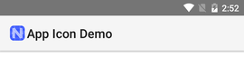
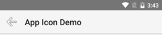
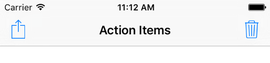
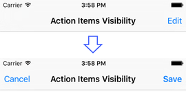
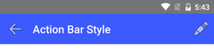
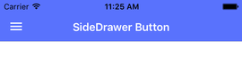

# Overview

The `ActionBar` is the NativeScript common abstraction over the Android ActionBar and iOS NavigationBar.

* [Defining The ActionBar](#defining-the-action-bar)
* [Title](#title)
  * [Setting the Title Text](#setting-the-title-text)
  * [Using a Custom Title View](#using-custom-title-view)
  * [Setting the App Icon](#setting-app-icon)
* [Navigation Button](#navigation-button)
  * [iOS Specifics](#ios-specifics)
  * [Android Specifics](#android-specifics)
* [Action Items](#action-items)
  * [Positioning](#positioning)
  * [Setting Icons](#setting-icons)
* [How To](#how-to)
  * [Showing/Hiding the ActionBar](#showing-hiding-the-action-bar)
  * [Hiding Action Items](#hiding-action-items)
  * [Styling](#styling)
  * [Creating SlideDrawer Button](#creating-slidedrawer-button)
  * [Adding Actions To Existing ActionBar](#adding-actions-to-existing-action-bar)


## Setting the Title Text


Here is how to define the ActionBar inside your page:
```XML
<Page xmlns="http://schemas.nativescript.org/tns.xsd">
  <Page.actionBar>
      <ActionBar title="My ActionBar"/>
  </Page.actionBar>

  <!-- page content ... -->
</Page>
```
We will include only the `ActionBar` tag in the rest of the code-snippets in this article. 


To define the ActionBar include the `ActionBar` tag inside a component template:
```XML
<ActionBar title="Custom Title"></ActionBar>
```
If more than one component defines an `ActionBar` - the last definition will be respected. You can also [add items to the current ActionBar](#adding-actions-to-existing-action-bar).

>Note: To show the ActionBar on the initial page of your application use the `startPageActionBarHidden: false` app option when bootstrapping the application.

```TypeScript
nativeScriptBootstrap(AppComponent, [CUSTOM_PROVIDERS], { startPageActionBarHidden: false });
```



# Title

## Setting The Title Text
Use the `title` property of the `ActionBar` to set the title:

```XML
<ActionBar title="Application Title"></ActionBar>
```

The result is:


## Using a Custom Title View

You can set a custom title view, which will render instead of the title.
The example below shows how to combine an image and label for a `titleView` (the example contains only the `ActionBar` definition):

### How to create custom title view instead of the ActionBar title.

```XML
<ActionBar title="test">
  <StackLayout orientation="horizontal"
    ios:horizontalAlignment="center"
    android:horizontalAlignment="left">
    <Image src="res://nativescript_logo" class="action-image"></Image>
    <Label text="ativeScript"  class="action-label"></Label>
  </StackLayout>
</ActionBar>
```
```CSS
.action-image {
    width: 40;
    height: 40;
    vertical-align: center;
}

.action-label {
    color: #3C5AFD;
    font-size: 24;
    font-weight: bold;
    vertical-align: center;
}
```

The result is:


> **Note**: You can use CSS to style the elements inside the `titleView`.

## Setting the App Icon for Android
You can set the application icon only for Android. By default, the application icon is hidden. You can show it by setting the `android.iconVisibility` property to `always`.

```XML
<ActionBar title="App Icon Demo" android.icon="res://icon" android.iconVisibility="always"></ActionBar>
```

The result is:



# Navigation Button

The `NavigationButton` component is a common abstraction over the iOS back button and the Android navigation button.


```XML
<ActionBar title="App Icon Demo">
  <NavigationButton text="Go Back" android.systemIcon="ic_menu_back" tap="onNavBtnTap"/>
</ActionBar>
```
```JavaScript
function onNavBtnTap() {
    // This code will be called only in Android.
    console.log("Navigation button tapped!");
}
exports.onNavBtnTap = onNavBtnTap;
```
```TypeScript
export function onNavBtnTap(){
    // This code will be called only in Android.
    console.log("Navigation button tapped!");
}
```


```XML
<ActionBar title="App Icon Demo">
  <NavigationButton text="Go Back" android.systemIcon="ic_menu_back" 
    (tap)="onNavBtnTap()"></NavigationButton>
</ActionBar>
```
```TypeScript
@Component({ ... })
class MyComponent {
    public onNavBtnTap(){
        // This code will be called only in Android.
        console.log("Navigation button tapped!");
    }
}
```


The result is:




## iOS Specifics

The default text of the button is the title of the previous page; you can change it by setting the `text` property as shown in the example `Setting the Text Title`.
In iOS, the back button is used explicitly for navigation. It navigates to the previous page and you cannot handle the `tap` event to override this behavior.

If you want to place a button on the left side of the `ActionBar` and handle the tap event (e.g., show slide-out), you can use `ActionItem` with `ios.position="left"`.

## Android Specifics

In Android, you cannot set text inside the navigation button. You can use the `icon` property to set an image (e.g., `~\images\nav-image.png` or `res:\\ic_nav`). You can use `android.systemIcon` to set one of the system icons available in Android.

# Action Items

You can define additional action buttons using the `actionItems` collection:


```XML
<ActionBar title="Action Items">
  <ActionItem tap="onShare"
      ios.systemIcon="9" ios.position="left"
      android.systemIcon="ic_menu_share" android.position="actionBar"/>
  <ActionItem tap="onDelete"
      ios.systemIcon="16" ios.position="right"
      text="delete" android.position="popup"/>
</ActionBar>
```
```JavaScript
function onShare(args) {
    console.log("Share action item tapped.");
}
exports.onShare = onShare;
function onDelete(args) {
    console.log("Delete action item tapped.");
}
exports.onDelete = onDelete;
```
```TypeScript
export function onShare(args: observable.EventData) {
    console.log("Share action item tapped.");
}

export function onDelete(args: observable.EventData) {
    console.log("Delete action item tapped.");
}
```


```XML
<ActionBar title="Action Items">
  <ActionItem (tap)="onShare()"
      ios.systemIcon="9" ios.position="left"
      android.systemIcon="ic_menu_share" 
      android.position="actionBar"></ActionItem>
  <ActionItem (tap)="onDelete()"
      ios.systemIcon="16" ios.position="right"
      text="delete" android.position="popup"></ActionItem>
</ActionBar>
```
```TypeScript
@Component({ ... })
class MyComponent {
    onShare(args: observable.EventData) {
        console.log("Share action item tapped.");
    }
    
    onDelete(args: observable.EventData) {
        console.log("Delete action item tapped.");
    }
}
```

The result is:




## Positioning

The following positioning options are available for iOS and Android.

Android (set with `android.position`):

* `actionBar`\[default\]: Puts the item in the ActionBar. Action item can be rendered both as text or icon.
* `popup`: Puts the item in the options menu. Items will be rendered as text.
* `actionBarIfRoom`: Puts the item in the ActionBar if there is room for it. Otherwise, puts it in the options menu.

iOS (set with `ios.position`):

* `left`\[default\]: Puts the item on the left side of the ActionBar.
* `right`: Puts the item on the right side of the ActionBar.

## Setting Icons

You can use the `icon` property to set an image instead of text for the action item. You can use local image (e.g., `~/images/add.png`) or resource (e.g., `res://ic_add`). Because there is no way to explicitly set `width` and `height` for icons, the recommended approach is using resources.

You can use the `android.systemIcon` and `ios.systemIcon` properties to show system icons. If you define a system icon, it will be used instead of `icon` and `text` properties.

Values for `android.systemIcon` correspond to the resources names of the built-in Android system icons. For a full list of Android drawable names, see [http://androiddrawables.com](http://androiddrawables.com).

Values for `ios.systemIcon` are numbers from the [`UIBarButtonSystemItem`](https://developer.apple.com/library/ios/documentation/UIKit/Reference/UIBarButtonItem_Class/index.html#//apple_ref/doc/uid/TP40007519-CH3-SW2) enumeration:

| Value | Icon           |     | Value | Icon          |
| ----- | -------------- | --- | ----- | ------------- |
|0      | Done           |     |12     | Search |
|1      | Cancel         |     |13     | Refresh |
|2      | Edit           |     |14     | Stop |
|3      | Save           |     |15     | Camera |
|4      | Add            |     |16     | Trash |
|5      | FlexibleSpace  |     |17     | Play |
|6      | FixedSpace     |     |18     | Pause |
|7      | Compose        |     |19     | Rewind |
|8      | Reply          |     |20     | FastForward |
|9      | Action         |     |21     | Undo |
|10     | Organize       |     |22     | Redo |
|11     | Bookmarks      |     |23     | PageCurl |

# How To

## Showing/Hiding the ActionBar

You can explicitly control the visibility of the `ActionBar` by setting the `actionBarHidden` property of the `Page`.

You can inject a reference to the current `Page` in the constructor of your component using the Angular DI.


In **Android**, the application bar is visible by default and shows the name of the application as title. The navigation button is visible only when it is explicitly defined in the application.

In **iOS**, if the application bar is empty (e.g., no title or action items are defined), it is hidden on the first page and automatically shown after navigation to host the navigation button. If the ActionBar is not empty (e.g., there is a title or action items defined) it will be shown on first page, too.

## Hiding Action Items

You can use the `visibility` property of the `ActionItem` to dynamically hide and show items. You can also use binding for the visibility.

Here is an example of showing different action items when the app is in "editing" mode:

```XML
<ActionBar title="Action Items Visibility">
  <ActionItem tap="onEdit" ios.systemIcon="2" android.systemIcon="ic_menu_edit" ios.position="right"
      visibility="{{ isEditing ? 'collapse' : 'visible' }}"/>
  <ActionItem tap="onSave" ios.systemIcon="3" android.systemIcon="ic_menu_save" ios.position="right"
      visibility="{{ isEditing ? 'visible' : 'collapse' }}"/>
  <ActionItem tap="onCancel"  ios.systemIcon="1" android.systemIcon="ic_menu_close_clear_cancel"
      visibility="{{ isEditing ? 'visible' : 'collapse' }}"/>
</ActionBar>
```
```JavaScript
var observable = require("data/observable");
function onLoaded(args) {
    var page = args.object;
    page.bindingContext = new observable.Observable();
    page.bindingContext.set("isEditing", false);
}
exports.onLoaded = onLoaded;
function onEdit(args) {
    console.log("Edit item tapped.");
    var btn = args.object;
    btn.bindingContext.set("isEditing", true);
}
exports.onEdit = onEdit;
function onSave(args) {
    console.log("Save item tapped.");
    var btn = args.object;
    btn.bindingContext.set("isEditing", false);
}
exports.onSave = onSave;
function onCancel(args) {
    console.log("Cancel item tapped.");
    var btn = args.object;
    btn.bindingContext.set("isEditing", false);
}
exports.onCancel = onCancel;
```
```TypeScript
import observable = require("data/observable");
import view = require("ui/core/view");

export function onLoaded(args: observable.EventData) {
    var page = <view.View>args.object;
    page.bindingContext = new observable.Observable();
    page.bindingContext.set("isEditing", false);
}

export function onEdit(args: observable.EventData) {
    console.log("Edit item tapped.");
    var btn = <view.View>args.object;
    btn.bindingContext.set("isEditing", true);
}

export function onSave(args: observable.EventData) {
    console.log("Save item tapped.");
    var btn = <view.View>args.object;
    btn.bindingContext.set("isEditing", false);
}

export function onCancel(args: observable.EventData) {
    console.log("Cancel item tapped.");
    var btn = <view.View>args.object;
    btn.bindingContext.set("isEditing", false);
}
```


You can use the `*ngIf` directive to dynamically hide and show action items.

Here is an example of showing different action items when the app is in "editing" mode:

```XML
<ActionBar title="Action Items Visibility">
  <ActionItem *ngIf="!isEditing" (tap)="onEdit()"
    ios.systemIcon="2" android.systemIcon="ic_menu_edit"
    ios.position="right"></ActionItem>
      
  <ActionItem *ngIf="isEditing" (tap)="onSave()" 
    ios.systemIcon="3" android.systemIcon="ic_menu_save"
    ios.position="right"></ActionItem>
    
  <ActionItem *ngIf="isEditing" (tap)="onCancel()"
    ios.systemIcon="1" android.systemIcon="ic_menu_close_clear_cancel"></ActionItem>
</ActionBar>
```
```TypeScript

@Component({ ... })
class MyComponent {
    isEditing:boolean = false;
    
    onEdit() {
        console.log("Edit item tapped.");
        this.isEditing = true;
    }

    onSave() {
        console.log("Save item tapped.");
        this.isEditing = false;
    }

    onCancel() {
        console.log("Cancel item tapped.");
        this.isEditing = false;
    }
}
```


The result is:




## Styling

The ActionBar has some CSS styling limitations. You can use only `background-color` and `color` properties. Here is an example:

```XML
<ActionBar title="ActionBar Style">
  <NavigationButton text="Go Back" android.systemIcon="ic_menu_back"></NavigationButton>
  <ActionItem ios.systemIcon="2" android.systemIcon="ic_menu_edit" ios.position="right"></ActionItem>
</ActionBar>
```
```CSS
ActionBar {
    background-color:  #3C5AFD;
    color: white;
}
```

The result is:




In iOS, the `color` property affects the color of the title and the action items.
In Android, the `color` property affects only the title text. However, you can set the default color of the text in the action items by adding an `actionMenuTextColor` item in the Android theme (inside `App_Resources\Android\values\styles.xml`).

>Note: Setting other CSS properties (e.g., `font-family`) will only affect the views defined inside `titleView`.

## Creating SlideDrawer Button

This example shows how to implement a "show side-drawer button" functionality.

For Android, this example uses the `NavigationButton` because `ActionItems` are shown on the right side of the `ActionBar`.

For iOS, this code adds a regular `ActionItem` with `position` set to `left`. Using the `NavigationButton` as a side-drawer button in iOS is not possible, because its function is to always navigate back in the application.


>Note: The `<android>` and `<ios>` tags are used inside the XML to define platform-specific elements.



```XML
<ActionBar title="SideDrawer Button">
  <android>
    <NavigationButton icon="res://ic_menu" tap="showSlideout" />
  </android>
  <ios>
    <ActionItem icon="res://ic_menu" ios.position="left" tap="showSideDrawer" />
  </ios>
</ActionBar>
```
```JavaScript
function showSideDrawer(args) {
    console.log("Show SideDrawer tapped.");
    // Show sidedrawer ...
}
exports.showSideDrawer = showSideDrawer;
```
```TypeScript
export function showSideDrawer(args: observable.EventData) {
    console.log("Show SideDrawer tapped.");
    // Show sidedrawer ...
}
```
```CSS
ActionBar {
    background-color:  #3C5AFD;
    color: white;
}
```


The result is:





## Adding Actions To Existing ActionBar
Using the `ActionBarExtension` component you can add additional action items to the current `ActionBar`. This is useful if you are writing a reusable component that exposes an action (ex. "save"), but you don't want to override the whole `ActionBar`.

Here is how to define a contextual `copy` action:

```XML
<ActionBarExtension>
    <ActionItem *ngIf="hasSelection" (tap)="copy()" text="Copy"></ActionItem>
</ActionBarExtension>
```
```TypeScript
@Component({ ... })
class MyTextEditorComponent {
    public hasSelection: boolean;
    // ...
    copy() {
        console.log("Copying...");
        // ...
    }
    // ...
}
```

