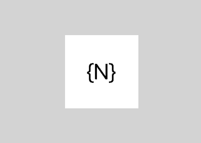
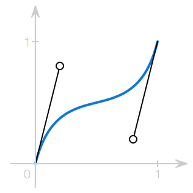

# Animations

One of the ways to improve the attractiveness of your application is by adding animations. NativeScript exposes simple and easy, but powerful enough API to allow animating almost every native element in your application.

For your convenience we expose two ways of creating animations:

- Declarative - you will use the easy and familiar CSS3 animations API
- Imperative - take full control of any animation by calling animation methods directly with code

##hello-world example

To get started we will change the background color of a button form "red" to "green". With code we can do the following:



``` JavaScript
view.backgroundColor = new colorModule.Color("red");
view.animate({ backgroundColor: new colorModule.Color("green"), duration: 2000 });
```
``` TypeScript
view.backgroundColor = new colorModule.Color("red");
view.animate({ backgroundColor: new colorModule.Color("green"), duration: 2000 });
```

The same animation can be expressed in CSS with the following definition:

``` CSS
@keyframes example {
    from { background-color: red; }
    to { background-color: green; }
}
.view {
    animation-name: example;
    animation-duration: 2s;
    animation-fill-mode: forwards;
}
```

* CSS animations apply with lower precedence like any other CSS settings, so any local values set in your element will cancel the animation.

In NativeScript the following properties can be animated:

- opacity
- backgroundColor
- translateX and translateY
- scaleX and scaleY
- rotate

In every animation you can control the following properties:

- duration: The length of the animation.
- delay: The amount of time, to delay starting the animation.
- iterations: Specifies how many times the animation should be played. 
- timing function: The speed curve of the animation. Available options are defined below.

##Animation curves

By default the animation moves with a linear speed without acceleration or deceleration. This might look unnatural and different from the real world where objects need time to reach their top speed and can't stop immediately. The animation curve (called sometimes easing function) is used to give animations an illusion of inertia. It controls the animation speed by modifying the fraction of the duration. NativeScript comes with a number of predefined animation curves:

- **linear** - The simplest animation curve is linear. It maintains a constant speed while the animation is running:


- **Ease-in** - The ease-in curve causes the animation to begin slowly, and then speed up as it progresses.


- **Ease-out** - An ease-out curve causes the animation to begin quickly, and then slow down as it completes.


- **Ease-in-out** - An ease-in ease-out curve causes the animation to begin slowly, accelerate through the middle of its duration, and then slow again before completing.


- **Spring** - A spring animation curve causes an animation to produce a spring (bounce) effect.


In NativeScript the animation curve is represented by the AnimationCurve enumeration and can be specified with the curve property of the animation. In CSS the animation curve is defined by using the animation-timing-function property:

``` JavaScript
view.animate({
	translate: { x: 0, y: 100},    
	duration: 1000,
	curve: enums.AnimationCurve.easeIn
});
```
``` TypeScript
view.animate({
	translate: { x: 0, y: 100},    
	duration: 1000,
	curve: enums.AnimationCurve.easeIn
});
```
``` CSS
.view {
	animation-name: example;
	animation-duration: 1;
	animation-timing-function: ease-in;
   animation-fill-mode: forwards;
}
@keyframes example {
	from { transform: translate(0, 0); }
	to { transform: translate(0, 100); }
}
```

It is easy to create your own animation curve by passing in the x and y components of two control points of a cubic Bezier curve. Using Bezier curves is a common technique to create smooth curves in computer graphics and they are widely used in vector-based drawing tools. The values passed to the cubicBezier method control the curve shape. The animation speed will be adjusted based on the resulting path.



``` JavaScript
view.animate({
    translate: { x: 0, y: 100 },
    duration: 1000,
    curve: enums.AnimationCurve.cubicBezier(0.1, 0.1, 0.1, 1)
});
```
``` TypeScript
view.animate({
    translate: { x: 0, y: 100 },
    duration: 1000,
    curve: enums.AnimationCurve.cubicBezier(0.1, 0.1, 0.1, 1)
});
```
``` CSS
.view {
	animation-name: example;
	animation-duration: 1;
	animation-timing-function: cubicBezier(0.1, 0.1, 0.1, 1);
	animation-fill-mode: forwards;
}
```


# CSS Animations

CSS animations are based on the simple and easy to use standard [CSS3 animations API](http://www.w3schools.com/css/css3_animations.asp). You can use them to animate almost every native view without even having to know JavaScript. You have the potential to alter the appearance and behavior of an element whenever a state change occurs, such as when it is touched, or activated. You can use multiple frames and change the aimation direction. Finally with CSS animations you can separate the animation code from your application logic.

CSS animations consist of two components, a style describing the CSS animation and a set of keyframes that indicate the start and end states of the animation's style, as well as possible intermediate waypoints. You can change as many animatable CSS properties you want, as many times you want.

The following example binds the "example" animation to the button element. The animation will lasts for 4 seconds, and it will gradually change the background-color of the button element from "red" to "green":

```
@keyframes example {
    from { background-color: red; }
    to { background-color: green; }
}

.view {
    animation-name: example;
    animation-duration: 4s;
	animation-fill-mode: forwards;
}
```

To get an animation to work, you must bind the animation to an element:

``` JavaScript
view1.className = "example";
```
``` TypeScript
view1.className = "example";
```
``` XML
<Button id="myButton" text="{N}" class="example"/>
```

* If the animation-duration property is not specified, the animation will use a default value - 0.3 seconds.

## Animatable properties

CSS animations support the same animatable properties like in code based animations: 

- opacity
- background-color corresponds with the backgroundColor
- transform: translate corresponds with translateX and translateY properties. 
- transform: scale corresponds with scaleX and scaleY properties
- transform: rotate corresponds with the rotate property

* You cannot set a single x or y field in scale and translate. If you set only x in translate, y will be assumed 0; If you set only y in scale, x will be assumed 1.

## Animation properties

A CSS animation is defined by using the animation property and its sub-properties. Those include timing, duration, delay, and other animation properties. The actual animation appearance is defined with the @keyframes rule.

The following list presents all animation properties:

- **animation-name**: specifies the name of the @keyframes rule that should be used.
- **animation-delay**: specifies the time between the style is applied and the beginning of the animation.
- **animation-duration**: the length of the animation in seconds.
- **animation-iteration-count**: Specifies how many times the animation should be played. Default is 1. To repeat an animation forever use infinite.
- **animation-timing-function**: Defines how the animation transitions through keyframes, by establishing acceleration curves.
- **animation-fill-mode**: Configures what values are applied by the animation after it is executing.
- **animation-direction**: Configures whether or not the animation should alternate direction on each run through the sequence or reset to the start point and repeat itself.
- **animation**: The shorthand property allows setting all animation properties in a single line.

## Animation keyframes

To set multiple points at which an element should undergo a transition, use the **@keyframes** rule. It includes the animation name, any animation breakpoints, and the properties intended to be animated. 

``` CSS
@keyframes example {
    from { background-color: red; }
    to { background-color: green; }
}
```

This example defines an animation with two keyframes. "from" represents 0% (the start of the animation) and "to" represents 100% (the final value). You can add more keyframes by using percent.

The following example will change the background-color when the animation is 25% complete, 50% complete, and again when the animation is 100% complete:

``` CSS
@keyframes example {
    0%   { background-color: red; }
    25%  { background-color: yellow; }
    50%  { background-color: blue; }
    100% { background-color: green; }
}
```

You can set multiple properties in a keyframe:

``` CSS
@keyframes example {
    0%   { background-color: red; transform: translate(0, 0); }
    25%  { background-color: yellow; transform: translate(200, 0); }
    50%  { background-color: blue; transform: translate(200, 200);  }
    75%  { background-color: green; transform: translate(0, 200); }
    100% { background-color: red; transform: translate(0, 0); }
}
```

You can combine keyframes:

``` CSS
@keyframes example {
    0%, 50% { background-color: red; transform: translate(0, 0); }
    25%, 75% { background-color: yellow; transform: translate(200, 0); }
    100% { background-color: red; transform: translate(0, 0); }
}
```

## Delay an Animation

The **animation-delay** property specifies a delay (in seconds) before the animation starts:

``` CSS
.view {
	background-color: red;
    animation-name: example;
    animation-duration: 4s;
    animation-delay: 2s;
}
```

## Set How Many Times an Animation Should Run

The **animation-iteration-count** property defines the number of times an animation should run. The following animation will play two times before it stops:

``` CSS
.view {
	background-color: red;
   animation-name: example;
   animation-duration: 4s;
   animation-iteration-count: 2;
}
```

If you want to play an animation forever, set this property to "infinite":

``` CSS
animation-iteration-count: infinite;
```

## Specify the Speed Curve of the Animation

The **animation-timing-function** property specifies the speed curve of the animation. It can have one of the following values:

- ease: specifies an animation with a slow start, then fast, then end slowly (this is default)
- linear: specifies an animation with the same speed from start to end
- ease-in: specifies an animation with a slow start
- ease-out: specifies an animation with a slow end
- ease-in-out: specifies an animation with a slow start and end
- spring: specifies a spring animation
- cubic-bezier(n,n,n,n): lets you define your own values in a cubic-bezier function

``` CSS
.view {
	animation-name: example;
   animation-timing-function: cubic-bezier(0.1, 0.1, 1.0, 1.0);
}
```

## Determine the result when the animation ends

The **animation-fill-mode** property determines the element style when the animation finishes. Its default value is "none". In this case all animated values will be reset to a previous value when the animation finishes. When using "forwards" all animated values will apply the property values for the time the animation ended.

``` CSS
.view {
	background-color: red;
    animation-name: example;
    animation-duration: 2s;
    animation-fill-mode: forwards;
}
```

## Animation direction

The **animation-direction** property can be used to play a CSS animation in reverse direction:

``` CSS
.view {
	background-color: red;
    animation-name: example;
    animation-duration: 4s;
    animation-direction: reverse;
}
```

## Animation Shorthand Property

The **animation** property allows setting all seven animation properties with a single line:

``` CSS
.view {
    animation: example 4s ease-in-out 2s infinite reverse forwards;
}
```

The supported syntax is:

animation: name duration timing-function delay iteration-count direction fill-mode;

You can combine two animations in the **animation** property by using commas:

``` CSS
.view {
    animation: example 4s ease-in-out 2s infinite reverse, second-animation-example 5s ease-out;
}
```

## Pseudo selectors

A pseudo-selector is used to define a special state of an element. For example, when a button is touched by the user. Pseudo selectors can be used to trigger animations:

``` CSS
.button {
    background-color: green;
}

.button:highlighted {
    animation-name: highlight;
    animation-duration: 2s;
    animation-fill-mode: forwards;
}

@keyframes highlight {
    from { background-color: yellow; }
    to { background-color: red; }
}
```

* Currently only the **Button** component has a built-in special state "highlighted" which indicates that it is touched by the user.

## Access CSS animations from code

The simplest way to trigger a CSS animation is by changing the element **className** property:

```JavaScript
var view = page.getViewById("view");
view.className = "transparent";
```
```TypeScript
let view = page.getViewById<viewModule.View>("view");
view.className = "transparent";
```

All keyframes defined in CSS can be accessed with code by using the **getKeyframeAnimationWithName** method. This allows further customization of animation properties:

``` JavaScript
var view = page.getViewById("view");
var animationInfo = page.getKeyframeAnimationWithName("bounce");
animationInfo.duration = 2000;
var keyframeAnimation = keyframeAnimation.KeyframeAnimation.keyframeAnimationFromInfo(animationInfo);
animation.play(view).then(() => {
    console.log("Played with code!");
});
```
``` TypeScript
let view = page.getViewById<viewModule.View>("view");
let animationInfo = page.getKeyframeAnimationWithName("bounce");
animationInfo.duration = 2000;
let keyframeAnimation = keyframeAnimation.KeyframeAnimation.keyframeAnimationFromInfo(animationInfo);
animation.play(view).then(() => {
    console.log("Played with code!");
});
```

# Animations with code

In case you need to animate a **single** [`View`]({{site.baseurl}}/ApiReference/ui/core/view/View.md) and you don't need to be able to **cancel** the animation, you can simply use the shortcut **View.animate** method which accepts an [`AnimationDefinition`]({{site.baseurl}}/ApiReference/ui/animation/AnimationDefinition.md), immediately starts the animation and returns its finished promise.

``` JavaScript
view.animate({
    translate: { x: 0, y: 100},    
    duration: 1000,
    curve: enums.AnimationCurve.easeIn
});
```
``` TypeScript
view.animate({
    translate: { x: 0, y: 100},    
    duration: 1000,
    curve: enums.AnimationCurve.easeIn
});
```

## The AnimationDefinition interface

The [`AnimationDefinition`]({{site.baseurl}}/ApiReference/ui/animation/AnimationDefinition.md) interface is central for defining an animation for **one or more properties** of a **single** [`View`]({{site.baseurl}}/ApiReference/ui/core/view/View.md). The animatable properties are:

 - opacity
 - backgroundColor
 - translateX and translateY
 - scaleX and scaleY
 - rotate

The [`AnimationDefinition`]({{site.baseurl}}/ApiReference/ui/animation/AnimationDefinition.md) interface has the following members:

 - target: The view whose property is to be animated.
 - opacity: Animates the opacity of the view. Value should be a number between 0.0 and 1.0.
 - backgroundColor: Animates the backgroundColor of the view.
 - translate: Animates the translate affine transform of the view. Value should be a [`Pair`]({{site.baseurl}}/ApiReference/ui/animation/Pair.md).
 - scale: Animates the scale affine transform of the view. Value should be a [`Pair`]({{site.baseurl}}/ApiReference/ui/animation/Pair.md).
 - rotate: Animates the rotate affine transform of the view. Value should be a number specifying the rotation amount in degrees.
 - duration: The length of the animation in milliseconds. The default duration is 300 milliseconds.
 - delay: The amount of time, in milliseconds, to delay starting the animation.
 - iterations: Specifies how many times the animation should be played. Default is 1. iOS animations support fractional iterations, i.e. 1.5. To repeat an animation infinitely, use Number.POSITIVE_INFINITY
 - curve: An optional animation curve. Possible values are contained in the [AnimationCurve enumeration]({{site.baseurl}}/ApiReference/ui/enums/AnimationCurve/README.md). Alternatively, you can pass an instance of type [`UIViewAnimationCurve`](https://developer.apple.com/library/ios/documentation/UIKit/Reference/UIView_Class/#//apple_ref/c/tdef/UIViewAnimationCurve) for iOS or [`android.animation.TimeInterpolator`](http://developer.android.com/reference/android/animation/TimeInterpolator.html) for Android.

 All members of the interface are **optional** and have default values with the following exceptions:
 
 - target is only optional when calling the **animate** method of a [`View`]({{site.baseurl}}/ApiReference/ui/core/view/View.md) instance since it is set automatically for you.
 - You must specify at least one property among opacity, backgroundColor, scale, rotate and translate.

## The Animation Class

The [`Animation`]({{site.baseurl}}/ApiReference/ui/animation/Animation.md) class represents a **set** of one or more [`AnimationDefinitions`]({{site.baseurl}}/ApiReference/ui/animation/AnimationDefinition.md) which can be played either **simultaneously or sequentially**. **This class is typically used when you need to animate several views together**. The constructor of the the [`Animation`]({{site.baseurl}}/ApiReference/ui/animation/Animation.md) class accepts an array of [`AnimationDefinitions`]({{site.baseurl}}/ApiReference/ui/animation/AnimationDefinition.md) and a boolean parameter indicating whether to play the animations sequentially. Creating an instance of the [`Animation`]({{site.baseurl}}/ApiReference/ui/animation/Animation.md) class does not start the animation playback. The class has four members:

 - play: a method that starts the animation and returns the instance it was called on for fluent animation chaining.
 - cancel: a void method which stops the animation.
 - finished: a promise which will be resolved when the animation finishes or rejected when the animation is cancelled or stops for another reason.
 - isPlaying: a boolean property returning true if the animation is currently playing.

## Animating multiple properties

It is easy to animate multiple properties at once, just pass the desired animatable properties and the corresponding values when calling the animate function:

``` JavaScript
view.animate({
    backgroundColor: new color.Color("#3D5AFE"),
    opacity: 0.5,
    translate: { x: 100, y: 100 },
    rotate: 180,
    duration: 3000
});
```
``` TypeScript
view.animate({
    backgroundColor: new color.Color("#3D5AFE"),
    opacity: 0.5,
    translate: {x: 100, y: 100},
    rotate: 180,
    duration: 3000
});
```


## Chaining animations with Promises

The animate method returns a promise that can be used to chain animations. Here is an example:
 
``` JavaScript
view.animate({ opacity: 0 })
    .then(function () { return view.animate({ opacity: 1 }); })
    .then(function () { return view.animate({ translate: { x: 100, y: 100 } }); })
    .then(function () { return view.animate({ translate: { x: 0, y: 0 } }); })
    .then(function () { return view.animate({ scale: { x: 3, y: 3 } }); })
    .then(function () { return view.animate({ scale: { x: 1, y: 1 } }); })
    .then(function () { return view.animate({ rotate: 180 }); })
    .then(function () { return view.animate({ rotate: 0 }); })
    .then(function () {
    console.log("Animation finished");
})
    .catch(function (e) {
    console.log(e.message);
});
```
``` TypeScript
view.animate({ opacity: 0 })
    .then(() => view.animate({ opacity: 1 }))
    .then(() => view.animate({ translate: { x: 100, y: 100 } }))
    .then(() => view.animate({ translate: { x: 0, y: 0 } }))
    .then(() => view.animate({ scale: { x: 3, y: 3 } }))
    .then(() => view.animate({ scale: { x: 1, y: 1 } }))
    .then(() => view.animate({ rotate: 180 }))
    .then(() => view.animate({ rotate: 0 }))
    .then(() => {
    console.log("Animation finished");
  })
    .catch((e) => {
    console.log(e.message);
  });
```


# Examples

The full source code for all samples is located [`here`](https://github.com/NativeScript/animation-demo).

## Opacity


``` JavaScript
view.animate({
    opacity: 0,
    duration: 3000
});
```
``` TypeScript
view.animate({
    opacity: 0,
    duration: 3000
});
```
``` CSS
.view {
	animation-name: opacity;
	animation-duration: 3;
}
@keyframes opacity {
	from { opacity: 1; }
	to { opacity: 0; }
}
```

## Background Color


``` JavaScript
view.animate({
    backgroundColor: new colorModule.Color("#3D5AFE"),
    duration: 3000
});
```
``` TypeScript
view.animate({
    backgroundColor: new colorModule.Color("#3D5AFE"),
    duration: 3000
});
```
``` CSS
.view {
	animation-name: backgroundColor;
	animation-duration: 3;
}
@keyframes backgroundColor {
	from { background-color: white; }
	to { background-color: #3D5AFE; }
}
```

## Translate


``` JavaScript
view.animate({
    translate: { x: 100, y: 100},
    duration: 3000
});
```
``` TypeScript
view.animate({
    translate: { x: 100, y: 100},
    duration: 3000
});
```
``` CSS
.view {
	animation-name: translate;
	animation-duration: 3;
}
@keyframes translate {
	from { transform: translate(0, 0); }
	to { transform: translate(100, 100); }
}
```

## Scale


``` JavaScript
view.animate({
    scale: { x: 2, y: 2},
    duration: 3000
});
```
``` TypeScript
view.animate({
    scale: { x: 2, y: 2},
    duration: 3000
});
```
``` CSS
.view {
	animation-name: scale;
	animation-duration: 3;
}
@keyframes scale {
	from { transform: scale(1, 1); }
	to { transform: scale(2, 2); }
}
```

## Rotate


``` JavaScript
view.animate({
    rotate: 360,
    duration: 3000
});
```
``` TypeScript
view.animate({
    rotate: 360,
    duration: 3000
});
```
``` CSS
.view {
	animation-name: rotate;
	animation-duration: 3;
}
@keyframes rotate {
	from { transform: rotate(0deg); }
	to { transform: rotate(360deg); }
}
```

## Chaining with Animation Set


``` JavaScript
var definitions = new Array();
definitions.push({ target: view1, translate: { x: 200, y: 0 }, duration: 3000 });
definitions.push({ target: view2, translate: { x: 0, y: 200 }, duration: 3000 });
definitions.push({ target: view3, translate: { x: -200, y: 0 }, duration: 3000 });
definitions.push({ target: view4, translate: { x: 0, y: -200 }, duration: 3000 });
var playSequentially = true;
var animationSet = new animationModule.Animation(definitions, playSequentially);
animationSet.play().then(function () {
    console.log("Animation finished");
})
    .catch(function (e) {
    console.log(e.message);
});
```
``` TypeScript
var definitions = new Array<animationModule.AnimationDefinition>();
definitions.push({target: view1, translate: {x: 200, y: 0}, duration: 3000 });
definitions.push({target: view2, translate: {x: 0, y: 200}, duration: 3000 });
definitions.push({target: view3, translate: {x: -200, y: 0}, duration: 3000 });
definitions.push({target: view4, translate: {x: 0, y: -200}, duration: 3000 });
var playSequentially = true;
var animationSet = new animationModule.Animation(definitions, playSequentially);
animationSet.play().then(() => {
    console.log("Animation finished");
})
.catch((e) => {
    console.log(e.message);
});
```

## Multiple Views


``` JavaScript
var definitions = new Array();
var a1 = {
    target: view1,
    translate: { x: 200, y: 0 },
    duration: 3000
};
definitions.push(a1);
var a2 = {
    target: view2,
    translate: { x: 0, y: 200 },
    duration: 3000
};
definitions.push(a2);
var a3 = {
    target: view3,
    translate: { x: -200, y: 0 },
    duration: 3000
};
definitions.push(a3);
var a4 = {
    target: view4,
    translate: { x: 0, y: -200 },
    duration: 3000
};
definitions.push(a4);
var animationSet = new animationModule.Animation(definitions);
animationSet.play().then(function () {
    console.log("Animation finished");
})
    .catch(function (e) {
    console.log(e.message);
});
```
``` TypeScript
var definitions = new Array<animationModule.AnimationDefinition>();
var a1: animationModule.AnimationDefinition = {
    target: view1,
    translate: {x: 200, y: 0},
    duration: 3000
};
definitions.push(a1);

var a2: animationModule.AnimationDefinition = {
    target: view2,
    translate: {x: 0, y: 200},
    duration: 3000
};
definitions.push(a2);

var a3: animationModule.AnimationDefinition = {
    target: view3,
    translate: {x: -200, y: 0},
    duration: 3000
};
definitions.push(a3);

var a4: animationModule.AnimationDefinition = {
    target: view4,
    translate: {x: 0, y: -200},
    duration: 3000
};
definitions.push(a4);

var animationSet = new animationModule.Animation(definitions);

animationSet.play().then(() => {
    console.log("Animation finished");
})
.catch((e) => {
    console.log(e.message);
});
```

## Reusing Animations


``` JavaScript
var animation1 = view.createAnimation({ opacity: 0 });
var animation2 = view.createAnimation({ opacity: 1 });
animation1.play()
    .then(function () { return animation2.play(); })
    .then(function () { return animation1.play(); })
    .then(function () { return animation2.play(); })
    .then(function () { return animation1.play(); })
    .then(function () { return animation2.play(); })
    .then(function () {
    console.log("Animation finished");
})
    .catch(function (e) {
    console.log(e.message);
});
```
``` TypeScript
var animation1 = view.createAnimation({opacity: 0});
var animation2 = view.createAnimation({opacity: 1});

animation1.play()
.then(()=>animation2.play())
.then(()=>animation1.play())
.then(()=>animation2.play())
.then(()=>animation1.play())
.then(()=>animation2.play())
.then(() => {
    console.log("Animation finished");
})
.catch((e) => {
    console.log(e.message);
});
```

## Slide-in Effect


``` JavaScript
var item = new imageModule.Image();
item.src = "~/res/icon_100x100.png";
item.width = 90;
item.height = 90;
item.style.margin = "5,5,5,5";
item.translateX = -300;
item.opacity = 0;
item.on("loaded", function (args) {
    args.object.animate({ translate: { x: 0, y: 0 }, opacity: 1 });
});
wrapLayout.addChild(item);
```
``` TypeScript
var item = new imageModule.Image();
item.src = "~/res/icon_100x100.png";
item.width = 90;
item.height = 90;
item.style.margin = "5,5,5,5";
item.translateX = -300;
item.opacity = 0;
item.on("loaded", (args: observable.EventData) => {
    (<viewModule.View>args.object).animate({translate: { x: 0, y: 0 }, opacity: 1});
});
wrapLayout.addChild(item);
```

## Infinite


``` JavaScript
animationSet = new animationModule.Animation([{
        target: view,
        rotate: 360,
        duration: 3000,
        iterations: Number.POSITIVE_INFINITY,
        curve: view.ios ? UIViewAnimationCurve.UIViewAnimationCurveLinear : new android.view.animation.LinearInterpolator
    }]);
animationSet.play().catch(function (e) {
    console.log("Animation stoppped!");
});
// Call animationSet.cancel() to stop it;
```
``` TypeScript
animationSet = new animationModule.Animation([{
    target: view,
    rotate: 360,
    duration: 3000,
    iterations: Number.POSITIVE_INFINITY,
    curve: view.ios ? UIViewAnimationCurve.UIViewAnimationCurveLinear : new android.view.animation.LinearInterpolator
}]);
animationSet.play().catch((e) => {
    console.log("Animation stoppped!");
});
// Call animationSet.cancel() to stop it;
```


