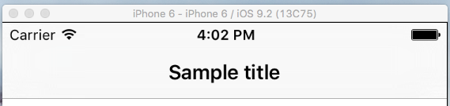
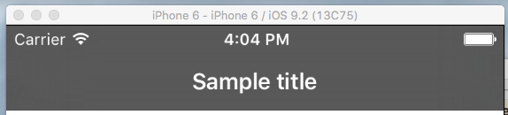
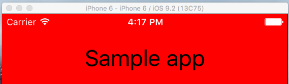

# Changing Status Bar Style in iOS
 
NativeScript allows you to build multiplatform applications by exposing a rich common API. You don't need to know specifics of the different platforms. However, every platform has its own features. In those cases when you need to fine tune your application and make it look more native, NativeScrpt gives you full control and access to the native API and platform-specific functionality. One such scenario is when you want to change the status bar style in iOS. 

There are two options to change the status bar style for iOS applications in NativeScript.

- By changing the `NavigationBar` style. 
- By using the `Info.plist` file.
 
## Changing the status bar style using the NavigationBar barStyle property
 
This method is easier, but it implies using an `ActionBar`. The NativeScript `ActionBar` is a common abstraction over iOS `UINavigationBar` and Android's `ActionBar`. It is a bar typically located at the top of the screen and it provides title and navigation control in your application.

- Use the page's XML file to declare an `ActionBar` in your application.

>caption Example 1: How to create default `ActionBar` with title
``` XML
<Page xmlns="http://schemas.nativescript.org/tns.xsd" loaded="loaded">
  <Page.actionBar>
     <ActionBar title="Sample title"></ActionBar>
  </Page.actionBar>
</Page>
```

__Figure 1__ shows the result of adding the sample code from __Example 1__.

>caption Figure 1: Default style of ActionBar


 
 It is easy to change the background color of the `UINavigationBar` and the status bar, respectively. To do this you should set the `backgroundColor` property of the `ActionBar`. This can be done in XML or with CSS.
 
 >caption Example 2:How to set up `ActionBar` backgroundColor property
``` XML
<Page.actionBar>
     <ActionBar title="Sample title" backgroundColor="green"></ActionBar>
</Page.actionBar>
``` 
``` CSS
ActionBar 
{
    background-color: green;
}
```
 
__Figure 2__ shows the result.

>caption Figure 2: Changed backgroung color of NavigationBar and StatusBar
 


In iOS there are two possible styles that you could set to the `UINavigationBar`: `UIBarStyleDefault` and `UIBarStyleBlack`. Changing the `UINavigationBar` style will change the style of the status bar automatically. By default, the `UINavigationBar` style in iOS is `UIBarStyleDefault`, which means that the letters will be black and the background color will be white. 

- Changing the style of UINavigationBar 

You should use the `frame` module to access the native instance of `UINavigationBar`. Then you can use its `barStyle` property to change its style to `UIBarStyleBlack`.

>caption Example 3: How to change UINavigationBar style using native code

``` JavaScript
var frame = require("ui/frame");
var platform = require("platform")
function loaded(args) {
    if (platform.isIOS) {
        var navigationBar = frame.topmost().ios.controller.navigationBar;
        navigationBar.barStyle = UIBarStyle.UIBarStyleBlack;
    }
}
exports.loaded = loaded;
```
``` TypeScript
import { EventData } from "data/observable";
import { topmost } from "ui/frame";
import { isIOS } from "platform"

export function loaded(args: EventData){
     if (isIOS) {
        let navigationBar = topmost().ios.controller.navigationBar;
        navigationBar.barStyle = UIBarStyle.UIBarStyleBlack;
    }
}
```

__Figure 3__ shows the result.
>caption Figure 3: Changing the default UINavigationBar style to UIBarStyleBlack



As __Figure 3__ shows, the style of `UINavigationBar` and status bar have been changed to a gray background color and white text and icons.

## Changing status bar style only
 
You should use this option in scenarios when you don't want to use `ActionBar`. In iOS, the status bar has two style types: the default one - `UIStatusBarStyleDefault` and `UIStatusBarStyleLightContent`. The default style looks like __Figure 4__: icons with black color and white background color.

>caption Figure 4: Default StatusBar style


You can use the application's Info.plist file to change the status bar style:
  
1. Go to the `app/App_Resources/iOS` folder.
 
2. Open the `Info.plist` file. 
 
3. Add the code shown below in your `Info.plist` before closing `</dict>` tag

``` XML
<key>UIStatusBarStyle</key>
<string>UIStatusBarStyleLightContent</string>
<key>UIViewControllerBasedStatusBarAppearance</key>
<false/>
```

As a result, your `Info.plist` should look like this:

``` XML
    <?xml version="1.0" encoding="UTF-8"?>
    <!DOCTYPE plist PUBLIC "-//Apple//DTD PLIST 1.0//EN" "http://www.apple.com/DTDs/PropertyList-1.0.dtd">
    <plist version="1.0">
    <dict>
        <key>CFBundleDevelopmentRegion</key>
        <string>en</string>
        <key>CFBundleDisplayName</key>
        <string>${PRODUCT_NAME}</string>
        <key>CFBundleExecutable</key>
        <string>${EXECUTABLE_NAME}</string>
        <key>CFBundleIconFile</key>
        <string>icon.png</string>
        <key>CFBundleIcons</key>
        <dict>
            <key>CFBundlePrimaryIcon</key>
            <dict>
                <key>CFBundleIconFiles</key>
                <array>
                    <string>icon-40</string>
                    <string>icon-60</string>
                    <string>icon-72</string>
                    <string>icon-76</string>
                    <string>Icon-Small</string>
                    <string>Icon-Small-50</string>
                </array>
                <key>UIPrerenderedIcon</key>
                <false/>
            </dict>
        </dict>
        <key>CFBundleInfoDictionaryVersion</key>
        <string>6.0</string>
        <key>CFBundleName</key>
        <string>${PRODUCT_NAME}</string>
        <key>CFBundlePackageType</key>
        <string>APPL</string>
        <key>CFBundleShortVersionString</key>
        <string>1.0</string>
        <key>CFBundleSignature</key>
        <string>????</string>
        <key>CFBundleVersion</key>
        <string>1.0</string>
        <key>LSRequiresIPhoneOS</key>
        <true/>
        <key>UILaunchStoryboardName</key>
        <string>LaunchScreen</string>
        <key>UIRequiresFullScreen</key>
        <true/>
        <key>UIRequiredDeviceCapabilities</key>
        <array>
            <string>armv7</string>
        </array>
        <key>UISupportedInterfaceOrientations</key>
        <array>
            <string>UIInterfaceOrientationPortrait</string>
            <string>UIInterfaceOrientationLandscapeLeft</string>
            <string>UIInterfaceOrientationLandscapeRight</string>
        </array>
        <key>UISupportedInterfaceOrientations~ipad</key>
        <array>
            <string>UIInterfaceOrientationPortrait</string>
            <string>UIInterfaceOrientationPortraitUpsideDown</string>
            <string>UIInterfaceOrientationLandscapeLeft</string>
            <string>UIInterfaceOrientationLandscapeRight</string>
        </array>
        <key>UIStatusBarStyle</key>
        <string>UIStatusBarStyleLightContent</string>
        <key>UIViewControllerBasedStatusBarAppearance</key>
        <false/>
    </dict>
    </plist>
```
Which you can see in __Figure 5__.

>caption Figure 5: Changed StatusBar style to `UIStatusBarStyleLightContent`


Now in place of the status bar we can see one white line. That happened because we changed the color of the icon to white; however, the background color is the same as the icon. To fix this we should set the page's `backgroundColor` property. You should also set the `backgroundSpanUnderStatusBar` property to `true`. This will span the background color under the status bar:

>caption: Example 5: How to span the background color under the status bar  

``` XML
<Page xmlns="http://schemas.nativescript.org/tns.xsd" backgroundSpanUnderStatusBar="true" backgroundColor="red">
  <StackLayout>
    <Label text="Tap the button" class="title"/>
    <Button text="TAP" tap="{{ onTap }}" />
    <Label text="{{ message }}" class="message" textWrap="true"/>
  </StackLayout>
</Page>
```
 
__Figure 6__ shows the result:
 
>caption Figure 6: Changed background color of status bar
  

 
The sample projects for both cases are available in these GitHub repositories: [StyleStatusBariOSviaActionBar](https://github.com/tsonevn/StyleStatusBariOSviaActionBar.git) and [StyleStatusBariOSviaInfo.plist](https://github.com/tsonevn/StyleStatusBariOSviaInfo.plist.git)