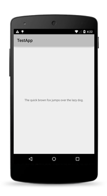

# User Interface Widgets

NativeScript ships with a set of user interface [`views`](http://docs.nativescript.org/api-reference/modules/_ui_core_view_.html) (also known as widgets) which you can use to build the user interface of a mobile application. Most of these views wrap the corresponding native view for each platform while providing a common API for working with it. For example, the `Button` view renders an [`android.widget.Button`](http://developer.android.com/reference/android/widget/Button.html) on Android and [`UIButton`](https://developer.apple.com/library/ios/documentation/UIKit/Reference/UIButton_Class/) on iOS.

* [Button](#button)
* [Label](#label)
* [TextField](#textfield)
* [TextView](#textview)
* [SearchBar](#searchbar)
* [Switch](#switch)
* [Slider](#slider)
* [Progress ](#progress)
* [ActivityIndicator](#activityindicator)
* [Image](#image)
* [ListView](#listview)
* [HtmlView](#htmlview)
* [WebView](#webview)
* [TabView](#tabview)
* [SegmentedBar](#segmentedbar)
* [DatePicker](#datepicker)
* [TimePicker](#timepicker)
* [ListPicker](#listpicker)
* [Dialogs](#dialogs)

Some of the components are provided by Telerik UI for NativeScript plugin, which is distributed in two versions:

* Telerik UI for NativeScript (free)
* Telerik UI for NativeScript Pro (paid)

Telerik UI for NativeScript is available for download on npmjs.com under the [nativescript-telerik-ui](https://www.npmjs.com/package/nativescript-telerik-ui) name. It contains two free components:

* [RadListView](#radlistview)
* [SideDrawer](#sidedrawer)

A fully functioning trial of Telerik UI for NativeScript Pro is available for download from the [Telerik website](https://www.telerik.com/download-trial-file/v2/nativescript-ui) or from npmjs.com under the [nativescript-telerik-ui-pro](https://www.npmjs.com/package/nativescript-telerik-ui-pro) name. Besides the two free components mentioned above, it also contains:

* [Calendar Premium](#calendar)
* [Chart Premium](#chart)
* [DataForm Premium](#dataform)

* [Gauges Premium](#gauges)
* [AutoCompleteTextView Premium](#autocompletetextview)


Defining the layout of the application is also an important part of the application development. For more information about the different layout containers that are available in NativeScript, see [The NativeScript Layout System]().

> **TIP:** You can access the underlying native widget for each view at runtime using the following properties:
>
> * Android: `<view>.android`
> * iOS: `<view>.ios`
>
> Accessing the native widgets might be useful when you want to use some platform-specific functionalities of the widget. You can find information about the underlying native component for each view below.

## Button

The [Button]() widget provides a standard button widget that reacts to a `tap` event.

**Native Component**

| Android               | iOS      |
|:----------------------|:---------|
| [android.widget.Button](http://developer.android.com/reference/android/widget/Button.html) | [UIButton](https://developer.apple.com/library/ios/documentation/UIKit/Reference/UIButton_Class/) |

## Label

The [Label]() widget provides a text label that shows read-only text.

**Native Component**

| Android               | iOS      |
|:----------------------|:---------|
| [android.widget.TextView](http://developer.android.com/reference/android/widget/TextView.html) | [UILabel](https://developer.apple.com/library/ios/documentation/UIKit/Reference/UILabel_Class/) |

## TextField

The [TextField]() widget provides an editable **single-line** text field.

**Native Component**

| Android               | iOS      |
|:----------------------|:---------|
| [android.widget.EditText](http://developer.android.com/reference/android/widget/EditText.html) | [UITextField](https://developer.apple.com/library/ios/documentation/UIKit/Reference/UITextField_Class/) |

## TextView

The [TextView]() widget provides an editable **multi-line** text view. 

You can use it to show multi-line text and implement text editing.

**Native Component**

| Android               | iOS      |
|:----------------------|:---------|
| [android.widget.EditText](http://developer.android.com/reference/android/widget/EditText.html) | [UITextView](https://developer.apple.com/library/ios/documentation/UIKit/Reference/UITextView_Class/) |

## SearchBar

The [SearchBar]() widget provides a user interface for entering search queries and submitting requests to the search provider.

**Native Component**

| Android               | iOS      |
|:----------------------|:---------|
| [android.widget.SearchView](http://developer.android.com/reference/android/widget/SearchView.html) | [UISearchBar](https://developer.apple.com/library/ios/documentation/UIKit/Reference/UISearchBar_Class/) |

## Switch

The [Switch]() widget provides a two-state toggle switch from which you can choose between two options.

**Native Component**

| Android               | iOS      |
|:----------------------|:---------|
| [android.widget.Switch](http://developer.android.com/reference/android/widget/Switch.html) | [UISwitch](https://developer.apple.com/library/ios/documentation/UIKit/Reference/UISwitch_Class/) |

## Slider

The [Slider]() widget provides a slider that you can use to pick a numeric value within a configurable range.

**Native Component**

| Android                | iOS      |
|:-----------------------|:---------|
| [android.widget.SeekBar](http://developer.android.com/reference/android/widget/SeekBar.html) | [UISlider](https://developer.apple.com/library/ios/documentation/UIKit/Reference/UISlider_Class/) |

## Progress

The [Progress]() widget is a visual bar indicator of a progress in a operation. It shows a bar representing the current progress of the operation.

**Native Component**

| Android                | iOS      |
|:-----------------------|:---------|
| [android.widget.ProgressBar](http://developer.android.com/reference/android/widget/ProgressBar.html) (indeterminate = false) | [UIProgressView](https://developer.apple.com/library/ios/documentation/UIKit/Reference/UIProgressView_Class/) |

## ActivityIndicator

The [ActivityIndicator]() widget is a visual spinner indicator which shows that a task is in progress.

**Native Component**

| Android                | iOS      |
|:-----------------------|:---------|
| [android.widget.ProgressBar](http://developer.android.com/reference/android/widget/ProgressBar.html) (indeterminate = true) | [UIActivityIndicatorView](https://developer.apple.com/library/ios/documentation/UIKit/Reference/UIActivityIndicatorView_Class/) |

## Image

The [Image]() widget shows an image. You can load the image from an [`ImageSource`](http://docs.nativescript.org/api-reference/modules/_image_source_.html) or from a URL.

**Native Component**

| Android                | iOS      |
|:-----------------------|:---------|
| [android.widget.ImageView](http://developer.android.com/reference/android/widget/ImageView.html) | [UIImageView](https://developer.apple.com/library/ios/documentation/UIKit/Reference/UIImageView_Class/) |

## ListView

The [ListView]() shows items in a vertically scrolling list. You can set an [`itemTemplate`](http://docs.nativescript.org/api-reference/modules/_ui_list_view_.knowntemplates.html) to specify how each item in the list should be displayed.

**Native Component**

| Android                | iOS      |
|:-----------------------|:---------|
| [android.widget.ListView](http://developer.android.com/reference/android/widget/ListView.html) | [UITableView](https://developer.apple.com/library/ios/documentation/UIKit/Reference/UITableView_Class/) |

## HtmlView

The [HtmlView]() represents a view with HTML content. Use this component instead of WebView when you want to show just static HTML content.

**Native Component**

| Android                | iOS      |
|:-----------------------|:---------|
| [android.widget.TextView](http://developer.android.com/reference/android/widget/TextView.html) | [UILabel](https://developer.apple.com/library/ios/documentation/UIKit/Reference/UILabel_Class/) |

## WebView

The [WebView]() shows web pages. You can load a page from a URL or by navigating back and forward.

**Native Component**

| Android                | iOS      |
|:-----------------------|:---------|
| [android.webkit.WebView](http://developer.android.com/reference/android/webkit/WebView.html) | [UIWebView](https://developer.apple.com/library/ios/documentation/UIKit/Reference/UIWebView_Class/) |

## TabView

With the [TabView]() control, you can implement tab navigation.

**Native Component**

| Android                | iOS      |
|:-----------------------|:---------|
| [android.support.v4.view.ViewPager](http://developer.android.com/reference/android/support/v4/view/ViewPager.html) | [UITabBarController](https://developer.apple.com/library/ios/documentation/UIKit/Reference/UITabBarController_Class/) |

## SegmentedBar

With the [SegmentedBar]() control, you can implement discrete selection.

**Native Component**

| Android                | iOS      |
|:-----------------------|:---------|
| [android.widget.TabHost](http://developer.android.com/reference/android/widget/TabHost.html) | [UISegmentedControl](https://developer.apple.com/library/prerelease/ios/documentation/UIKit/Reference/UISegmentedControl_Class/index.html) |

## DatePicker

With the [DatePicker]() control, you can pick a date.

**Native Component**

| Android                | iOS      |
|:-----------------------|:---------|
| [android.widget.DatePicker](http://developer.android.com/reference/android/widget/DatePicker.html) | [UIDatePicker](https://developer.apple.com/library/ios/documentation/UIKit/Reference/UIDatePicker_Class/index.html) |

## TimePicker

With the [TimePicker]() widget, you can pick a time.

**Native Component**

| Android                | iOS      |
|:-----------------------|:---------|
| [android.widget.TimePicker](http://developer.android.com/reference/android/widget/TimePicker.html) | [UIDatePicker](https://developer.apple.com/library/ios/documentation/UIKit/Reference/UIDatePicker_Class/index.html) |

## ListPicker

With the [ListPicker]() widget, you can pick a value from a list.

**Native Component**

| Android                | iOS      |
|:-----------------------|:---------|
| [android.widget.NumberPicker](http://developer.android.com/reference/android/widget/NumberPicker.html) | [UIPickerView](https://developer.apple.com/library/prerelease/ios/documentation/UIKit/Reference/UIPickerView_Class/index.html) |

## Dialogs

The [dialogs module]() lets you create and show dialog windows.

## RadListView


The [RadListView component](http://docs.telerik.com/devtools/nativescript-ui/Controls/NativeScript/ListView/overview) for NativeScript is a virtualizing list component that provides the most popular features associated with scenarios where a list of items is used.



The [RadListView component](http://docs.telerik.com/devtools/nativescript-ui/Controls/Angular/ListView/overview) for NativeScript is a virtualizing list component that provides the most popular features associated with scenarios where a list of items is used.


## SideDrawer


The [SideDrawer](http://docs.telerik.com/devtools/nativescript-ui/Controls/NativeScript/SideDrawer/overview) is a component can show a hidden view that contains navigation UI or common settings.



The [SideDrawer](http://docs.telerik.com/devtools/nativescript-ui/Controls/Angular/SideDrawer/overview) is a component can show a hidden view that contains navigation UI or common settings.


## Calendar

>This component is part of [Telerik UI for NativeScript Pro](http://docs.telerik.com/devtools/nativescript-ui/introduction).


The [Calendar](http://docs.telerik.com/devtools/nativescript-ui/Controls/NativeScript/Calendar/overview) for NativeScript is based on the corresponding native calendar components from the Telerik UI for iOS and Telerik UI for Android suites. It exposes a unified API covering all major features coming from the native components like:



The [Calendar](http://docs.telerik.com/devtools/nativescript-ui/Controls/Angular/Calendar/overview) for NativeScript is based on the corresponding native calendar components from the Telerik UI for iOS and Telerik UI for Android suites. It exposes a unified API covering all major features coming from the native components like:


* inline events
* different view modes
* cells customization
* selection

## Chart

>This component is part of [Telerik UI for NativeScript Pro](http://docs.telerik.com/devtools/nativescript-ui/introduction).


The [Chart](http://docs.telerik.com/devtools/nativescript-ui/Controls/NativeScript/Chart/overview) for NativeScript is a charting component that has been designed for the mobile environment.



The [Chart](http://docs.telerik.com/devtools/nativescript-ui/Controls/Angular/Chart/overview) for NativeScript is a charting component that has been designed for the mobile environment.


## DataForm

>This component is part of [Telerik UI for NativeScript Pro](http://docs.telerik.com/devtools/nativescript-ui/introduction).


The [DataForm](http://docs.telerik.com/devtools/nativescript-ui/Controls/NativeScript/DataForm/dataform-overview)  for NativeScript helps you edit the properties of a business object during runtime and build a mobile form fast and easy.



The [DataForm](http://docs.telerik.com/devtools/nativescript-ui/Controls/Angular/DataForm/dataform-overview)  for NativeScript helps you edit the properties of a business object during runtime and build a mobile form fast and easy.



## Gauges

>This component is part of [Telerik UI for NativeScript Pro](http://docs.telerik.com/devtools/nativescript-ui/introduction).

The [Gauges](http://docs.telerik.com/devtools/nativescript-ui/Controls/NativeScript/Gauges/overview)  is a highly customizable component that allows you to show the current status of a value within a range of upper and lower bounds, illustrate progress towards a goal or a summary of a fluctuating metric.

## AutoCompleteTextView

>This component is part of [Telerik UI for NativeScript Pro](http://docs.telerik.com/devtools/nativescript-ui/introduction).

The [AutoCompleteTextView](http://docs.telerik.com/devtools/nativescript-ui/Controls/NativeScript/AutoCompleteTextView/overview) can automatically complete user input string by comparing the text being entered to all strings in the associated data source.

